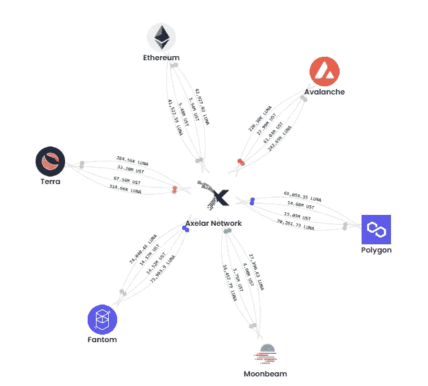
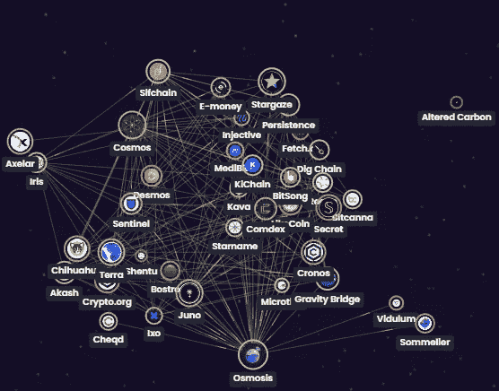

# 渗透之城的桥梁

> 原文：<https://medium.com/coinmonks/bridge-to-the-city-of-osmosis-64d1ddd7459b?source=collection_archive---------4----------------------->

**Osmosis City**

在现实世界中，桥梁是用来连接一个岛和另一个岛的。由于宇宙生态系统是所有加密中增长最快的区块链生态系统，它也不会有什么不同。不幸的是，并不是每个区块链都将启用 Cosmos SDK，所以可以说，这是为了建立最佳的桥梁支持，以允许您的车辆从 A 点行驶到 B 点。

一个恰当的例子是 Axelar 公司已经与几个不同的区块链建立了网络。上面你会看到:Terra，以太坊，雪崩，Fantom，月光，多边形，希望很快渗透。一个很好的方式来思考上面的区块链图是六个孤立的孤岛，没有办法互相交流或发送资源。然而，有了 Axelar 的框架，他们现在可以互相交流和发送资源。对我来说，Axelar 网络是渗透在 Axelar 桥的另一端的坚实选择；毕竟，它是利用 Cosmos SDK 从头开始构建的。使用 Axelar 将允许完全的可组合性，同时允许所有这些虚拟桥相互连接。最好的事情是最终用户甚至没有意识到这一点，因为他们不必在他们的链上进行直接交易——这是真正的**最佳互操作性！**

## 据我对 Axelar 的了解，用户可以将非 IBC 资产(如 ETH)从比特币基地直接发送到 Osmosis，无需桥接交互。这是一个游戏改变者！

目前，在 IBC 有 38 个独立的主权区块链可以相互沟通；同样，这都归功于标准化的 Cosmos SDK。想象 Cosmos SDK 威力的一个好方法是把它想象成一种可组合的“通用语言”,每个人都可以说，交换数据，互相交换，做任何事情。

你去过别的国家吗？或者见鬼，甚至在你目前居住的国家的不同地方，有人说不同的语言？你不想知道那些人在说些什么吗？现在，想象一下，如果地球上的每个人都说同一种语言，并且没有这样的语言障碍；很难衡量每个人/每件事的效率和时间效率会有多高，但我想作为人类，我们会走得更远。

mapofzones.com

好事也有坏事。你听说过“厨房里厨师太多”这句话吗？

需要在河流或海洋之间架设多座桥梁；然而，我不相信需要有多个桥在同一个位置转移相同的车辆。我这么说是什么意思？好吧，让我们看看 Saber，它是索拉纳生态系统的一部分。我认为自己是一个相当有经验的加密用户，但即使是我也对所有不同版本的 Solana 令牌完全不知所措。仅举几个例子，mSOL，stSOL，daoSOL，aSOL，prtSOL，xSOL，pSOL，scnSOL，JSOL，eSOL…等等等等。

**完全披露**:如果有一天 OSMO 有 15 个不同的版本，我可能会把我的显示器扔到房间的另一边。此外，我在 IBC 以外的地方见过 LP 池，同一令牌的不同包装版本的数量令人困惑，尤其是稳定的硬币。我倾向于问自己，婴儿潮一代会理解这一点吗？简单的回答:不，我的意思是真的，但是，谁真的知道呢？抱歉，婴儿潮一代，我仍然爱你。

**严肃地说**:我认为 IBC 在标准化的 Cosmos SDK 之外处理令牌的最佳方式是就上述资产的赢家和输家达成一致。例如，我不希望七座桥跨越七个不同版本的 ETH。对我来说，这在很多方面都是一场灾难。我不介意几座桥的唯一方法是，如果 ETH 是一个统一的挂钩，它会自动成为可替代的 ETH 令牌，可以像任何 IBC 资产一样使用，而不会有一堆不同的丑陋字母。我希望用户将 ETH 从他们的 MetaMask 发送到 Osmosis，而用户甚至不知道他们使用了桥；我希望没有混乱，加载[渗透区](https://app.osmosis.zone/)点击存款，轰你的、戴、ETH、SOL、DOT、ADA、等刚刚出现。我真的希望在不久的将来这是可能的。

最后，让我们来一个快速头脑风暴，说渗透决定用 Axelar，虫洞，游牧或 Umee 来代表 X 令牌，这并不意味着渗透不能用 GRAV 来代表 Y 令牌。目标应该是可组合性和可替代性，以及 IBC 真正平滑的事务性质。那是 IBC 的面包和黄油！在令牌离开宇宙星球后，它可以再次变异成 15 个版本，我真的不在乎。但是在宇宙星球上，我们都在一起——不需要相同资产的 15 个版本。

> *加入 Coinmonks* [*电报频道*](https://t.me/coincodecap) *和* [*Youtube 频道*](https://www.youtube.com/c/coinmonks/videos) *了解加密交易和投资*

# 另外，阅读

*   [Bookmap 点评](https://coincodecap.com/bookmap-review-2021-best-trading-software) | [美国 5 大最佳加密交易所](https://coincodecap.com/crypto-exchange-usa)
*   最佳加密[硬件钱包](/coinmonks/hardware-wallets-dfa1211730c6) | [Bitbns 评论](/coinmonks/bitbns-review-38256a07e161)
*   [新加坡十大最佳加密交易所](https://coincodecap.com/crypto-exchange-in-singapore) | [购买 AXS](https://coincodecap.com/buy-axs-token)
*   [红狗赌场评论](https://coincodecap.com/red-dog-casino-review) | [Swyftx 评论](https://coincodecap.com/swyftx-review) | [CoinGate 评论](https://coincodecap.com/coingate-review)
*   [投资印度的最佳密码](https://coincodecap.com/best-crypto-to-invest-in-india-in-2021)|[WazirX P2P](https://coincodecap.com/wazirx-p2p)|[Hi Dollar Review](https://coincodecap.com/hi-dollar-review)
*   [加拿大最佳加密交易机器人](https://coincodecap.com/5-best-crypto-trading-bots-in-canada) | [库币评论](https://coincodecap.com/kucoin-review)
*   [用于 Huobi 的加密交易信号](https://coincodecap.com/huobi-crypto-trading-signals) | [HitBTC 审查](/coinmonks/hitbtc-review-c5143c5d53c2)