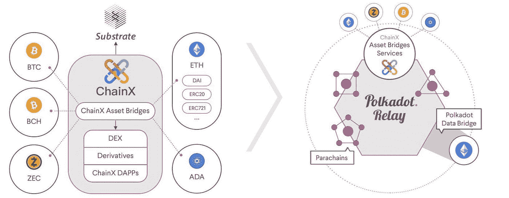
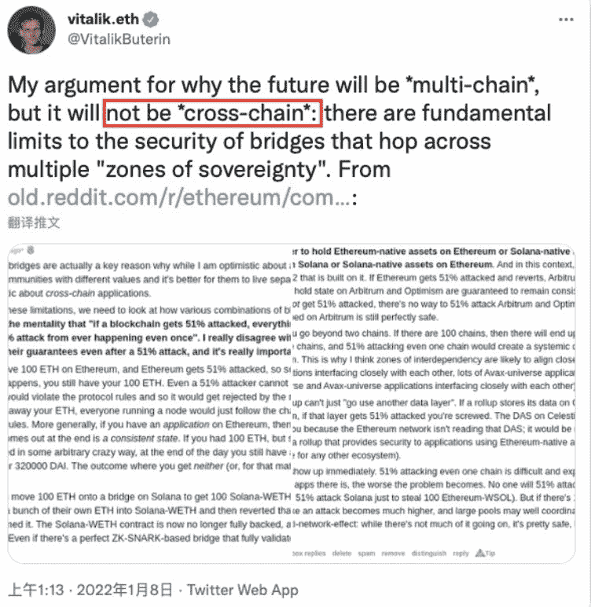
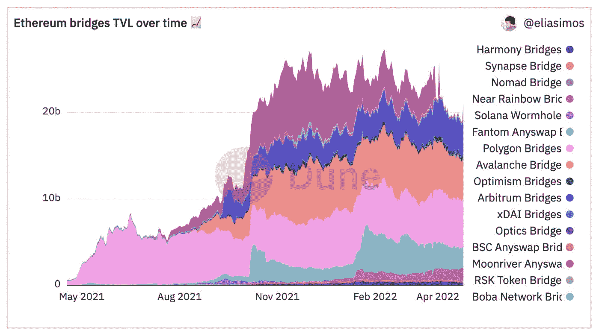

# 无桥跨链互换；这可能是侧链和其他的替代品。

> 原文：<https://medium.com/coinmonks/bridgeless-cross-chain-swaps-could-this-be-a-replacement-for-side-chains-and-others-832493d3c908?source=collection_archive---------12----------------------->

## *Hashflow 推出第 0 层无桥交叉链交换*

[https://www.pinterest.com/](https://www.pinterest.com/)

**【TL:DR】**

1.  对可扩展性、互操作性以及从一个区块链到另一个的数据和信息传输的需求一直是区块链技术的重大挑战。
2.  侧链、跨链和多链是针对各种区块链的可扩展性和互操作性而定制的几种解决方案。
3.  侧链是一种独特的区块链，使用双向 peg 连接到其主区块链上。侧链资产交换有时可以被视为跨链交换，它允许将数字资产从单独的区块链转移到主链。
4.  跨链互换，也称为原子跨链互换，是各有其区块链的数字资产之间的交易——例如，用 ETH 交换 BNB。
5.  DeFi 交易平台 Hashflow 引入了无桥跨链互换，使人们能够转移他们喜欢的任何一对链上的任何资产。

Source: docs.polkastarter.com

# **侧链简介**

顾名思义，侧链(sidechains)是建立在主区块链之上并依附于主区块链的侧链或子链区块链。它们的主要功能是帮助增加互操作性、可伸缩性和不同区块链之间的事务挑战。

将侧链视为不同区块链的全球网络，具有独特的特性和功能，在独立、连接但分散的生态系统中无缝交互。

侧链允许将数字资产和加密货币从一个区块链转移和使用到另一个，然后在必要时返回到主区块链。

侧链被认为是第 2 层解决方案的保证，因为它们允许在主链之外进行交易。侧链与主链相连，承担主链的压力，允许更快更便宜的交易。

由于侧链独立于主链，所以它们负责其安全性，如果受到危害，它们不能影响主链的运行。

## **侧链是如何工作的？**

让我们假设你想从以太网发送 x Eth 到一个侧链。首先，您必须将一个以太网交易传输到一个以太网加密箱地址。最初，在这个过程中，锁箱中的任何以太坊都被有效地从以太坊的总供应中移除。您还包括关于您打算在该交易中发送以太坊的侧链地址的信息。一旦以太坊网络收到交易并将其添加到区块链，侧链锁箱就会释放 x Ether 并将其发送到以太坊网络交易中指定的地址。只需颠倒这些指令，将 ETH 送回。在这种情况下，双向挂钩通过一种被称为“桥”的机制运作，这种机制允许数字资产在区块链之间来回转移。

## **侧链的优点**

侧链有可能带来数字资产之间的区块链可伸缩性、互操作性和交互。这将防止几个区块链孤立运作，并为区块链技术的未来提供更多合作。

## **侧链的局限性**

侧链还不是完美的解决方案；事实上，如果要广泛采用它们作为扩展解决方案，还有几个挑战需要解决。侧链的局限性包括对采矿权的安全担忧，转让妥协情况下的不明确情况，以及新区块链用户的高度复杂性。

# **什么是跨链互换，它们是如何运作的**

跨链交换通常被称为原子跨链交换；这是一个智能合约解决方案，允许令牌在两个不同的区块链生态系统之间进行交易。它允许用户在另一个区块链上直接交换代币，而无需中间人、第三方或中央权威机构。它使用点对点(P2P)机制运行，通常是分散的。跨链交换允许独立区块链之间的互操作性。

根据底层技术的不同，跨链交互分为同构跨链和异构跨链。各种组件(如安全机制、一致性算法、网络结构和块创建验证逻辑)之间的同构跨链相互作用是相对重要的。对于异构交叉链，在交互中采用了通常用于比特币的 PoW(工作证明)算法和广泛用于 Tendermint 的 PBFT(实用拜占庭容错)共识方法。

跨链互换基本上是通过使用智能合约来实现的。这些智能合约用于跨链互换，以允许两个独立区块链上的双方进行令牌交换。这项技术由哈希时间锁契约(HTCLs)提供支持，这是一种使用唯一组合锁定事务以确保双方验证的机制。

跨链掉期的优势包括一种新的分散、安全和私有的货币交换能力，无需依赖集中或分散的交易所。其他包括增强的安全性、点对点交易的低成本以及允许交换多个令牌的高灵活性。

使用交叉链技术的区块链的例子包括 Polkadot、Aion、Wanchain 和 Cosmos 等。

## **跨链互换的局限性**

跨链交换无疑是实现区块链互操作性的一个前沿步骤，但它也不是没有限制。跨链互换的主要挑战是安全性。跨链互换是由智能合约驱动的，智能合约是程序化的；如果实施不当，互换中可能存在安全漏洞。如果我们使用的钱包没有正确地实现这个协议，我们也有丢失钱的风险。这方面的一个例子是有争议的 Axie Infinity 的 Ronin 6.2 亿美元黑客攻击。由于黑客通过窃取多个跨链桥验证节点的私钥来攻击 Ronin 和 Ethereum 之间的跨链桥，由跨链交换提供动力的 Ronin 桥交易被黑客攻击。最近，跨链桥已经成为众多黑客攻击的目标。2022 年 1 月 27 日，量子比特桥被黑，具体金额的美元被转出；2 月 2 日，虫洞桥也遭到攻击，损失 3.2 亿美元；而在 2 月 5 日，另一个跨链桥 Meter.io 桥损失了 420 万美元给黑客。

以太坊的创始人 Vitalik Buterin 在今年早些时候的 Reddit 声明中认为，由于其安全限制，区块链的未来是多链而不是跨链。

## **Hashflow:无桥跨链互换的曙光**

分散金融(DeFi)交易平台 Hashflow 推出了零层无桥跨链掉期。Hashflow 让用户有机会在他们喜欢的任何一对链条上交易任何资产。通过强迫做市商签署在交易期间保持不变的报价，Hashflow 完全保护了交易者免受滑点和 MEV 的影响。这意味着无论是本地交易还是跨链交易，都不会有滑点。用户从著名的做市商那里请求报价，并在链上安全地提交。

Hashflow 已经在以太坊区块链上推出，但计划专注于扩展到其他区块链，如 Solana，Polkadot 和 Cosmos 等。考虑能够用 ETH 交换 SOL，而不必手动桥接，然后使用 AMM！

随着以太坊区块链的 TLV(锁定的总价值)数量多年来不断扩大，我们可以得出结论，DeFi 生态系统已经取得了显著增长，这是跨链互换和使用多个 dApps 的结果。现金流无桥互换等创新将带来更多互动，为多链未来铺平道路。

Source: Hashflow

在过去的一年里，将以太坊留给其他连锁店的 TVL 总量急剧增加。

## **无桥跨链互换的可能缺点**

尽管 Hashflow 无桥跨链互换看起来很棒，但它仍然是一项新技术，因此，它还没有受到黑客的严重压力或利用。它很有可能面临与桥接跨链相同的安全挑战，并可能在用于规划整个流程的智能合同中存在漏洞；这可能导致交易者的资金损失。

此外，Hasflows 文章中的括号中突出显示了一个免责声明，它宣布

> "*注意:这是 alpha 的一个实验性功能，所以请只交易你觉得舒服的东西."*

## **结论**

跨链交换是一项伟大的创新，可以在多个区块链之间实现更高级别的互操作性，但是要成为一个被广泛接受的可伸缩性解决方案，必须及时解决其安全性挑战。最后，说无桥交叉链将取代侧链将是一个快速的结论，因为区块链的未来可能是多链的，这是有争议的。

目前正在为 **NewsCrypto** 教育频道撰写文章，该频道可在 [NewsCrypto.io](https://newscrypto.io/) 找到。Newscrypto 提供专业工具和免费的学院部分，可以帮助您在以最安全的方式进行交易的同时赚钱，同时让您了解加密。他们的本地令牌是 NWC 令牌，可以从他们的网站上购买。

> 加入 Coinmonks [电报频道](https://t.me/coincodecap)和 [Youtube 频道](https://www.youtube.com/c/coinmonks/videos)了解加密交易和投资

# 另外，阅读

*   [最佳期货交易信号](https://coincodecap.com/futures-trading-signals) | [流动性交易所评论](https://coincodecap.com/liquid-exchange-review)
*   [火币的加密交易信号](https://coincodecap.com/huobi-crypto-trading-signals) | [Swapzone 审查](/coinmonks/swapzone-review-crypto-exchange-data-aggregator-e0ad78e55ed7)
*   最佳[密码交易机器人](https://coincodecap.com/best-crypto-trading-bots) | [购买索拉纳](https://coincodecap.com/buy-solana) | [矩阵导出审查](https://coincodecap.com/matrixport-review)
*   [Coldcard 评论](https://coincodecap.com/coldcard-review) | [BOXtradEX 评论](https://coincodecap.com/boxtradex-review)|[uni swap 指南](https://coincodecap.com/uniswap)
*   [比特币基地评论](/coinmonks/coinbase-review-6ef4e0f56064) | [德里比特评论](/coinmonks/deribit-review-options-fees-apis-and-testnet-2ca16c4bbdb2) | [FTX 评论](/coinmonks/ftx-crypto-exchange-review-53664ac1198f)