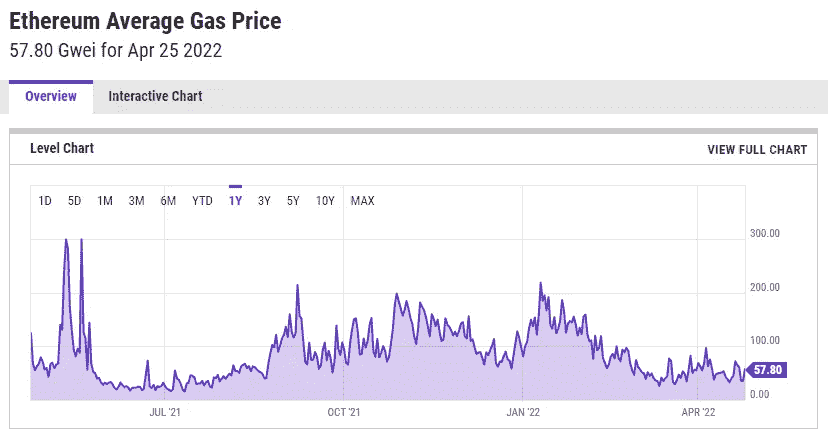
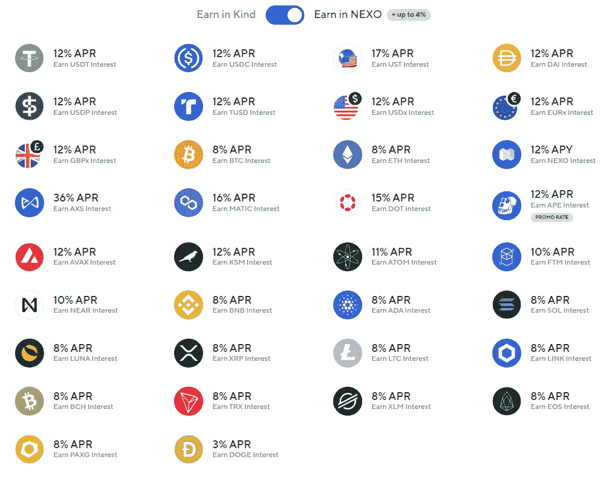
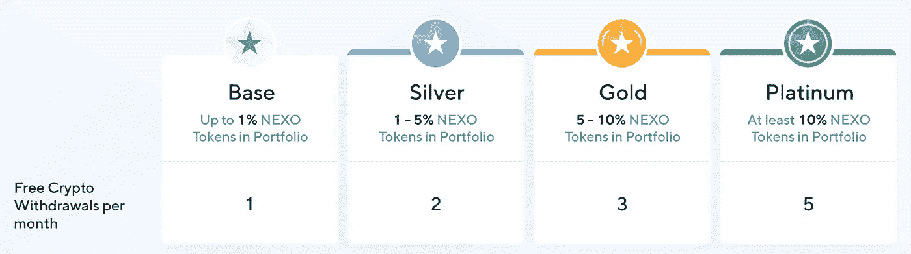
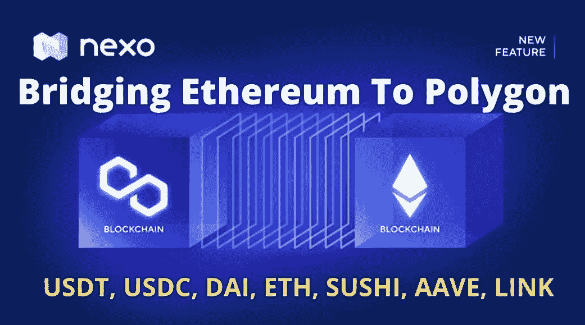
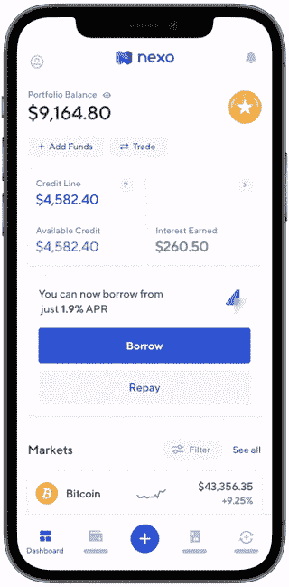
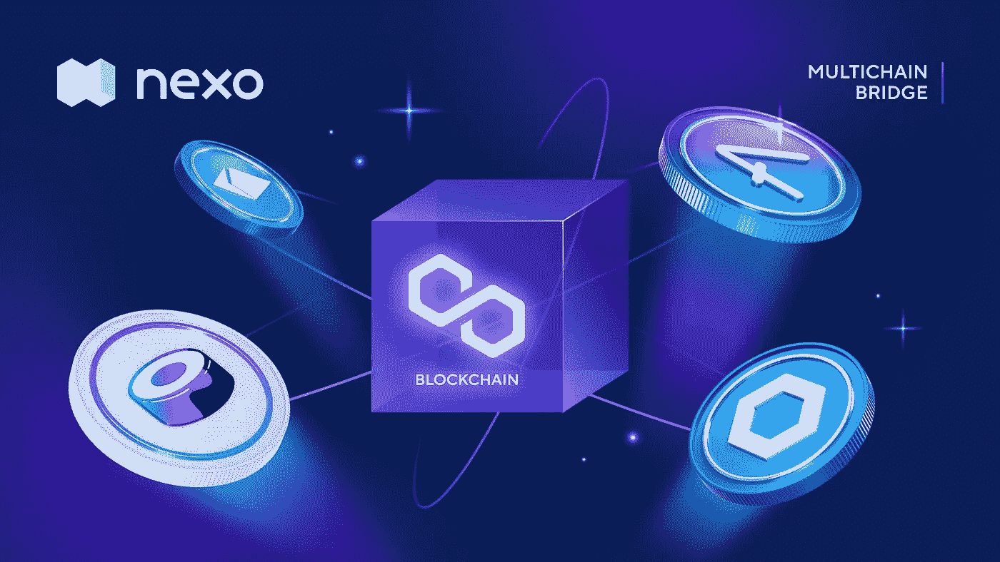

# 以太坊到多边形的桥梁:Nexo 多链桥

> 原文：<https://medium.com/coinmonks/bridging-erc20-matic-the-nexo-multichain-bridge-597ae382bad1?source=collection_archive---------9----------------------->

Image taken from ycharts

G as 费用是成功处理加密货币交易所需的费用。以太币气费，以 gwei (1 gwei = 0.000000001 以太币)表示，一直以来都是出了名的高，有时甚至超过了正在转让的代币的价值！以太坊网络的平均天然气价格目前为 57.8 gwei，低于一年前 300 gwei 的高点。因此，不难看出为什么 Polygon 网络将自己呈现为以太坊的一个有吸引力的替代方案，考虑到它建立在相同的网络上，并且除了高昂的汽油费之外，以太坊区块链上的几乎所有东西都允许用户以非常低的交易费存储、转移和使用他们喜爱的以太坊令牌。还有一个问题——我们如何利用多边形网络的低廉费用进行以太币交易？

# 为什么选择 Nexo？介绍

N 自 2017 年初以来， [Nexo](https://nexo.io/ref/hce5cfdt5o?src=web-link) 已经在加密货币行业建立了稳固的声誉，包括 BitGo 和 Ledger Vault 在内的安全提供商为其数字资产提供了 3.75 亿美元的保险保护；定期实时安全审计；以及它的军用级存储。事实上，Nexo 是我最喜欢的数字钱包，可以安全而有利可图地存放我闲置的加密货币，因为所有数字资产每天都会支付诱人的利率。

# Nexo 上的免费提款

鉴于高昂的 ETH gas 费用，免费取款对于任何加密货币平台来说都是一个受欢迎的功能— [Nexo](https://nexo.io/ref/hce5cfdt5o?src=web-link) 也不例外。根据持有 NEXO Token 的比例以及忠诚度等级，用户有权获得 1 至 5 次完全免费的每月加密提款，如下所示。

除了跨钱包转账，Nexo 账户之间的转账始终免费。在 Nexo 上的免费提款确实是对飞涨的 ETH 汽油费的一种解脱，我也因此节省了一大笔钱。

# Nexo 多链桥:蛋糕上的樱桃

R 近日， [Nexo](https://nexo.io/ref/hce5cfdt5o?src=web-link) 宣布于 2022 年 1 月下旬成功整合 Polygon 网络，随后 Nexo 多链桥上线，零费用弥合以太坊与 Polygon 之间的鸿沟！如此一来，**以太坊(ETH)、Chainlink (LINK)、Aave()、SushiSwap (SUSHI)、** **MATIC、、和戴等支持的代币，现在都可以通过 Polygon 网络轻松地在 Nexo 之间来回传输了！**最棒的是，**通过 Polygon 网络从 Nexo 提款是免费的**，与忠诚度等级无关！

因此，Nexo 多链电桥开启了一系列激动人心的可能性和应用:

*   将 ERC20 令牌从以太坊转移到 Polygon，不收取任何桥接服务费用。
*   以低廉的费用将多边形、和戴存入您在 Nexo 上的多边形地址！
*   从 Nexo 将 Polygon、、戴撤回到您在其他地方的 Polygon 地址，完全免费！

# 如何在 Nexo 上通过多边形网络存放资产？

在仪表板中，选择支持的加密货币，点击充值，然后选择多边形网络，随后将显示 MATIC 存款地址。

# 最后的想法

N **exo 是一个安全的数字平台，可以安全地存储和增长您的加密货币。**我最喜欢的 Nexo 功能之一是免费取款(Nexo 每月提供分级免费取款；以及对其他 Nexo 用户的免费无限制提款，最近是通过 Polygon 网络)；最近，Nexo 多链桥进一步增加了这笔交易的吸引力，它增加了不同区块链之间的互操作性，并提高了不同网络之间移动令牌的灵活性。我喜欢使用 Nexo 还有很多其他原因——点击这里查看我以前的文章[。你有什么想法？欢迎在下面的部分留下你的评论！](/coinmonks/reasons-why-i-love-using-nexo-522527e05eb2)

**如果您想注册 Nexo，您可以使用我的链接** [**此处**](https://nexo.io/ref/hce5cfdt5o?src=web-link) **获取在 BTC 支付的 25 美元注册奖金，在任何支持资产中存入 100 美元的合格存款，持有一个月。**快乐收益！

*本文使用的一些材料取自 Nexo 官方网站和博客。*

和往常一样，这不是财务建议！而只是我投资过的，觉得值得分享的投资平台。在投资前做好自己的研究，不要存你输不起的钱。下面有什么问题可以随时问我。

*如果您喜欢这篇文章，* [*关注&订阅*](/@cybery) *！*

*查看以下值得信赖的平台！*

*🎁*[*honey gain*](https://r.honeygain.me/CYBER577DD)*一款被动收入 app，从你未使用的互联网带宽中赚钱。* [*免费获得 5 美元*](https://r.honeygain.me/CYBER577DD) *，无需投资。*

*🎁* [*蛋糕 Defi*](https://cakedefi.com/?ref=677920) *一站式投资平台，以高达 200%的年利率烘焙被动现金流！* [*在 DFI 用 50 美元存款获得 30 美元*](https://cakedefi.com/?ref=677920) *。*

*🎁*[*Nexo*](https://nexo.io/ref/hce5cfdt5o?src=web-link)*全球最先进、受监管的数字资产机构，在 200 多个司法管辖区提供 40 多种法定货币的即时加密贷款、每日资产收益、交换和服务。* [*用 100 美元存款获得 25 美元*](https://nexo.io/ref/hce5cfdt5o?src=web-link) *。*

*🎁* [*摄氏度*](https://celsiusnetwork.app.link/174094633e) *一个金融科技平台，提供带息储蓄账户、借贷，以及用数字和法定资产进行支付。* [*在 BTC 拿 50 美元*](https://celsiusnetwork.app.link/174094633e) *拿 400 美元存款。*

*🎁*[*Hodlnaut*](https://www.hodlnaut.com/join/RTbHxuJMX)*一个稳健的新加坡加密借贷平台，成立于 2019 年，从你闲置的加密货币中产生被动现金流。* [*拿 30 美元*](https://www.hodlnaut.com/join/RTbHxuJMX) *在 USDC 存 1000 美元。*

*🎁*[*cabial*](https://invite.cabital.com/7P3UFW)*赚取高达 12%的加密利率，无需疯狂。*

*🎁*[*block fi*](https://blockfi.com/?ref=a16e37fd)*一种加密货币交易所和钱包。* [*用 100 美元存款得到 10 美元*](https://blockfi.com/?ref=a16e37fd) *。*

*🎁* [*库币*](https://www.kucoin.com/r/af/rJH29LZ) *最大的加密货币交易所之一。*

*🎁***最大的加密货币交易所之一。**

**🎁*[*MEXC*](https://m.mexc.com/auth/signup?inviteCode=1NAJC)*最大的加密货币交易所之一。**

**🎁*[*Crypto.com*](https://read.cash/@TraderFX/10-tips-to-maximize-earnings-on-honeygain-an-effortless-free-passive-income-app-68535728#bad-link)*一款基于新加坡的加密货币兑换 app。* [*得到 25 美元*](https://crypto.com/app/fcbsjmf5pb) *在 CRO 赌一张红宝石牌。**

**针对马来西亚投资者**

**🎁* [*斯塔沙威*](https://www.stashaway.my/referrals/kenleel9jx) *获得 6 个月免费投资！**

**🎁Wahed code 'KENLIE1' RM10 注册奖金**

**🎁Capbay P2P 代码' 8879c6' RM100 注册奖金**

**连接我* [*中*](https://cybery.medium.com/)*|*[*read . cash*](https://read.cash/r/TraderFX)*|*[*Youtube*](https://www.youtube.com/c/SmartInvestingChannel)*|*[*Twitter*](https://twitter.com/cybertraderfx)*|*[*Linktree*](https://linktr.ee/trader.fx)*

> *加入 Coinmonks [电报频道](https://t.me/coincodecap)和 [Youtube 频道](https://www.youtube.com/c/coinmonks/videos)了解加密交易和投资*

# *另外，阅读*

*   *[最佳密码交换平台](https://coincodecap.com/best-crypto-swap-platforms) | [最佳密码交易所](https://coincodecap.com/crypto-exchange)*
*   *[购买比特币印度](/coinmonks/buy-bitcoin-in-india-feb50ddfef94) | [Pionex 评论](/coinmonks/pionex-review-exchange-with-crypto-trading-bot-1e459d0191ea) | [加密交易机器人](/coinmonks/crypto-trading-bot-c2ffce8acb2a)*
*   *[n rave ZERO Review](/coinmonks/ngrave-zero-review-c465cf8307fc)|[phe MEX Review](/coinmonks/phemex-review-4cfba0b49e28)|[PrimeXBT Review](/coinmonks/primexbt-review-88e0815be858)*
*   *最佳[区块链分析](https://bitquery.io/blog/best-blockchain-analysis-tools-and-software)工具| [赚比特币](/coinmonks/earn-bitcoin-6e8bd3c592d9)*
*   *[Cloudbet 赌场评论](https://coincodecap.com/cloudbet-casino-review) | [点火赌场评论](https://coincodecap.com/ignition-casino-review)*
*   *[加密套利](/coinmonks/crypto-arbitrage-guide-how-to-make-money-as-a-beginner-62bfe5c868f6)指南| [如何做空比特币](/coinmonks/how-to-short-bitcoin-568a2d0b4ae5)*