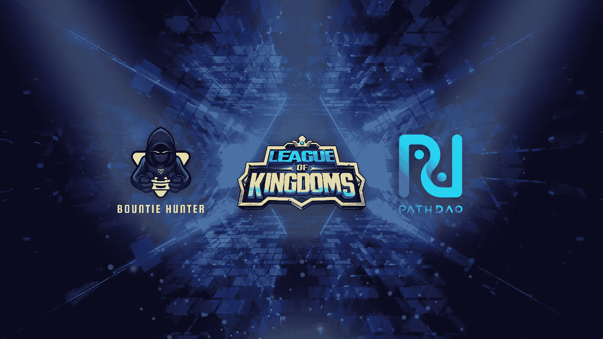

# 从《王国联盟》开始，将印度尼西亚玩家带到元宇宙

> 原文：<https://medium.com/coinmonks/bringing-indonesian-gamers-to-the-metaverse-starting-with-league-of-kingdoms-c8af205ba95e?source=collection_archive---------12----------------------->

**雅加达，2022 年 4 月 2 日** — [PathDAO](https://www.pathdao.io/) 和 [Bountie Hunter](https://bountiehunter.io/) 宣布建立战略合作伙伴关系，整合两家公司的专业知识，旨在将数百万印度尼西亚游戏玩家带入元宇宙游戏世界。这一合作有助于 PathDAO 实现为 web3 带来数百万用户的使命。'

*“在 web3 游戏世界中，玩家可以尽情娱乐、社交、赚取额外收入并真正拥有资产。PathDAO 和 Bountie 非常高兴能够携手合作，将 web3 游戏的魅力带给印度尼西亚的游戏玩家。”*

玩赚加密游戏，也称为 Web3 游戏，在 2021 年取得了显著的增长，随着游戏玩家的范式转变，他们被吸引到为他们在游戏中花费的时间提供财务奖励的游戏上。《王国联盟》( LoK)就是这样一款免费游戏，已经有成千上万的玩家选择了这款游戏。

《王国联盟》是世界上第一款大型多人(MMO)战略游戏，以建立王国和统治世界为中心。在这里，玩家可以建立一个强大的王国和军队，建立联盟，与他人竞争，并在整个区块链交易数字资产。作为一款复杂的 MMORTS 游戏，该游戏旨在为游戏玩家提供一站式服务，让他们享受各种游戏模式，如 PvP、PvE、MMO、P2E 以及其他许多游戏玩家可以想象的模式。

这些土地是独特的 NFT，透明且可验证地存储在区块链网络上，因此玩家可以自由拥有和交易。玩家不仅可以拥有一块土地，还可以拥有其中的各种资源，以及游戏平台未来的成长。此外，在未来，玩家将有机会拥有一套新的 NFT，如超级稀有皮肤，龙一样的宠物，等等。

*“我们非常高兴 PathDAO 成为我们的战略投资者和合作伙伴，共同推动 crypto 和 web3 的主流应用。加上他们投资的 LOK 等游戏，我们相信印度尼西亚的游戏玩家会成群结队地加入进来，就像菲律宾游戏玩家对 Axie Infinity 的态度一样。*【Lex Na，赏金猎人 CEO】

作为合作声明的一部分，PathDAO 和 Bountie Hunter 将在印尼举办一场王国联盟(LoK)玩家招募和激活活动。下载并在 PathDAO 游戏社区 PathGuild 注册 LoK 帐户的前 600 名玩家将有资格获得总价值为 **$15，000** 的 LoK 不可替换代币(NFTs)赠品。该赠品仅提供给注册的印度尼西亚 LoK 玩家，请点击以下[链接](https://play.gamestreet.io/?signup=true)注册成为首批 600 名玩家的一员。

**关于 PathDAO**

PathDAO 是一个社区第一、去中心化的自治组织(DAO)，在不断增长的区块链元宇宙(游戏+社交+ NFTs)中为投资者和玩家创造价值

**关于赏金猎人**

Bountie Hunter 是一个为游戏玩家提供发现和投资加密游戏和元宇宙项目的策划市场。我们帮助玩家找到下一个游戏和元宇宙宝石，并组织任务。供我们的游戏玩家社区玩和赚取！

**关于王国联盟**

《王国联盟》是一款大型多人(MMO)战略游戏，以建立王国和统治世界为中心。在这里，玩家可以建立一个强大的王国和军队，建立联盟，与他人竞争，并在整个区块链交易数字资产。

这些土地被透明地、可验证地存储在区块链网络上，因此玩家可以自由地拥有和交易。玩家不仅可以拥有一块土地，还可以拥有其中的各种资源，以及游戏平台未来的成长。

🌐 [**网站**](https://www.leagueofkingdoms.com/) **|** 🚜 [**陆地门户**](http://land.leagueofkingdoms.com/) **|** 👾 [**不和谐**](https://discord.gg/leagueofkingdoms) **|** 💬 [**电报**](https://t.me/LoK_global) **|** 🐦 [**推特**](https://twitter.com/LeagueKingdoms) **|** 🍏 [**应用商店**](https://apps.apple.com/us/app/league-of-kingdoms/id1523441842) **|** 🤖[**Google play**](https://play.google.com/store/apps/details?id=com.nplusent.lok)**|**🕸️[**web**](https://play.leagueofkingdoms.com/)

**关于王国联盟竞技场(LOKA)**

王国联盟竞技场(LOKA)是王国联盟的本地治理令牌，将成为游戏项目扩展到 metaverses 的基石，在 metaverses 中，游戏玩家可以拥有并蓬勃发展。

洛卡将作为王国联盟游戏特许经营中的货币，用于所有游戏商店购买，如购买包、皮肤、商品。此外，洛卡令牌将作为一个 NFT 助推器，以创建，升级和收购特殊的 NFT 资产，包括但不限于德拉戈和皮肤 NFT。令牌还将用于提议和投票链上的治理提议，以确定游戏的未来特征、策略、内容和/或参数。最后但并非最不重要的是，还可以通过玩游戏内的比赛和/或完成特殊任务来获得洛卡代币——例如，在每次大陆对大陆(CvC)战斗后，获胜者将根据战斗中的表现获得洛卡代币(以及可能更稀有的 NFT 物品奖励)。

🌐 [**网站**](https://leagueofkingdoms.com/lok) **|** 📈****|**📜 [**白皮书**](https://whitepaper.playersarena.foundation/loka/)**

****媒体联系:****

**联系人:**

**电话:+62 82111484075**

**电子邮件:savara@bountie.io**

**网址:bountiehunter.io**

> **加入 Coinmonks [电报频道](https://t.me/coincodecap)和 [Youtube 频道](https://www.youtube.com/c/coinmonks/videos)了解加密交易和投资**

# **另外，阅读**

*   **[用于 Huobi 的加密交易信号](https://coincodecap.com/huobi-crypto-trading-signals) | [Swapzone 审查](/coinmonks/swapzone-review-crypto-exchange-data-aggregator-e0ad78e55ed7)**
*   **最佳[密码交易机器人](https://coincodecap.com/best-crypto-trading-bots) | [购买索拉纳](https://coincodecap.com/buy-solana) | [矩阵导出评论](https://coincodecap.com/matrixport-review)**
*   **[Coldcard 评论](https://coincodecap.com/coldcard-review) | [BOXtradEX 评论](https://coincodecap.com/boxtradex-review)|[unis WAP 指南](https://coincodecap.com/uniswap)**
*   **[比特币基地评论](/coinmonks/coinbase-review-6ef4e0f56064) | [德里比特评论](/coinmonks/deribit-review-options-fees-apis-and-testnet-2ca16c4bbdb2) | [FTX 评论](/coinmonks/ftx-crypto-exchange-review-53664ac1198f)**
*   **[联合国硬币评论](https://coincodecap.com/unocoin-review) | [最佳加密赌注硬币](https://coincodecap.com/best-crypto-staking-coins)**
*   **[如何使用 MetaMask Wallet 获得 KCC 地址？](https://coincodecap.com/kcc-address-metamask)**