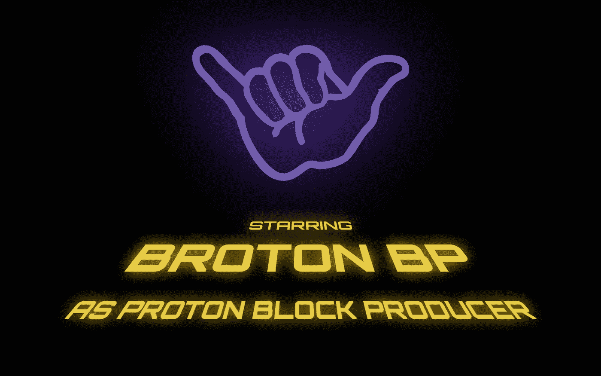

# 布罗顿杂志:简介

> 原文：<https://medium.com/coinmonks/broton-journal-introduction-a7e81f235c2c?source=collection_archive---------48----------------------->

## 质子区块链一个街区制作人的现场笔记

嗨，亲爱的读者！

我们是 Broton BP 公司——T2 质子区块链号的制作人。在这里，我们保持我们的日志，在那里我们将告诉你我们的进展和计划，成功，和我们的块生产者的道路上的困难。我们的目标是对投票给我们的人公开透明。当然，我们将继续以一切可能的方式推广宝腾。

> 知道道路和走在道路上是有区别的。莫斐斯。

# 我们的背景故事

## 为什么是质子？⚛️

从去年春天开始，我就开始关注宝腾，并投资了一些钱。这似乎是一个非常有前景的项目，以下是一些原因:

*   质子是一个独立的区块链，就像比特币、以太坊、索拉纳等。因此，这不仅仅是一个项目，而是一个建造 dApps 的完整生态系统，它可能是巨大的。
*   它很快——每秒超过 4000 次诚实交易，而且这还不是极限。比如以太坊每秒可以做 15 笔交易。Solana 声明 65，000 TPS，但据 [SolanaFM](https://solana.fm/statistics) 称，所有交易中超过 90%是所谓的“投票”和其他“系统”交易，这些交易不是由真实用户发起的。
*   宝腾没有汽油费，所有交易对最终用户都是免费的。宝腾使用基于 EOSIO 技术的 DPoS(授权股权证明)共识模型(不是 EOS fork！)，其中使用了“资源”的概念。但 Proton 的方法与大多数 EOSIO 网络不同——在 Proton 中，开发者必须为他们的应用购买资源。因此，所有交易对最终用户都是免费的。
*   Proton 实现了一种签名请求机制，允许应用程序将身份验证请求直接发送到客户端钱包，这使得加密支付变得前所未有的简单。
*   宝腾拥有一支背景深厚的专业团队，隶属于美国公司 Metallicus Inc,[金属支付](https://metalpay.com/about)产品的开发商。Metal Pay 成立于 2017 年，其本土代币 MTL 在包括币安在内的最受欢迎的交易所交易。
*   宝腾强调未来对加密货币的监管，因为团队知道这是不可避免的，所以宝腾在这种情况下会做得很好。宝腾开发了独特的 [KYC/KYB 链上验证系统](https://protonkyc.com)，允许在区块链直接存储用户验证状态。战略合作伙伴提供了一个验证机制，并确保所有敏感数据的安全。想象一下——一旦你通过了 KYC，你就可以与区块链上运行的任何应用程序交互，而无需再次验证。太棒了！
*   一年前，Proton 已经推出了面向 iOS 和 Android 的移动钱包，这是我用过的最方便的加密钱包。最近，它被完全重写和重新命名，现在被称为[WebAuth.com 钱包](https://www.protonchain.com/wallet)，因为它不仅仅是一个加密钱包，而且是对任何资源进行简单而安全授权的标准——你可以在这里[阅读更多关于它的信息](https://blog.protonchain.com/meet-webauth/)。
*   宝腾正积极围绕其区块链: [NFT 市场](https://www.protonmarket.com)，DeFi 应用 [Proton Swap](https://protonswap.com) (DEX，Yield Farms)等，以及最近发布的贷款平台 [Proton Loan](https://protonloan.com) ，开发生态系统，推出仅两个月就锁定了逾 2500 万美元的价值！

一般来说，Proton 的首要任务就是让所有人都能使用加密货币，这样人们就可以开始在日常生活中使用它了。它是免费的、快速的、安全的、易于使用的。你还能梦见什么？😍

我希望这些要点足以让我开始喜欢 Proton，因为我可以继续无限地谈论它…:)

## 关于我们🤙

BROTON BP 是一个由 IT 专业人员组成的小型团队，在产品开发、市场营销和服务器管理方面拥有丰富的经验。我们在大公司工作过，也参与过初创公司。我们从 2017 年就开始参与数字加密货币的交易，我们相信区块链是过去十年发生在人类身上的主要事件。

我的名字是罗曼，我是 BROTON BP 的创始人。如前所述，我在去年一直和 Proton 保持联系。说实话，这是我第一次如此深入地研究数字加密项目和加密社区。和其他很多制造噪音很大但又没有实用产品的加密货币项目不同，宝腾的情况正好相反——他们制造的东西很酷，而且并不打算大肆宣传。这就是我喜欢它的原因。

我的经验告诉我，最好的投资策略是专注于自己相信的事情，并保持耐心。当你在追逐泵币时，你会得到大量的拥挤和最小的收益。所以，这次我选择相信自己的直觉。

2021 年 11 月，我意识到我不想只是一个被动的观众，因为我觉得我可以为质子社区的发展做更多的事情。我就是这样决定成为一名街区制作人的。💡

首先，我意识到我需要一个很酷的名字。没过多久——我就想出了“BROTON BP”。什么是“Broton”？如果你看过质子聊天，你可能已经知道了；如果不是——有一个简单的答案给你:“Bro”+“质子”=“Broton”。这个词诞生于社区，包括我在内的许多人在交谈中使用它。在我看来，它象征着质子社区人民的团结和统一——我们都团结在这个项目周围。此外，这个词强调了社区中的友好气氛。

下一步，我必须召集一支队伍。我需要一个服务器管理方面的专家，因为这不是我最强的一面，也需要一个设计师来帮助创建一个标志和品牌。由于在 IT 行业工作多年，我与各个领域的专业人士都有联系。所以，我们的小团队准备好了，我们可以继续前进了！

***下次我们会告诉你在 Proton 上推出 block producer 的技术和组织细节。*⏭**

要了解更多关于质子和不要错过重要的更新，我们建议你:

*   跟随我们的媒体页面
*   [在推特上关注我们](https://twitter.com/brotonbp)
*   加入我们的电报组

此外，你可以在我们的网站上看到[入门指南](https://brotonbp.com/guide)来快速浏览宝腾。

> 加入 Coinmonks [电报频道](https://t.me/coincodecap)和 [Youtube 频道](https://www.youtube.com/c/coinmonks/videos)了解加密交易和投资

# 另外，阅读

*   [ProfitFarmers 点评](https://coincodecap.com/profitfarmers-review) | [如何使用 Cornix Trading Bot](https://coincodecap.com/cornix-trading-bot)
*   [如何匿名购买比特币](https://coincodecap.com/buy-bitcoin-anonymously) | [比特币现金钱包](https://coincodecap.com/bitcoin-cash-wallets)
*   [瓦济里克斯 NFT 评论](https://coincodecap.com/wazirx-nft-review) | [比茨盖普 vs 皮奥克斯](https://coincodecap.com/bitsgap-vs-pionex) | [坦吉姆评论](https://coincodecap.com/tangem-wallet-review)
*   [如何使用 Solidity 在以太坊上创建 DApp？](https://coincodecap.com/create-a-dapp-on-ethereum-using-solidity)
*   [币安 vs FTX](https://coincodecap.com/binance-vs-ftx) | [最佳(SOL)索拉纳钱包](https://coincodecap.com/solana-wallets)