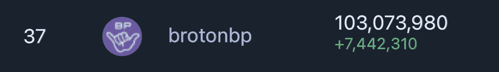

# broton Journal:mainnet 上的月份

> 原文：<https://medium.com/coinmonks/broton-journal-month-on-mainnet-36c0516eb663?source=collection_archive---------53----------------------->

## 质子区块链一个街区制作人的现场笔记

4 月 9 日，我们在 mainnet 上注册 BROTON BP 已经一个月了。我们想告诉你在此期间我们做了些什么，以及我们取得了哪些成果。

正如我之前所写的，我们成为街区制作人的工作始于 2021 年 11 月，所以我会告诉你从那一刻起所做的所有工作。

> *知道&走道是有区别的。莫斐斯。*

# 网站

首先，我们必须创建一个网站，展示我们作为一个区块生产者，并填充内容。从一开始，我们就决定做一个内容丰富的网站，而不仅仅是一个有基本信息的登陆页面。

这是我们的网站:【brotonbp.com 🌐

## 博客

我们需要一个博客来写关于宝腾及其服务的有益文章和手册。

目前，我们已经编写了三个手册:

*   [如何购买 XPR？](https://brotonbp.com/tpost/7f2x427z01-how-to-buy-xpr)
*   [如何入股 XPR，投票给区块制作人？](https://brotonbp.com/tpost/hsby5x3901-how-to-stake-xpr-and-vote-for-block-prod)
*   [高产养殖](https://brotonbp.com/tpost/hovxav1i31-yield-farming)

虽然有官方的质子手册，我们试图使我们的更详细，并在一个地方收集所有可用的信息。

未来，我们计划增加更多的新文章，包括一篇关于质子贷款的文章，这是质子团队在年初推出的一个新的贷款平台。我们认为这个话题值得特别关注。

## 信息图表

我经常在官方质子电报组看到关于打桩和耕作的问题，比如:

*   怎么押/拆？
*   我的资金会被锁定多久？
*   什么是 APR？
*   有什么风险？
*   什么是无常的失去？
*   什么更好:赌博还是耕作？

诸如此类…

为了以简单直观的方式回答所有这些问题，我们想出了创建“与 Broton 一起学习 ProFi”系列信息图的主意，这些信息图是关于 Proton 的 DeFi 特性的:

*   [质子打桩](https://brotonbp.com/infographics/stake)
*   [质子农业](https://brotonbp.com/infographics/farms)

到目前为止，这些是我们在 Twitter 上最喜欢和转发的帖子——210 个喜欢和 87 个转发！感谢马歇尔·海纳😁

我们看到这样的内容受到了社区的欢迎，但是，事实上，我们不知道如何让每个新人都可以访问它。当我们的社区足够大时，传递信息会容易得多。目前，信息图表可以在我们的网站上找到。

## 基于质子建造

在质子之后的这段时间里，我们发现了几个基于它的项目。大部分都处于积极发展阶段。遗憾的是，很多人并不了解这些项目。

我们认为质子的采用必须吸引更多的开发者，让更多的人使用 dApps。所以我们想出了在我们的网站上收集所有这些项目的想法，以帮助人们轻松地探索它们。

我们可以只写项目，但我们选择了一种更复杂的方式——我们希望了解团队，并了解他们对所构建产品的愿景。

到目前为止，我们已经与项目团队一起创建了以下页面:

*   [Slamchain (Slam。陆地)](https://brotonbp.com/built-on-proton/slamchain)
*   [狙击硬币](https://brotonbp.com/built-on-proton/snipcoins)
*   [Freeos](https://brotonbp.com/built-on-proton/freeos)
*   [不久。市场](https://brotonbp.com/built-on-proton/soonmarket)
*   [Storex](https://brotonbp.com/built-on-proton/storex)

还有几页正在制作中。因为通讯的原因，它没有那么快。但我们相信，一些新项目将很快加入我们的收藏。嗨托马斯！😉

对了，都是很可爱的人！和他们打交道是一种乐趣！

## 布罗顿指南

[本页](https://brotonbp.com/guide)是宝腾新人(不仅仅是新人)学习其基础知识的简单途径:

*   质子产品和代币。
*   官方和非官方信息来源，如团体和社交媒体账户。
*   去哪里拿手机钱包。
*   如何购买和股份$XPR？

此外，该指南描述了几个有价值的行动，你可以完成，以帮助促进质子。

# BrotonRookieBot

我们开发了 Broton guide 的互动版本 BrotonRookie 电报机器人。

 [## BrotonRookie

### 我会让你成为真正的兄弟

t.me](https://t.me/BrotonRookieBot) 

在这个机器人的帮助下，人们可以一步一步地交互式地快速完成所有的指导步骤。

此外，作为奖励，这个机器人使每个为 BROTON BP 投票的人都能获得一个免费的 3D Broton 徽章，我们计划在未来的活动中使用。🤙

BTW，Broton 会徽是我和 Blender 相识的果实。😂

 [## Broton 徽章细节- glbdex

### Broton by brotonbp

glbdex.com](https://glbdex.com/512332545531/41620) 

# 质子鲸警报

区块链是为了透明而生的，但尽管如此，在成吨的数据中找到有价值的信息可能并不那么容易。这就是为什么我们创建了*质子鲸警报*频道，以突出质子区块链上的大量转移。

 [## 质子鲸警报

### 关于⚛️质子区块链号上重大转移的通知🐋🚨由 BROTON BP 创建🤙@brotonbpgroup 如果你…

t.me](https://t.me/ProtonWhalesAlert) 

我们的 bot 在这个频道上发布的每一笔转账都高于以美元结算的阈值——目前为 1 万美元，但我们已经看到，由于发布过于频繁，这个阈值应该会更高。

社区赞赏质子鲸警报频道的优点——经过几天的工作，它已经有 120 个订户了！💪

# 社交网络

我们试图在 Twitter 和 Telegram 上保持活跃，并扩大我们的受众。

到目前为止，我们已经:

*   在[推特](https://twitter.com/brotonbp)上有 318 名关注者
*   [我们电报组](https://t.me/brotonbpgroup)的 25 名成员
*   媒体上有 2 名追随者😂(在质子社区中非常受欢迎的媒体)

我们已经锁定了这条推文，直到$XPR 的价格达到 10 美分！你觉得它能获得 500+赞吗？😁

# 全部的

让我们总结一下自 BP 推出以来所做的工作:

✅网站

✅博客有三个手册

✅两个信息图:打桩和农业

✅·布罗顿指南

✅ BrotonRookie 电报机器人

✅质子鲸警报频道

✅社交媒体活动

✅，别忘了我们在媒体上 Broton 杂志🤙

# 布罗顿等级

经过一个多月的工作，我们达到了令人印象深刻的 1 亿张选票的里程碑——确切地说是 103，073，980 张！🎉

我们想对所有投票给我们的人说声谢谢！我们将尽最大努力继续为质子生态系统和社区做出贡献！

要了解更多关于质子和不要错过重要的更新，我们建议你:

*   跟随我们的媒体页面
*   [在 Twitter 上关注我们](https://twitter.com/brotonbp)
*   加入我们的电报组

另外，你可以在我们的网站上看到入门指南[来快速浏览宝腾。](https://brotonbp.com/guide)

> 加入 Coinmonks [电报频道](https://t.me/coincodecap)和 [Youtube 频道](https://www.youtube.com/c/coinmonks/videos)了解加密交易和投资

# 另外，阅读

*   [最好的卡达诺钱包](https://coincodecap.com/best-cardano-wallets) | [Bingbon 副本交易](https://coincodecap.com/bingbon-copy-trading)
*   [印度最佳 P2P 加密交易所](https://coincodecap.com/p2p-crypto-exchanges-in-india) | [柴犬钱包](https://coincodecap.com/baby-shiba-inu-wallets)
*   [8 大加密联盟项目](https://coincodecap.com/crypto-affiliate-programs) | [eToro vs 比特币基地](https://coincodecap.com/etoro-vs-coinbase)
*   [最佳以太坊钱包](https://coincodecap.com/best-ethereum-wallets) | [电报上的加密货币机器人](https://coincodecap.com/telegram-crypto-bots)
*   [交易杠杆代币的最佳交易所](https://coincodecap.com/leveraged-token-exchanges) | [购买 Floki](https://coincodecap.com/buy-floki-inu-token)