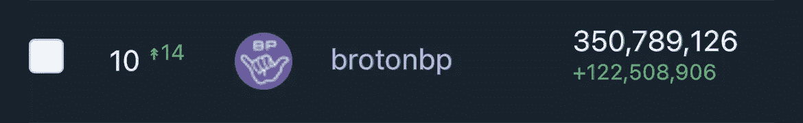

# Broton Journal:在 mainnet 上的三个月

> 原文：<https://medium.com/coinmonks/broton-journal-three-months-on-mainnet-737bf9e73e76?source=collection_archive---------34----------------------->

## 质子区块链一个街区制作人的现场笔记

嘿，亲爱的兄弟们！时间过得真快——自从我们在 mainnet 上发布以来已经三个月了！上次更新是两个月前，是时候盘点一下了。

> 知道道路和走在道路上是有区别的。莫斐斯。

# ⚛️原鲸警报的更新🐋🚨

质子社区非常喜欢这项服务，因为它使区块链更加透明。现在任何人都可以很容易地观察到资金沿着链条的大量移动，分析数据并得出自己的结论。

 [## 质子鲸警报

### 关于⚛️质子区块链号上重大转移的通知🐋🚨由 BROTON BP 创建🤙@brotonbpgroup 如果你…

t.me](https://t.me/ProtonWhalesAlert) 

我们做了一些有用的更新:

*   改进的邮件格式—现在它们更易于阅读，并且不包含不必要的数据。
*   直接链接到发件人/收件人帐户名称，以便更轻松、更快速地导航。
*   交易类型的指示:转让、质子互换(添加/移除流动性、交换)、质子贷款(存款、赎回、偿还)、过桥(存款/提款)、赌注(赌注/未赌注、长期赌注支出)。
*   所有已知账户的唯一标签:🔄交易所，⚛️公司(Metallicus)、👤团队成员。

此外，我们将最低交易门槛从 1 万美元提高到 2 万美元，以降低通知频率。

在撰写本文时，**质子鲸警报**频道有 **217 个订户**！我们很高兴你喜欢它！❤️

# 我们网站的更新—brotonbp.com

我们已经更新和重新组织了我们网站上的信息，使其更加结构化和易于访问。

## 主页🤙

主页现在包含我们的块生产者的全部信息。在这里，您可以了解我们的使命、我们提供的服务和基础设施、我们社交网络的链接以及我们创建的内容。

 [## 布罗顿 BP

### 我们是 Broton BP，一个由 IT 专业人员组成的小团队，在 web 和移动开发、服务器等领域拥有 15 年以上的经验

brotonbp.com](https://brotonbp.com) 

## 质子页⚛️

现在我们的网站上有一个专门介绍宝腾的独立页面。在这里，您可以找到一个简短但内容丰富的 Proton 之旅，其中包括它的优势、服务和特性、第三方项目以及面向开发人员的链接。此外，还有到我们的 [Broton 指南](https://brotonbp.com/guide)的链接，它将帮助您跟踪更新，执行一些推广 Proton 的操作，甚至获得一个免费的 NFT。

 [## 质子

### 人的区块链。闪电般的速度- 4，000 TPS，人类可读的帐户名，无油费，原生移动钱包…

brotonbp.com](https://brotonbp.com/proton) 

## 建立在质子🛠上

另一个伟大的项目被添加到我们的[质子](https://brotonbp.com/built-on-proton)部分——像素英雄**游戏和 NFT 收集。**

我们很久以前就开始了对《像素英雄》的创作者托马斯的采访，但直到最近才得以完成。

 [## 像素英雄

### 我第一次爱上质子是从定义和技术的角度。当我探索生态系统时，我尝试…

brotonbp.com](https://brotonbp.com/built-on-proton/pixelheroes) 

# 质子统计信息📊

这是我们的新资源，在这里你可以找到有趣的质子指示器，显示在动力学中。我们每天收集数据，并以图形方式显示出来。

 [## 质子链统计

### 使用可演示的图表跟踪动力学中的质子链指标，并查看您最喜爱的区块链如何增长。

质子统计信息](https://protonstat.info/) 

此刻，我们将信将疑:

*   按天数统计的总账号和新账号。
*   按天计算的 XPR/贷款/XMT 持有人(到目前为止，只有流动余额)。
*   区块生产者的统计:按 BPs 划分的投票总数和投票人数，按投票人账户类型划分的投票分段。

未来，我们计划开发新的功能(如过滤器、排序等)并添加新数据。

我们还创建了 **ProtonStat** 电报频道，每日发布新账户统计数据:

 [## 质子调节器

### BROTON BP 创建的质子区块链⚛️的关键指标的每日通知🤙@brotonbpgroup

t.me](https://t.me/ProtonStat) 

# 测试智能合约… 🧑‍💻

不久前，Proton 团队为开发者发布了一个更新的门户网站:

 [## 质子智能合同

### 质子智能合同编译到 WASM 的最高性能为 4000 TPS。它与 TypeScript 的相似性使它…

docs.protonchain.com](https://docs.protonchain.com/) 

伴随着全新的文档，一个很酷的特性出现了——使用 AssemblyScript 编写智能合同的能力，它具有熟悉的类型脚本语法。书面智能合同被编入 WASM，以确保最佳性能。

我们从未编写过智能合约，决定尝试一下…因此，我们编写了一个简单的智能合约，它从区块链表中读取数据，执行一些计算，并将结果存储在另一个表中。

你知道吗？它非常简单，工作起来像时钟一样准确！这很棒，因为它允许更多不懂 C++的开发人员在 Proton 上编写智能合同。这是大规模采用的一大步！💪⚛️这在很大程度上要归功于宝腾的首席技术官[赛义德·贾夫里](https://medium.com/u/a910394040f2?source=post_page-----737bf9e73e76--------------------------------)。👏

# 社交网络📢

自从上次更新以来，我们的观众人数增加了。至此，我们已经:

*   在[推特](https://twitter.com/brotonbp)上有 566 名粉丝
*   我们电报组的 44 名成员
*   媒体上有 5 名追随者(仍然是“最”受欢迎的媒体，但这并没有阻止我们🤣)

我们很高兴添加我们的 **Snipcoins** 账户，拥有 88 名粉丝:

 [## 布罗顿 BP

### 社区驱动块生产者对质子⚛️ Broton 日报:https://brotonbp.medium.com brotonrookiebot…

snipcoins.com](https://snipcoins.com/brotonbp) 

我们在平台上还不够活跃，但我们会努力在未来修复它。💪

此外，我们已经在 Twitter 上开始了一系列新的常规帖子，标签为 [#LearnProton](https://mobile.twitter.com/hashtag/LearnProton) 。请务必关注我们，了解更多关于质子的令人兴奋的事实。🧑‍🎓⚛️

# 全部的

让我们总结一下自上次更新以来我们所做的工作:

✅原鲸警报机器人更新🐋

brotonbp.com，✅更新了我们的网站🌐

✅启动了 ProtonStat.info 项目📊

✅将继续支持质子社区# learn 质子🧑‍🎓

✅向🧑‍智能合同发展迈出了第一步💻

# BROTON BP 评级

最后，令人印象深刻的消息！我们已经达到了 BP 道路上的另一个里程碑——我们以 3.5 亿张选票进入了质子区块生产商的前 21 名。这意味着现在我们正在生产积木！🎊🥳🔝21

我们知道这随时都可能改变，因为投票来来去去，但这将被永远记录在质子区块链！💪这就是为什么我们都爱区块链！😄

**我们再次感谢所有投票给我们的人！💜🙏我们感谢你的支持。每一张选票，哪怕是很小的一张，对我们来说都非常重要！**

要了解更多关于质子和不要错过重要的更新，我们建议你:

*   跟随我们的媒体页面
*   [在推特上关注我们](https://twitter.com/brotonbp)
*   [关注我们的 Snipcoins](https://snipcoins.com/brotonbp)
*   加入我们的电报组

另外，你可以在我们的网站上看到入门指南[来快速浏览宝腾。](https://brotonbp.com/guide)

> 加入 Coinmonks [电报频道](https://t.me/coincodecap)和 [Youtube 频道](https://www.youtube.com/c/coinmonks/videos)了解加密交易和投资

# 另外，阅读

*   [如何在 FTX 交易所交易期货](https://coincodecap.com/ftx-futures-trading) | [OKEx vs 币安](https://coincodecap.com/okex-vs-binance)
*   [CoinLoan 评论](https://coincodecap.com/coinloan-review) | [YouHodler 评论](/coinmonks/youhodler-4-easy-ways-to-make-money-98969b9689f2) | [BlockFi 评论](https://coincodecap.com/blockfi-review)
*   XT.COM 评论 | [币安评论](https://coincodecap.com/xt-com-review)
*   [SmithBot 评论](https://coincodecap.com/smithbot-review) | [4 款最佳免费开源交易机器人](https://coincodecap.com/free-open-source-trading-bots)
*   [比特币基地僵尸程序](/coinmonks/coinbase-bots-ac6359e897f3) | [AscendEX 审查](/coinmonks/ascendex-review-53e829cf75fa) | [OKEx 交易僵尸程序](/coinmonks/okex-trading-bots-234920f61e60)