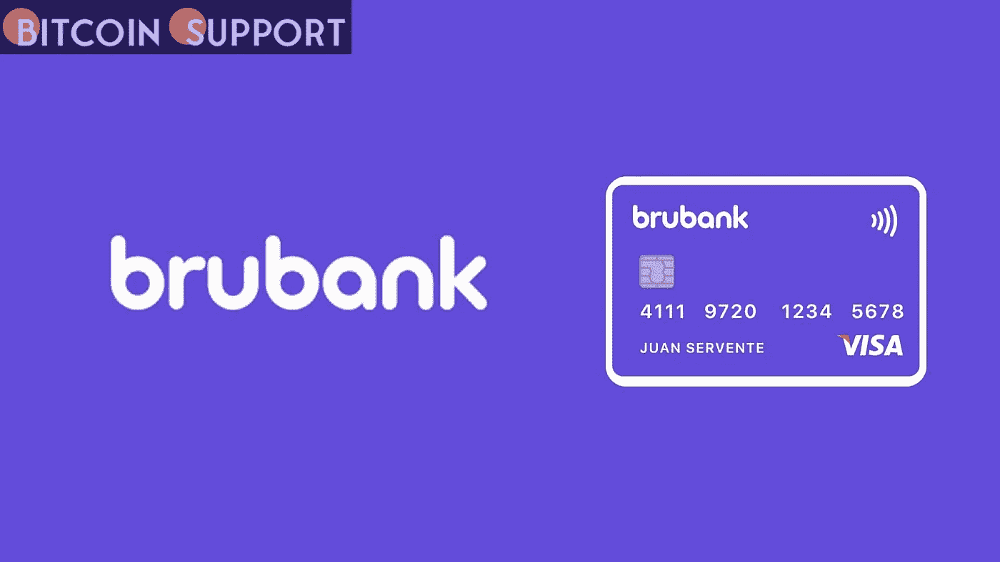

# 阿根廷数字银行 Brubank 宣布，它现在将通过其平台接受加密货币购买

> 原文：<https://medium.com/coinmonks/brubank-an-argentinian-digital-bank-now-accepts-cryptocurrency-purchases-on-its-platform-fa59f839f720?source=collection_archive---------17----------------------->

Brubank 是阿根廷首批获得该国中央银行认可的数字银行之一，已进入加密货币市场。客户现在可以在该公司的应用程序上购买加密资产，允许他们使用该公司的平台进行比特币投资。据报道，这是该国第二家提供这些服务的银行机构。

**Brubank 推出加密货币服务**

在阿根廷的加密爆炸中，私人银行开始意识到为客户提供比特币服务的价值。该国央行已批准全数字金融机构 Brubank 在其应用程序上提供比特币购买服务。当一名消费者询问平台上的其他可能性时，银行在社交媒体上宣传了这一新功能。

据 Brubank:

**没错，我们有加密货币！这是一个逐渐向我们所有用户开放的功能。一旦你启用了它，你就可以在应用程序的“投资”部分看到它。**

在布鲁班克的平台上只有四种加密货币:BTC、ETH 和两种稳定货币:、戴。

**银行业密码合法性狂潮的**

bru bank 远不是阿根廷第一家向客户提供比特币服务的银行。另一家私人银行 Banco Galicia 在 5 月 2 日表示，在客户需求之后，它已经通过其家庭银行应用程序直接销售比特币投资产品。

另一方面，加密货币在该国仍不受监管，银行无法自行提供比特币投资。为了做到这一点，银行正在与在国外经营的第三方机构建立伙伴关系，以提供白标服务。Lirium 是一个欧洲监管平台，以 Banco Galicia 为例，为银行客户提供流动性、执行交易和托管服务。Brubank 尚未透露哪个平台将为该行提供这些服务。

由于这些安排的性质，这些加密货币钱包中的资金不受当地法律保护，并且不在当地机构(如中央银行或国家价值委员会)可以为投资工具提供的保护范围内。

**免责声明:以上为作者观点，不应视为投资建议。读者应该自己做研究。**

> *加入 Coinmonks* [*电报频道*](https://t.me/coincodecap) *和* [*Youtube 频道*](https://www.youtube.com/c/coinmonks/videos) *了解加密交易和投资*

# 另外，阅读

*   [3 商业评论](/coinmonks/3commas-review-an-excellent-crypto-trading-bot-2020-1313a58bec92) | [Pionex 评论](https://coincodecap.com/pionex-review-exchange-with-crypto-trading-bot) | [Coinrule 评论](/coinmonks/coinrule-review-2021-a-beginner-friendly-crypto-trading-bot-daf0504848ba)
*   [莱杰 vs n 格拉夫](/coinmonks/ledger-vs-ngrave-zero-7e40f0c1d694) | [莱杰纳诺 s vs x](/coinmonks/ledger-nano-s-vs-x-battery-hardware-price-storage-59a6663fe3b0) | [币安评论](/coinmonks/binance-review-ee10d3bf3b6e)
*   [Bybit Exchange 审查](/coinmonks/bybit-exchange-review-dbd570019b71) | [Bityard 审查](https://coincodecap.com/bityard-reivew) | [Jet-Bot 审查](https://coincodecap.com/jet-bot-review)
*   [3 commas vs crypto hopper](/coinmonks/3commas-vs-pionex-vs-cryptohopper-best-crypto-bot-6a98d2baa203)|[赚取加密利息](/coinmonks/earn-crypto-interest-b10b810fdda3)
*   最好的比特币[硬件钱包](/coinmonks/hardware-wallets-dfa1211730c6) | [BitBox02 回顾](/coinmonks/bitbox02-review-your-swiss-bitcoin-hardware-wallet-c36c88fff29)
*   [BlockFi vs Celsius](/coinmonks/blockfi-vs-celsius-vs-hodlnaut-8a1cc8c26630)|[Hodlnaut 点评](/coinmonks/hodlnaut-review-best-way-to-hodl-is-to-earn-interest-on-your-bitcoin-6658a8c19edf) | [KuCoin 点评](https://coincodecap.com/kucoin-review)