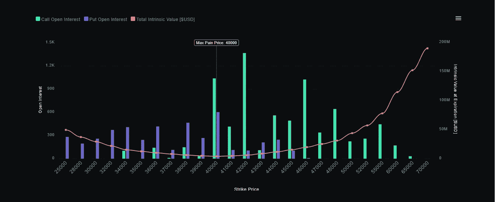

# 使用期权流的 BTC 分析

> 原文：<https://medium.com/coinmonks/btc-analysis-using-options-flow-2a8943bd6463?source=collection_archive---------10----------------------->

## 使用看跌/看涨期权预测比特币价格走势的可能性。

Image Credit: CoinOptionsTrack

在我看来，期权流直接反映了比特币市场的交易者/投资者情绪，因此应该注意研究比特币的看跌/看涨期权流，以预测至少近似的价格行为。