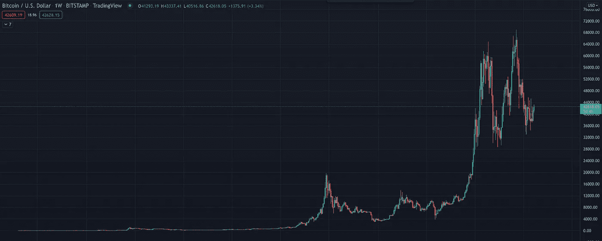
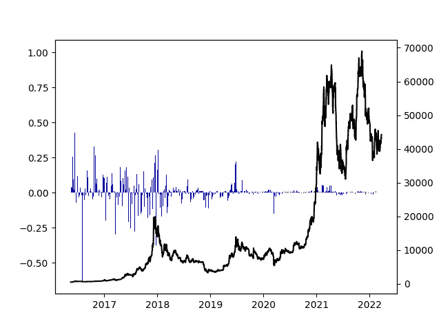
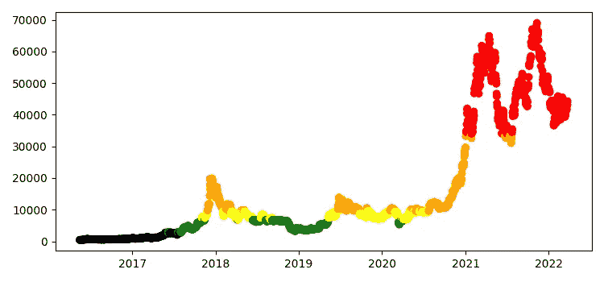
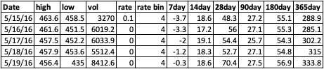
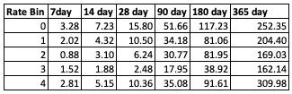

# BTC 和融资利率分析(2/3)

> 原文：<https://medium.com/coinmonks/btc-and-funding-rates-analysis-2-x-ca8fa28c1801?source=collection_archive---------13----------------------->

如果你在这里，希望你已经读过我的第一篇文章。如果没有，你可能会感到困惑，但祝你好运。我相信你。

**基本分析**

所以现在我们已经得到了我们分析所需的所有数据。任何好的分析的第一步都是从机器学习算法开始，并抱最好的希望？在这种情况下不会。我总是从查看数据和收集基本的见解开始，这些见解可以给我们一些好的信息，引导我们走向正确的方向。为此，我从比特币价格图表开始(由 *Tradingview 提供)。*

BTC price chart

看着这些数据，我相信每个阅读这篇文章的人都知道，*比特币*的价格自其诞生以来发生了巨大的变化。在 10 年左右的时间里，从不到 1 美元增加到超过 6 万美元。这让我对尝试一起使用数据保持警惕，因为这可能会有很大的不同。

下一步是查看*融资利率*，我希望能够看到它们在*比特币*价格方面的表现，所以我将它们绘制在一起(代码可以在 Github repo 中找到)。

BTC price and Funding Rate

看这张图表，你可以看到这些年来融资利率的波动性在稳步下降。在 2016/2017 年，它将在 0.5 和-0.5 之间波动，而在当前的牛市(2020 年至今)中，它将在 0.07 和-0.18 之间波动。我将把它放在我的后袋里，因为我不想对整个数据集做太多的归纳。

因此，我不想使用*价格*和*融资利率*作为连续变量，因为我将试图描述大量的数字。我决定将*融资利率*和*价格*放入五个大小相等的容器中。我选择将数据分箱，因为我希望能够准确地描述它，而不必查看所有的数字，我可以将数字放入箱中，现在*价格*不是从 0 美元到 60K+，而是*价格箱*从 1 到 5。

现在，为了直观显示数据复杂性如何随仓位变化，我用*融资利率仓位*作为颜色绘制了*价格*。

Price with Funding Rate bin as colors

看着这个，我们可以看到这些年来融资利率是如何变化的。*黑*仓都没有，大概还有一两天*绿*仓。此外，从 4 万美元到 6 万美元的范围始终具有相同的*融资利率* bin。这张图表告诉我，试图找出我们的假设*融资利率和价格如何相关的最佳指标*可能是一个错误的问题。

**正确的问题？**

当想知道*融资利率*和*价格*如何相互关联时，如果这个信息对交易者有帮助，我们需要找到一个领先指标。领先指标会告诉我们有事情要发生，而滞后指标则相反；告诉我们一段已经发生的关系。如果*融资利率*是一个滞后指标，它会告诉我们*嘿，价格下跌了*，但如果你试图交易比特币，我敢肯定你已经在手机上收到通知，告诉你 7 个头寸已经平仓。底线是，滞后的指标没有帮助。

为了确定*融资利率*是否是领先指标，我想看看未来的*价格*。从每一天开始，我都展望未来的 7 天、14 天、28 天、90 天和 365 天，看看是否有我们可以尝试和推导的相关性。这些数字是以百分比表示的。

Price change for each Date

为了获得更多一点的背景信息，我将查看所有箱的平均值，看看是否有很大的差异。

Average Price change per bin (in %)

从图表来看，就*价格*变化而言，*融资利率*仓位之间似乎也没有太多关联。

现在我们对数据和它的作用有了很好的理解，现在我想看看市场周期顶部，因为这最终是我们希望能够预测的。如果我能看到一个顶部的到来，那么我知道去杠杆化我的资产。为了做到这一点，我定义了三种不同的顶部:市场周期顶部(500 天的最高价格)，中期周期顶部(200 天的最高价格)，和微观周期顶部(50 天的最高价格)。对于市场周期顶部，代码告诉我们:*2017 年 2 月 9 日，2017 年 12 月 17 日，2019 年 6 月 26 日，2021 年 10 月 20 日，2021 年 11 月 10 日*。其中一些数据接近 500 天的原因是因为我按日期对数据进行了分类，所以如果从数据集开始的第 500 天是最高的，那么第 501 个数据点也可能是最高的，因为它在不同的分类中。

由于我们试图找到 BTC *价格*和*融资利率*之间的关系，我决定查看峰值处的*融资利率*，并查看数据中是否有任何其他时间，无论是过去还是现在，出现相同的*融资利率*。由于*融资利率*是如此小的数字，我使用的利率是+/- 0.0005。这样，有 38 次出现了与我们之前确定的市场周期顶部相似的融资利率。即使使用图表中的市场周期顶部(仅以 2021 年 11 月 10 日为例)，类似的*融资利率*也出现了 10 次。

根据这些信息，以及我们之前通过查看图表得出的结论，我不认为*融资利率*将是顶部/底部的最佳指标。我认为可能有所帮助的是观察一段时间内*融资利率*的变化，看看是否有任何顶部或底部的迹象。

[的下一篇文章](/@jakelindell/btc-and-funding-rates-analysis-3-x-49dddcd02ce8)将进入*融资利率变化*，看看这是否是 BTC 价格的领先指标。

> 加入 Coinmonks [电报频道](https://t.me/coincodecap)和 [Youtube 频道](https://www.youtube.com/c/coinmonks/videos)了解加密交易和投资

# 另外，阅读

*   [AscendEx 保证金交易](https://coincodecap.com/ascendex-margin-trading) | [Bitfinex 赌注](https://coincodecap.com/bitfinex-staking) | [bitFlyer 审核](https://coincodecap.com/bitflyer-review)
*   [麻雀交换评论](https://coincodecap.com/sparrow-exchange-review) | [纳什交换评论](https://coincodecap.com/nash-exchange-review)
*   [支持卡审核](https://coincodecap.com/uphold-card-review) | [信任钱包 vs 元掩码](https://coincodecap.com/trust-wallet-vs-metamask)
*   [Exness 回顾](https://coincodecap.com/exness-review)|[moon xbt Vs bit get Vs Bingbon](https://coincodecap.com/bingbon-vs-bitget-vs-moonxbt)
*   [如何开始通过加密贷款赚取被动收入](https://coincodecap.com/passive-income-crypto-lending)