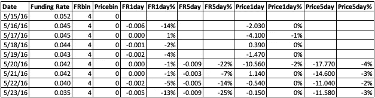
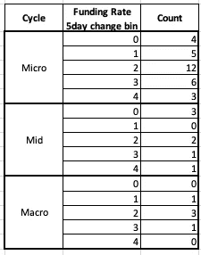
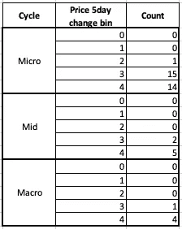

# BTC 和资金利率分析(3/3)

> 原文：<https://medium.com/coinmonks/btc-and-funding-rates-analysis-3-x-49dddcd02ce8?source=collection_archive---------28----------------------->

所以我们在最后一篇文章的结尾[谈到我们不认为*融资利率*会是一个好的领先指标，因为融资利率到处都是，我们无法在所有数据中找到*融资利率*之间的任何显著性。如果一个你想变得重要的数据点和一堆无关紧要的数据点共享相同的值，那么它就是不重要的。](/coinmonks/btc-and-funding-rates-analysis-2-x-ca8fa28c1801)

我想看的是几天，也许一周内*融资利率*的百分比变化，看看这是否与比特币价格有任何关联。在这篇文章中，我们将研究不同时间段内 BTC *价格*和融资利率变化*之间的相关性，看看是否存在任何相关性。*

Data with *Funding Rate change by %*

现在我们有了 1 天和 5 天增量的所有*融资利率变化*。我将继续这个主题，再次绑定*融资利率变化*和*价格变化*变量，1 天和 5 天，看看我们是否可以找到融资利率变化和*价格*最终在顶部或底部之间的任何相关性。

我决定制造 3 种不同的顶部结果，就像我们在以前的文章中讨论的那样:宏观周期顶部，中期周期顶部和微观周期顶部(分别是 500 天，200 天，50 天)。下一张图显示了顶部(3 =宏观，2 =中期，1 =微观)和*融资利率变化*仓位如何相互反应。

Funding Rate 5 day change and cycle count

看这张图表，我们似乎无法从 5 天*融资利率变化*仓位中做出任何假设/关联。这有点令人沮丧，因为这是我们认为可行的，但它并没有给我们所需要的(所有周期顶部都在*融资利率变化* bin 4)。不过有一点确实很突出，那就是融资利率变化区间 2 中出现了大量的顶部。我们宏观周期顶部的 3/5 发生在*融资利率变化* bin 2，因此我们可以从中得出的结论是，当有非常高的*融资利率*时，这可能有足够的动力保持反弹强劲。

另一个要看的图表是 5 天*价格变化*仓位，以及它们与周期顶部的关系。值得注意的是，这是过去的 5 天，所以从今天(3 月 30 日)开始，*价格变化*将会回溯到 3 月 26 日，而不是向前。

5 day Price change and cycle tops

这张图表给出了更多有希望的结果。除了一个周期顶部之外，所有的周期顶部都发生在价格变化的第 3 或第 4 阶段。最后。值得做的事。虽然这并没有给我们很多信息，因为每个 bin 中有 428 个事件，但它确实给了我们一些至少看起来不错的东西。

我试着合并了两个箱子，但是没有给出任何有意义的东西，我想你不会想看另一个图表。我尽力了。在这次平淡无奇的冒险之后，我确实想制造更多的垃圾桶，将 5 天的差异改为 3 天的差异，但都没有得出结论性的结果。

回顾这篇文章的其他部分，我记得我们并不认为将所有的数据放在一起会产生好的结果。正因为如此，我决定再次尝试这种分析，但只使用从 2020 年初到现在的数据。不用担心，它也没有给我们任何有用的东西。呸！ˌ什么！(表示不满或歉意)

肯定有更多的东西要看，因为我确实认为*融资利率*和*价格*是相关的，最终我确实认为*融资利率*是一个领先指标，但它对我的分析不起作用。如果你有任何想法，请告诉我！谢谢伙计们

> 加入 Coinmonks [电报频道](https://t.me/coincodecap)和 [Youtube 频道](https://www.youtube.com/c/coinmonks/videos)了解加密交易和投资

# 另外，阅读

*   [SmithBot 评论](https://coincodecap.com/smithbot-review) | [4 款最佳免费开源交易机器人](https://coincodecap.com/free-open-source-trading-bots)
*   [比特币基地僵尸工具](/coinmonks/coinbase-bots-ac6359e897f3) | [AscendEX 审查](/coinmonks/ascendex-review-53e829cf75fa) | [OKEx 交易僵尸工具](/coinmonks/okex-trading-bots-234920f61e60)
*   [如何在印度购买比特币？](/coinmonks/buy-bitcoin-in-india-feb50ddfef94) | [瓦济克斯审查](/coinmonks/wazirx-review-5c811b074f5b)
*   [隐翅虫替代品](/coinmonks/cryptohopper-alternatives-d67287b16d27) | [HitBTC 审查](/coinmonks/hitbtc-review-c5143c5d53c2)
*   [CBET 评论](https://coincodecap.com/cbet-casino-review) | [库科恩 vs 比特币基地](https://coincodecap.com/kucoin-vs-coinbase)
*   [折叠 App 审核](https://coincodecap.com/fold-app-review) | [Kucoin 交易机器人](/coinmonks/kucoin-trading-bot-automate-your-trades-8cf0ca2138e0) | [Probit 审核](https://coincodecap.com/probit-review)