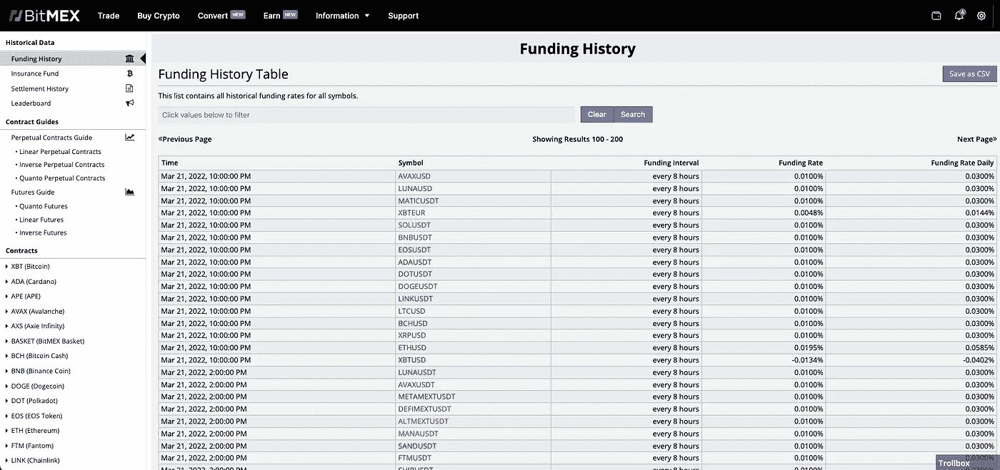
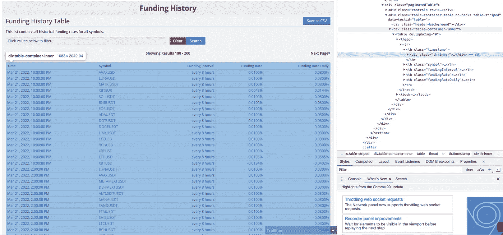
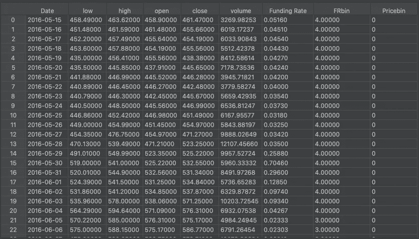
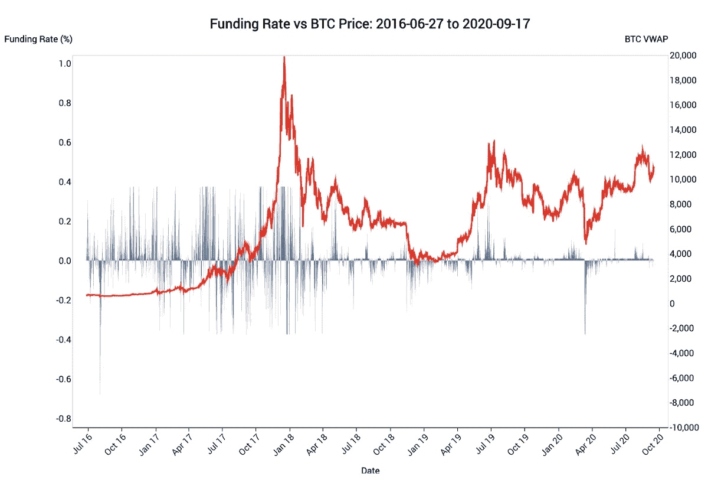

# BTC 和融资利率分析(1/3)

> 原文：<https://medium.com/coinmonks/btc-and-funding-rates-analysis-c03c06e061e5?source=collection_archive---------10----------------------->

**问题**


I would like to avoid feeling like this

为了赚钱，每个人，不管是不是 crypto，都希望能够预测股票、商品、住宅、crypto 或任何其他实体的价格。如果有人能够有效地做到这一点，他们很可能就不会在中等到 0 的粉丝上写博客了(*咳咳*)。

我已经在加密货币领域工作了 2 年多，和许多人一样，我很快就投入了进去。从“什么是区块链”到了“我如何让种植隐形玉米获得最大收益”。也像大多数人一样，我进入了杠杆交易，有一天早上醒来发现我的账户被清算了，心想“这不能再糟了”，YOLO 死了，情况变得更糟了。这让我踏上了能够预测或预见加密货币资产价格变化的旅程，希望不会亏钱，但最终会赚钱。

当我和*@ moneywithcarter*(crypto Twitter)一起做一个项目时，我开始研究不同交易所的资金利率如何预测、影响或不预测比特币的价格。对于那些不熟悉术语*融资利率*的人来说，它基本上是使用期货/杠杆合约时交易者之间的支付。当资金利率为> 0 时，多头交易者多于空头，< 0 则相反。因此，我试图解决的问题是:*BTC 的融资利率和价格之间的相关性是什么，无论是现在、过去还是未来*。

整个项目都是用 Python 完成的，包有:

```
import pandas as pd
import numpy as np
import seaborn as sns
from datetime import datetime, date
import Historic_Crypto
from selenium import webdriver
from webdriver_manager.chrome import chromeDriverManager
import re
```

**数据**

任何问题的第一步都是找到数据并给它一个好的外观。

**价格数据**

幸运的是，我能够找到一个名为 *Historic_Crypto* 的 Python 包，它非常容易使用并获得比特币的历史价格。我创建了下面的函数来获取数据，并使它看起来像我想要的那样:

```
def Price_data():
    BTC_pricedata = Historic_Crypto.HistoricalData('BTC-USD', 86400, '2016-05-14-00-00').retrieve_data()
    BTC_pricedata.index.name = 'Date'
    BTC_pricedata.reset_index(inplace=True)
    BTC_pricedata['Date'] = pd.to_datetime(BTC_pricedata['Date']).dt.date
    BTC_pricedata = BTC_pricedata[['Date', 'low', 'high', 'open', 'close', 'volume']]
    return BTC_pricedata
```

*历史 _ 加密。HistoricalData* 接收报价器(*BTC-美元*)、以秒为单位的时间范围(86400 秒=每天)和开始日期(选择这个日期是因为这是资金利率回溯的时间)。这个功能给了我回到 2016 年 5 月 14 日的比特币价格数据。

**融资利率**

现在是有趣的事情。我想获得两个交易所的所有融资利率，*币安*和 *Bitmex* (出于任何原因，我没有公开选择这两个交易所)。我从 Bitmex 开始，注意到他们有一个 API([*https://www.bitmex.com/app/fundingHistory?start=*](https://www.bitmex.com/app/fundingHistory?start=))。*牛逼。*



Bitmex website

任何做网络搜集的人都知道 API 节省了大量的时间和精力。然而，当尝试使用 API 时，它不允许我获得我想要的那么多数据。我想要所有的数据，而他们不想让我拥有所有的数据。这不能怪他们。我现在的选择是:1。使用 API，获取尽可能多的数据，使用不同的 IP 地址(从 VPN 或从不同的计算机)并获取其余的数据，或者 2。自己刮(可能有其他选择，但如果有，我显然不知道他们)。

作为一个花了一些时间浏览网站的人，我决定“嘿，这会很有趣”却发现不会。我试着使用我喜欢的 *BeautifulSoup* 包，但是在尝试使用它时，它找不到正确的 HTML 标签，所以我决定使用 *Selenium。*我发现当网站具有良好的 HTML 标签功能时, *BeautifulSoup* 更容易使用，但当 HTML 标签不直观时就不容易使用了。

在检查网页时，我决定使用 XPath 标签，因为 HTML 标签不起作用。



Inspecting the table I want

首先，我知道我只想得到 BTC 的数据，在 *BitMex* 上是‘xbt USD’。在浏览网站时，我还意识到我需要循环浏览页面以获取所有数据。为此，我在网站上找到了搜索栏，考察了搜索栏，复制了 *full XPath* ，我上路了。在我的代码中，我需要找到搜索栏，输入' *XBTUSD* '，然后单击*搜索*按钮进行导航。

```
driver = webdriver.Chrome(executable_path=ChromeDriverManager().install())
driver.get(url)
text_area = driver.find_element_by_xpath('//*[@id="filter"]')
text_area.send_keys('{"symbol":"XBTUSD"}')
button = driver.find_element_by_xpath('/html/body/div[2]/div/span/div[2]/div/div/section/div/div/div/form/fieldset/div/div/div[2]/button[2]')
button.click()
```

下一步是获取表的完整 XPath，这样我就可以提取每个页面的内容。我检查了表，复制了完整的 XPath，并继续前进。

```
jb = driver.find_element_by_xpath("/html/body/div[2]/div/span/div[2]/div/div/section/div/div/div/div[2]/div[2]/div[2]/table/tbody")
```

```
*def bitmex_data(): #wanted to try and get the data w/o using APIs
    url_base = 'https://www.bitmex.com/app/fundingHistory?start='
    # the number changes by 100 for each page
    page = 0
    total_data = []
    while True:
        url = url_base + str(page)
        driver = webdriver.Chrome(executable_path=ChromeDriverManager().install())
        driver.get(url)
        text_area = driver.find_element_by_xpath('//*[@id="filter"]')
        text_area.send_keys('{"symbol":"XBTUSD"}')
        button = driver.find_element_by_xpath('/html/body/div[2]/div/span/div[2]/div/div/section/div/div/div/form/fieldset/div/div/div[2]/button[2]')
        button.click()
        time.sleep(5)
        jb = driver.find_element_by_xpath("/html/body/div[2]/div/span/div[2]/div/div/section/div/div/div/div[2]/div[2]/div[2]/table/tbody")
        time.sleep(3)
        a = jb.text
        if a == 'No data.':
            break
        list = a.splitlines()
        array = []
        for i in list:
            newlist = re.split(' AM | PM | every 8 hours |\%', i)[0:4]
            array.append(newlist)
        page += 100
        total_data.extend(array)
        driver.close()*
```

*我创建的函数以 URL 为基础，运行 while 循环，不断改变分页，并获取表结果。如果我所做的跳转令人困惑，我认为最好从查看 *find_element_by_xpath* 的结果开始，看看如何从那里得到有意义的数据集(对不起，这篇文章已经很长了)。*

****币安资助率****

*既然我花了很多时间为 Bitmex 构建一个 webscraper，我最不想做的事情就是以某种复杂的方式从币安获取数据。够直观了，我只是做了不可想象的事情(铁杆数据科学家捂眼睛)。我*将表格*复制粘贴到 *Excel 中。*抱歉。如果你不读书了，我能理解，但是当你可以复制别人的房子时，为什么要盖房子呢？之后，我用这个函数来清理它:*

```
*def binance_data():
    BTCdata = pd.read_csv('path.../data/Funding Rate History_BTCUSDT Perpetual_2022-02-11.csv')
    BTCdata['Date'] = pd.to_datetime(BTCdata['Time']).dt.date
    BTCdata['Time'] = pd.to_datetime(BTCdata['Time']).dt.time
    BTCdata['Funding Rate'] = (BTCdata['Funding Rate'].str.rstrip('%').astype('float') / 100.0)
    #BTCdata['Funding Rate'] = float(BTCdata['Funding Rate'].apply(lambda x: '%.8f' % x))
    BTCdata = BTCdata[['Date', 'Time', 'Funding Interval', 'Funding Rate']]
    return BTCdata*
```

*(您需要输入自己的路径。不想给你看我的用户名是 DJ 好好先生)。*

***让它看起来很漂亮***

*现在我们已经有了*融资利率*数据和*价格*数据，我想对其进行一点清理，使其更易于使用。我决定将 *Pandas* 包用于用户友好的数据框。由于数据的极端性，我认为最好将*价格*和*融资利率*数据放入存储箱。宁滨数据允许您大幅减少变量的大小，同时仍然试图描述变量。我不认为看 BTC 54900 美元和 55000 美元的价格有什么重要。我决定将价格*和融资利率*的数据放入 5 个箱中。*

```
*def merge_rates_price(BTCpricedata, BTCdata):
    data_join = BTCpricedata.merge(BTCdata, how='left', on='Date')
    data_join = data_join[['Date', 'low', 'high', 'open', 'close', 'volume', 'Funding Rate']]
    data_join['Funding Rate'] = data_join['Funding Rate'].astype(float)
    data_join['FRbin'] = pd.qcut(data_join['Funding Rate'], 5, precision=5, duplicates='drop', labels=False)
    data_join['Pricebin'] = pd.qcut(data_join['high'], 5, precision=5, duplicates='drop', labels=False)
    data_join['FRbin'].value_counts()
    return data_join*
```

*该函数产生数据集:*

**

*现在我们有了数据，我们可以继续有趣的事情了。这在[下一篇](/@jakelindell/btc-and-funding-rates-analysis-2-x-ca8fa28c1801)里。*

**

*Shows the relationship between Funding Rate and Bitcoin price*

*如果你在任何时候想要我的代码，它有点混乱，但可以在 https://github.com/jrlindell/CryptoFundingRates 找到*

> **加入 Coinmonks* [*电报频道*](https://t.me/coincodecap) *和* [*Youtube 频道*](https://www.youtube.com/c/coinmonks/videos) *了解加密交易和投资**

# *另外，阅读*

*   *[有哪些交易信号？](https://coincodecap.com/trading-signal) | [Bitstamp vs 比特币基地](https://coincodecap.com/bitstamp-coinbase) | [买索拉纳](https://coincodecap.com/buy-solana)*
*   *[ProfitFarmers 点评](https://coincodecap.com/profitfarmers-review) | [如何使用 Cornix 交易机器人](https://coincodecap.com/cornix-trading-bot)*
*   *[十大最佳加密货币博客](https://coincodecap.com/best-cryptocurrency-blogs) | [YouHodler 评论](https://coincodecap.com/youhodler-review)*
*   *[MyConstant Review](https://coincodecap.com/myconstant-review) | [8 款最佳摇摆交易机器人](https://coincodecap.com/best-swing-trading-bots)*
*   *[MXC 交易所评论](/coinmonks/mxc-exchange-review-3af0ec1cba8c) | [Pionex vs 币安](https://coincodecap.com/pionex-vs-binance) | [Pionex 套利机器人](https://coincodecap.com/pionex-arbitrage-bot)*