# BTC、ETH、BNB、SOL、XRP、ADA、LUNA、AVAX、DOT、DOGE: 4/1 价格分析

> 原文：<https://medium.com/coinmonks/btc-eth-bnb-sol-xrp-ada-luna-avax-dot-doge-4-1-price-analysis-b2746d9a0bfe?source=collection_archive---------62----------------------->

**Visit our website:-** [**https://bitcoinsupports.com/**](https://bitcoinsupports.com/)

既然 BTC 和 altcoins 的短暂盘整阶段似乎已经过去，多头已经将目光投向新高。比特币(BTC)已经收复了 1 月份的大部分失地，交易者的注意力现在转向了 4 月份，这在历史上一直是这种加密货币的强势月份。根据 Coinglass 的数据，比特币仅在 4 月份出现了三次亏损，最大的月度亏损是 2015 年的 3.46%。

尽管历史有利于多头，但鲸影指示器检测到，超过 1.1 万枚比特币从一个闲置了 7 至 10 年的钱包中被取走。根据独立并购分析师 Phillip Swift 的说法，从休眠账户转移类似规模的交易量通常会导致显著的顶部。

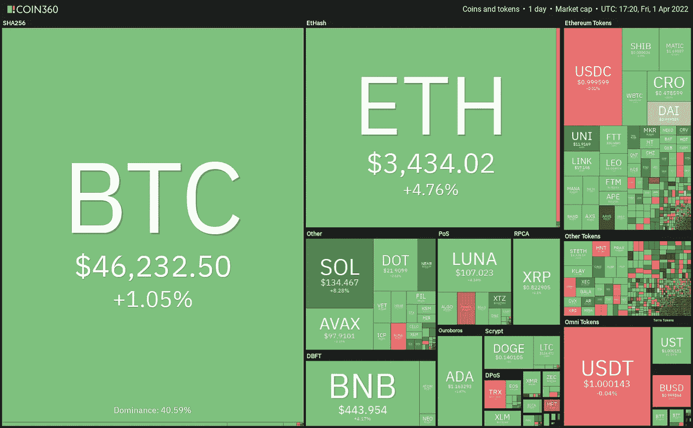

**Visit our website:-** [**https://bitcoinsupports.com/**](https://bitcoinsupports.com/)

交易员应该密切关注加密市场以及美国股市的表现，以寻找迹象，因为几周来比特币一直与股票市场密切相关。

多头能否突破比特币和其他一些替代货币的上方阻力，延续从低点的显著反弹？让我们看看十大加密货币的图表，看看我们能学到什么。

**BTC/USDT**

3 月 29 日，比特币跌破 200 天简单移动平均线(48291 美元)，今日跌破 20 天指数移动平均线(43935 美元)。今天的烛台有一条长尾巴，表明买家正在逢低涌入。

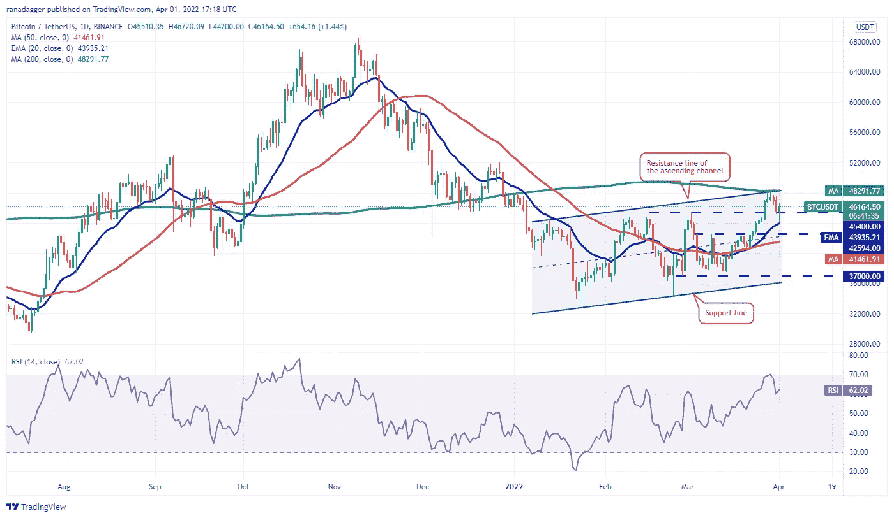

**Visit our website:-** [**https://bitcoinsupports.com/**](https://bitcoinsupports.com/)

多头的目标是再次推动价格超过 200 天的均线。如果他们成功，BTC/USDT 组合可能会飙升至 52，000 美元，空头可能会在此处发起另一次重大阻力。

或者，如果市场再次跌破 200 日均线，这将表明空头已经在该水平建立了牢固的障碍。有几天，这对货币可以在 20 日均线和 200 日均线之间稳定下来。

如果 20 日均线被打破并收于其下方，多头动能有所减弱。这可能会导致价格跌至 50 天均线(41，461 美元)。

**ETH/USDT**

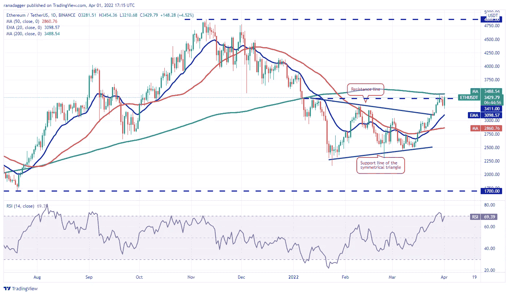

**Visit our website:-** [**https://bitcoinsupports.com/**](https://bitcoinsupports.com/)

从上涨的 20 日均线(3098 美元)和接近超买区的相对强弱指数(RSI)可以看出，多头处于主导地位。如果买家将价格推至 200 天均线上方，看涨势头可能会进一步增强，ETH/USDT 货币对可能会攀升至 4000 美元的心理里程碑。

与此思路相反，如果价格从上方阻力继续下跌，则表明空头不愿意放弃。空头将试图将该货币对拖至 20 天移动平均线以下。如果成功，这对组合可能会跌至 50 天均线(2860 美元)。

**BNB/USDT**

3 月 30 日和 31 日，币安币(BNB)突破 445 美元上方阻力，但多头无力维持涨势。

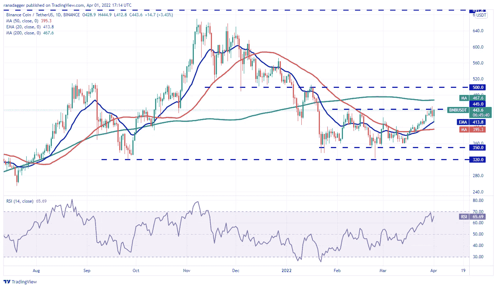

**Visit our website:-** [**https://bitcoinsupports.com/**](https://bitcoinsupports.com/)

空头今天将价格拉至 20 日均线附近(413 美元)，但快速反弹标志着在较低水平的大量多头买入。如果多头推动并维持价格超过 445 美元，BNB/USDT 组合可能会进入 200 天均线(467 美元)，然后冲刺 500 美元的心理关口。如果价格跌破移动平均线，并从当前水平向下，这种看涨观点将在短期内失效。再过几天，这对组合可能会保持在 350 美元至 445 美元之间的区间波动。

**索尔/USDT**

在 122 美元的重要水平附近，索拉纳(SOL)一直在经历着一场激烈的多头与空头之战。3 月 31 日烛台延长灯芯信号卖在更高的水平，但空头今天无法保持价格低于 122 美元。

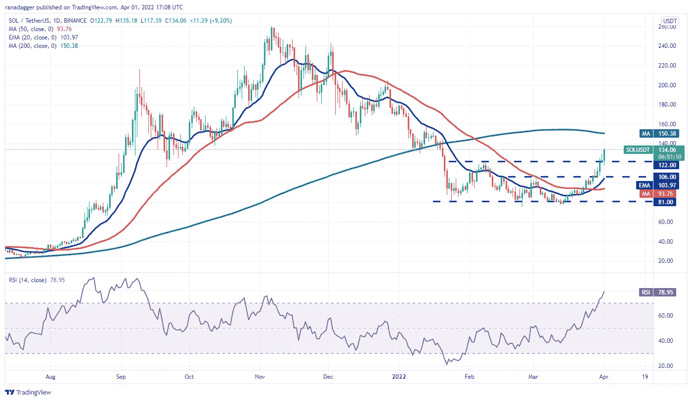

**Visit our website:-** [**https://bitcoinsupports.com/**](https://bitcoinsupports.com/)

这表明，多头抓住了轻微的回调。价格已经越过 122 美元的阻力位，标志着新一轮上涨的开始。索尔/USDT 现在可能试图突破 200 天均线(150 美元)。如果多头能够突破这一阻力，下一个目标可能是 163 美元。相比之下，如果价格没有保持在 122 美元以上，则表明需求在更大水平上已经枯竭。然后，该货币对可能跌至 20 天指数移动平均线(103 美元)。

**XRP/USDT**

3 月 30 日，Ripple (XRP)开发了一个日内烛台模式，在 3 月 31 日以猛烈的下跌对空头有利。这表明在较低价位买入的买家积极平仓。

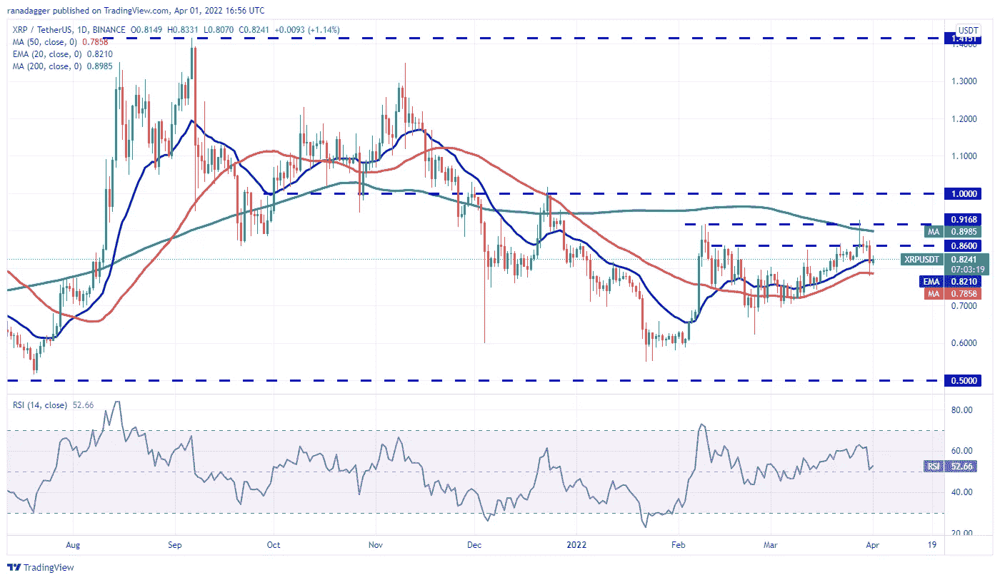

**Visit our website:-** [**https://bitcoinsupports.com/**](https://bitcoinsupports.com/)

20 日均线(0.82 美元)走平，RSI 接近中点，表明多头势头正在减弱。如果价格跌破 50 天均线(0.78 美元)，XRP/USDT 货币对可能会跌至下一个支撑位 0.70 美元。与这种观点相反，如果价格从当前水平上涨，买家将试图将该货币对移动到 0.86 美元以上，并挑战 0.91 美元的阻力。如果这一水平被打破并收于上方，它可能为反弹至 1 美元的心理水平铺平道路。

**阿达/USDT**

卡尔达诺(ADA)已经从 1.26 美元的头顶阻力掉头向下，说明空头正在大举卫冕该级别。价格现在可能下降到 20 天指数移动平均线(1.05 美元)，这是一个需要监控的关键指标。

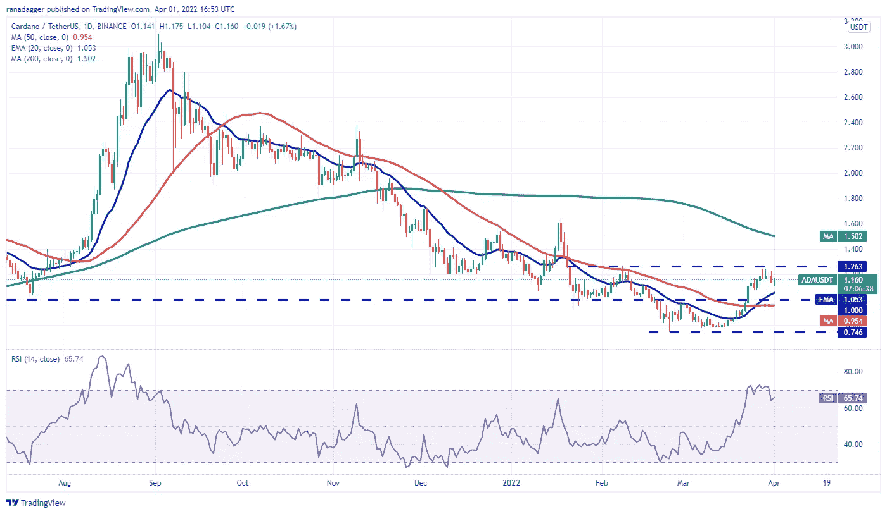

**Visit our website:-** [**https://bitcoinsupports.com/**](https://bitcoinsupports.com/)

如果市场从 20 日均线反弹，买家会试图再次将 ADA/USDT 推至 1.26 美元以上。如果他们成功了，他们将会创造一个相反的头肩底形态。这种模式表明，二人组已经触底。这对货币接下来可能会反弹至 200 天均线(1.50 美元)和 1.63 美元之间的顶部阻力区，空头可能会在此进行激烈的战斗。从中期来看，如果价格突破并保持在 50 天 SMA(0.95 美元)下方，这种看涨前景将会破灭。

**月神/USDT**

在 3 月 30 日达到历史新高后，Terra 的月神令牌开始下跌，这表明空头正在寻求停止前进。稍微有利的是，多头阻止了价格跌破 96 美元。这表明多头正在试图将这一水平转化为支撑。

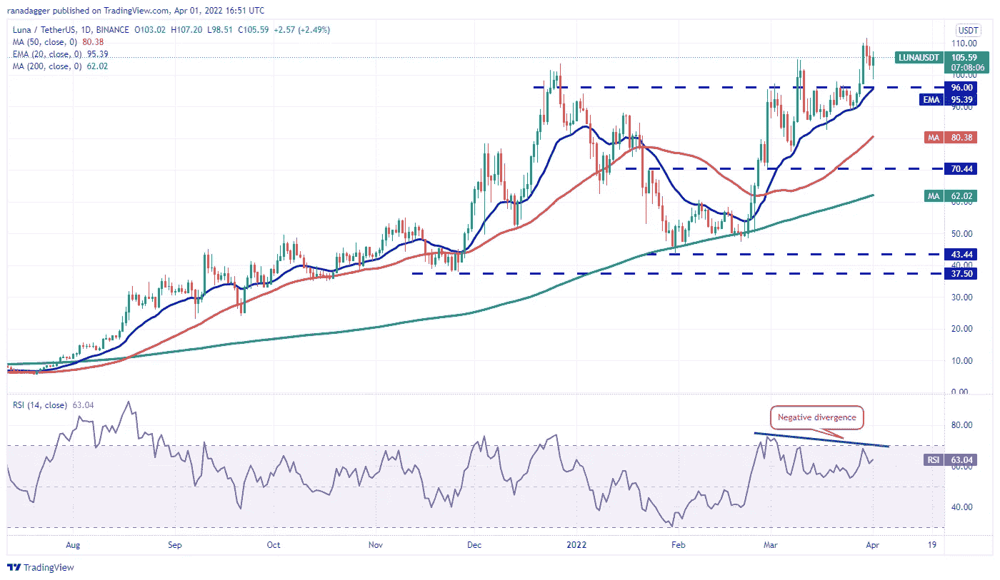

**Visit our website:-** [**https://bitcoinsupports.com/**](https://bitcoinsupports.com/)

上涨的 20 日均线(95 美元)标志着买方的优势，但是 RSI 的看跌背离表明多头势头可能正在消退。如果投资者将价格推至 111 美元以上，上涨可能会继续。之后，卢娜/USDT 可能会涨到 125 美元。

与这种观点相反，如果价格跌破 20 日均线，并跌破当前水平或顶部阻力，这表明交易者正在积极预订收益。之后，该货币对可能会跌至 50 天均线(80 美元)。

**AVAX/USDT**

3 月 30 日和 31 日，雪崩(AVAX)突破了 98 美元的上方阻力但却无法维持较高水平。因此，短线交易者可能被诱惑去创造利润。

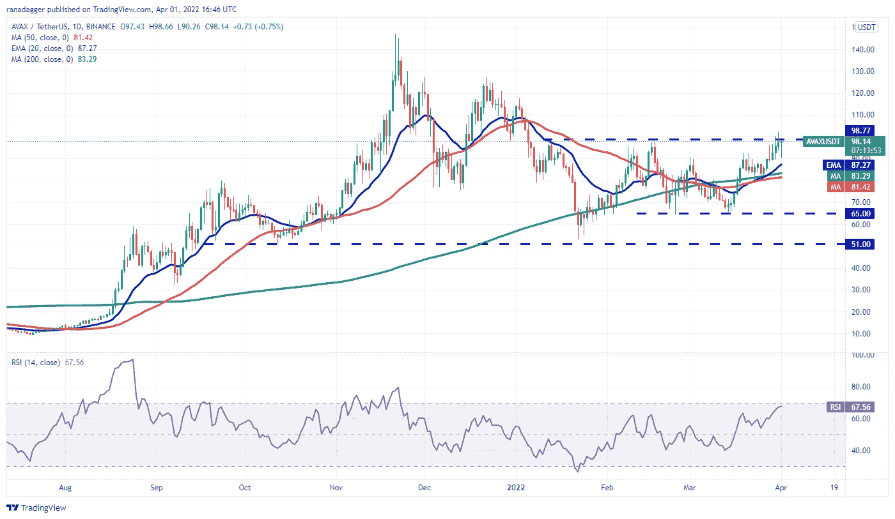

**Visit our website:-** [**https://bitcoinsupports.com/**](https://bitcoinsupports.com/)

尽管空头推至 20 日均线(87 美元)，当日蜡烛线的长尾表明需求持续处于较低水平。多头正试图推动市场越过 98-100 美元的顶部区域，并保持在那里。如果他们成功了，AVAX/USDT 组合可能会获得动力，涨到 120 美元。另一方面，如果价格跌破顶部阻力，这将是在更高水平大量抛售的信号。这可能导致价格向移动平均线靠拢。

**【DOT】/USDT**

无法突破 23 美元关口水平可能促使波尔卡多的短线交易者将利润入账(DOT)。因此，价格今天下跌到 20 日均线(20 美元)。

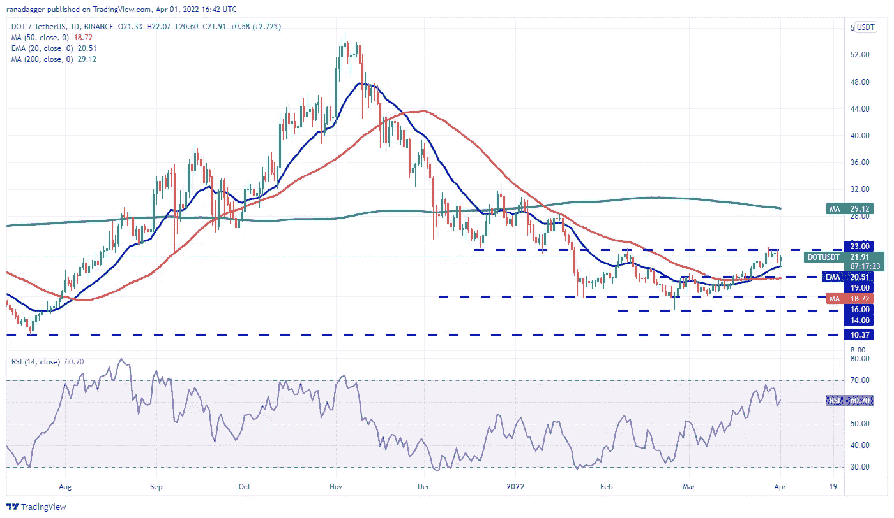

**Visit our website:-** [**https://bitcoinsupports.com/**](https://bitcoinsupports.com/)

从 20 日均线的强劲反弹意味着逢低买入是个好主意。在 23 美元，多头将试图再次清除开销的障碍。如果他们成功，点/USDT 对可能会进入一个新的上升趋势，飙升至 200 天的均线(29 美元)。

另一方面，如果价格跌破 20 日均线，则表明多头势头已经消退。这可能会将价格推低至 19 美元，如果这一水平保持不变，16 美元将是下一站。

**DOGE/USDT**

DOGE coin(DOGE)在 3 月 28 日从 0.15 美元下跌后跌至均线。如果要保持积极的情绪，买方必须捍卫这一关键的支持。

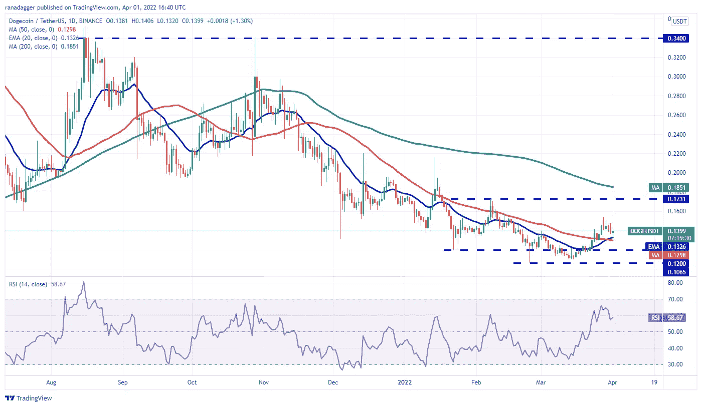

**Visit our website:-** [**https://bitcoinsupports.com/**](https://bitcoinsupports.com/)

如果价格从目前水平强劲反弹，多头将寻求推动多吉/USDT 货币对超过 0.15 美元。如果他们成功了，这对组合可能会反弹到 0.17 美元，这是顶部阻力。20 日均线(0.13 美元)微幅上涨，RSI 处于正区，说明买家略有优势。

如果空头下沉，使价格保持在均线以下，这种看涨观点在短期内将失效。这样的走势可能会为跌破 0.12 美元至 0.10 美元的关键支撑区铺平道路。

**访问我们的网站:-**[**https://bitcoinsupports.com/**](https://bitcoinsupports.com/)

**免责声明:以上为作者观点，不应视为投资建议。读者应该自己做研究。**

> 加入 Coinmonks [电报频道](https://t.me/coincodecap)和 [Youtube 频道](https://www.youtube.com/c/coinmonks/videos)了解加密交易和投资

# 另外，阅读

*   [Bookmap 点评](https://coincodecap.com/bookmap-review-2021-best-trading-software) | [美国 5 大最佳加密交易所](https://coincodecap.com/crypto-exchange-usa)
*   最佳加密[硬件钱包](/coinmonks/hardware-wallets-dfa1211730c6) | [Bitbns 评论](/coinmonks/bitbns-review-38256a07e161)
*   [新加坡十大最佳加密交易所](https://coincodecap.com/crypto-exchange-in-singapore) | [购买 AXS](https://coincodecap.com/buy-axs-token)
*   [红狗赌场评论](https://coincodecap.com/red-dog-casino-review) | [Swyftx 评论](https://coincodecap.com/swyftx-review) | [CoinGate 评论](https://coincodecap.com/coingate-review)
*   [投资印度的最佳密码](https://coincodecap.com/best-crypto-to-invest-in-india-in-2021)|[WazirX P2P](https://coincodecap.com/wazirx-p2p)|[Hi Dollar Review](https://coincodecap.com/hi-dollar-review)