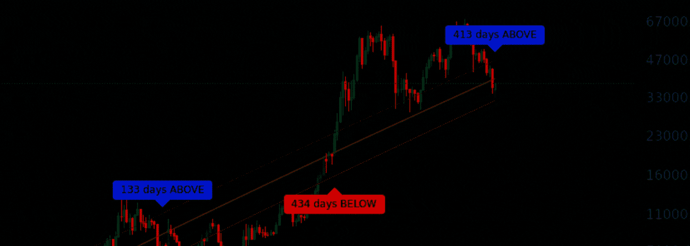
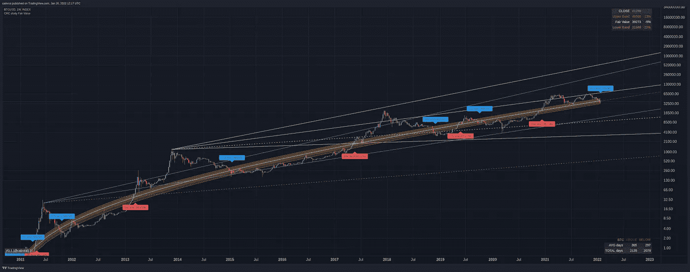
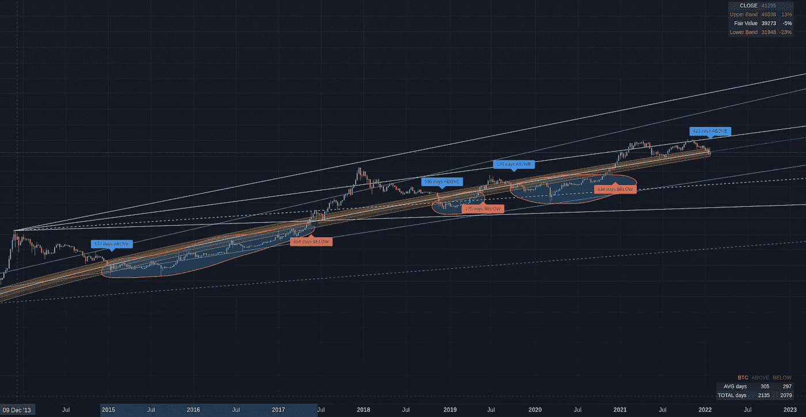

# BTC 公允价值——多头该冬眠了？

> 原文：<https://medium.com/coinmonks/btc-fair-value-time-for-bulls-to-hibernate-3cec83cc117?source=collection_archive---------12----------------------->

空气中弥漫着如此多的兴奋，这是显而易见的！哦，等等，那是从我们通红的脸上冒出来的汗水和泪水！从 ATH 的 69k 下降了近 50%,对许多人来说，情况可能会感到绝望。30-40%或更多的 BTC 持有者现在完全被淹没了。巅峰以来除了痛苦什么都没有！然而，如果我们退一步，强迫自己有一些观点，现实情况并没有那么糟糕。

BTC Fair Value — Going up!?

BTC 价格增长曲线可以很好地用简单的对数回归线来模拟。典型的价格，以及更高和更低的范围。这不是一门精确的科学，但如果我们找到 BTC 价格几乎正好一半在上方(牛市泡沫)一半在下方(熊市泡沫)的中间线，我们最终会得到我和其他人所说的 BTC 的“公允价值”。当然，这是武断的，但我相信这是一个伟大的工具，可以帮助我们在所有的混乱中找到一些观点。

我的公允价值模型向我个人表明，我们刚刚进入“熊市预警”区域。这并不是说我们还没有进入熊市……这是有可能的。但在这一点上，我们也同样有可能没有。它在边缘上。

我在等待下一个大动作。如果我们最终从这里反弹，我们可以期待类似另一个 100-200 天的牛市势头。事实可能证明，这个垃圾场正是我们所需要的，以启动那些呼吁 10 万+ BTC 的人一直在等待的狂热阶段。如果我们收盘时周蜡烛线低于公允价值的底部范围，目前比 32k 的当前水平低约 20%……我非常抱歉地说，但 HODL 对你的 BTC 乡亲，但这个熊市才刚刚开始。

从乐观的一面来看，长期来看，BTC 将继续坚持回归增长模式！HODL 对乡亲，因为根据我自己的指标，无论如何，BTC 的公允价值到 2022 年将在 6.5 万，到 2023 年底 10 万+。在你决定甩掉并赶走这些人之前，先考虑一下这个问题。想想看…

顺便说一句，我已经在我的新 YouTube 频道上发布了一些新的想法。我要去度假几周，所以我可能不会经常发帖，但喜欢/订阅和如果你想要更多。:)下面是我的个人资料中的链接。

保持冷静。学习。找到你的水平。设定你的买入限额、止损限额和止盈限额。观察。不要反应。赢了。

***鼓掌，赞，+1，订阅，关注更！***

*   **新增 YOUTUBE 频道:**[https://www.youtube.com/channel/UCjHR6-4OM6u9Ys2KKCrL1nQ](https://www.youtube.com/channel/UCjHR6-4OM6u9Ys2KKCrL1nQ)
*   每月新增免费指标:[https://www.tradingview.com/u/calmrat/](https://www.tradingview.com/u/calmrat/)
*   分析、预测、交易:[https://medium.com/@calmrat](/@calmrat)
*   https://twitter.com/calmrat
*   insta gram:【https://www.instagram.com/calmratcrypto/ 
*   https://www.facebook.com/calmratcrypto[脸书](https://www.facebook.com/calmratcrypto)

交易奖金，折扣和更多…

*   *Crypto.com—*[*https://crypto.com/exch/v4n3pauckj*](https://crypto.com/exch/v4n3pauckj)
*   *https://accounts.binance.com/en/register?ref=346510770—*[*币安*](https://accounts.binance.com/en/register?ref=346510770)
*   *Bybit—*[【https://www.bybit.com/en-US/invite?ref=EKJRL】T21](https://www.bybit.com/en-US/invite?ref=EKJRL)
*   *https://ftx.com/profile#a=60256726—*[*FTX*](https://ftx.com/profile#a=60256726)
*   交易视图—[https://www.tradingview.com/gopro/?share_your_love=calmrat](https://www.tradingview.com/gopro/?share_your_love=calmrat)