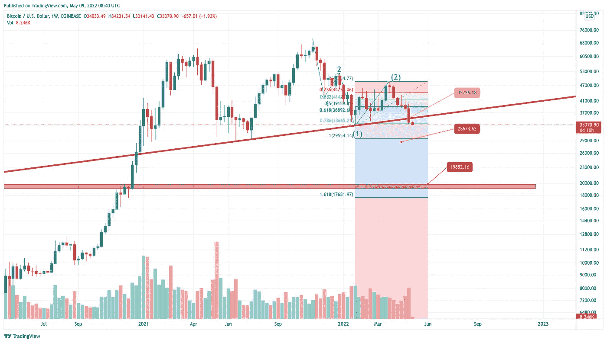
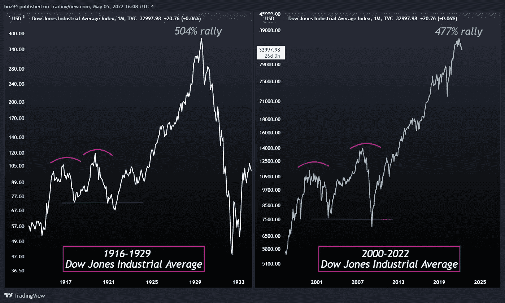

# BTC 有趣的图表@蹩脚交易者笔记#11

> 原文：<https://medium.com/coinmonks/btc-intriguing-charts-crappy-trader-notes-11-fd7ed7dcbf78?source=collection_archive---------68----------------------->

随着 BTC 接近 2021 年 12 月无法想象的水平(实际上我们一直都在预料之中)，我们想与读者分享两个图表，我们觉得有些有趣。

是的，这篇文章是不同的。这不是宏观价格行为概率分析。我们只是在分享我们松散的想法。对于那些正在等待价格行为分析和情景概率的人，请耐心等待，我们将很快返回另一篇文章，专门讨论价格行为分析以及如何和何时(时机很重要)在即将到来的反转中获利。

# 有趣的图表#1

这是 BTC 美元周线图。

我们设置了三个彩色价格水平和一条红色实线——这些是决定 BTC 价格走势的关键因素。

以下是我们的想法:

*   黄区(35k+ BTCUSD)最近破了。这不是一个好的迹象，因为它使得所谓的“跑平”修正变得不可能(见我们以前的版本，了解更多关于这个话题的信息)。这种情况对多头来说意味着更多的痛苦，因为我们已经突破了这一水平，价格行动仍然远远没有减缓下跌。我们预计这一水平将被重新测试为一个新的阻力区。如果复试失败，那么进一步下降是迫在眉睫的。
*   橙色区域(28k+ BTCUSD)是反转或底部的天然候选者。但是考虑到达到 28k 也意味着打破一个巨大的双顶结构。好好看看图上那条粗粗的红线。有一条规则说，当双顶被打破时，利润目标等于形态的高度。在这种特殊情况下，这给了我们更多的 50%的跌幅，这给了我们 17k BTC 美元的目标价。
*   红色区域(19k BTCUSD)是一个前期顶部，突破这个水平将使一级浪计数无效。这将是一个改变人生的事件，因为我们所有的长期、多年 TA 计算都需要重新计算。达到这一水平是一个真正的游戏规则改变者，散户投资者应该害怕得要命。

# 有趣的图表 2

下面是由 hoz94@TradingView 发布的道琼斯工业平均指数(DJIA)走势图。

这是一个令人伤脑筋的观点，因为人们对这些图表只有两种可能的解释/反应:

*   除了 DJIA 处于泡沫地带的事实之外，它还会以某种方式增长/膨胀得更多，所以 BTC 美元价格的最后第五波可能会在股市崩溃之前结束。这意味着股票市场的泡沫应该会持续两年多(因为我们需要这样的时间跨度来完成当前的调整，并形成最后的第五波上涨)。这是…嗯…保持冷静。可怕，但我们仍然有时间和可能的 BTCUSD 对 ATH 之前，所有地狱失控。
*   时间到了。我们完蛋了。泡沫即将破裂。如果是这样的话，那么每一个加密资产都将陷入困境。是的，这也包括 BTC 股市，因为它跟随整个股市。这真的很可怕，因为左边的图片是 1929 年的“华尔街股灾”，随后是大萧条的黑暗时代。

# 摘要

这是我们今天分享的第二个图表，当我们看到当前 BTC 美元的调整时，它让我们感到不安。似乎底部近了，价格行为和技术分析正在发挥作用——但股市泡沫上方的乌云可能会揭开黑天鹅的面纱，使我们的计算无效。

因此，尤其是今天，保持安全和流动性。日子不好过，现金为王。

# 更多阅读

如果你想知道我是如何得出当前预测的，我推荐你阅读博客的前几章。因此，你可以理解我的推理，看看我的话有多真实。

*   2022 年 4 月初认罪— [搞错了细节@蹩脚交易员笔记#10](/coinmonks/got-the-details-wrong-crappy-trader-notes-10-e9847ae48772)
*   2022 年 3 月初失败的三角诊断— [底部的气味@蹩脚交易者笔记#9](/coinmonks/the-scent-of-the-bottom-crappy-trader-notes-9-a810316a2eaf)
*   2022 年 2 月下旬阐述最可能的底部情景— [底部在情景中@蹩脚交易者笔记#8](https://yentenobserver.medium.com/bottom-is-in-scenarios-crappy-trader-notes-8-9fc2dc4cf017)
*   2022 年 2 月反弹被揭穿— [下一站 30k BTCUSD @蹩脚交易者笔记#7](https://yentenobserver.medium.com/next-station-30k-btcusd-crappy-trader-notes-7-204ea6d157cc)
*   2022 年 1 月熊市情景解释— [BTCUSD 熊市在控制中@蹩脚交易者笔记#6](https://yentenobserver.medium.com/btcusd-bears-are-in-control-crappy-trader-notes-6-50507d28179a)
*   2021 年 12 月下旬 C 波情景的有力证实—[BTC C 波放大@蹩脚交易者笔记#5](https://yentenobserver.medium.com/btc-wave-c-zoom-in-crappy-trader-notes-5-2cd5ccfc6a8a)
*   2021 年 12 月初可能下跌的预警—[BTC C 波风暴来了？@ CrappyTrader 笔记#4](https://yentenobserver.medium.com/wave-c-storm-is-coming-crappytrader-notes-4-d71eee69f4ff)
*   2021 年 11 月下旬对可能的熊市前景的悲观预测— [我们处于 C 浪之中吗？@ CrappyTrader 笔记#3](https://yentenobserver.medium.com/are-we-in-a-c-wave-crappytrader-notes-3-2eecee27ca45?source=your_stories_page----------------------------------------)
*   2021 年 11 月 11 月价格走势有两种选择——BTC 突破还是牛市陷阱？@ CrappyTrader 笔记#2

# 你觉得我的工作有价值吗？

如果是，那么您可以通过以下方式支持我的努力:

*   在推特上关注我
*   跟随我的媒体档案

> 加入 Coinmonks [电报频道](https://t.me/coincodecap)和 [Youtube 频道](https://www.youtube.com/c/coinmonks/videos)了解加密交易和投资

# 另外，阅读

*   [Bookmap 评论](https://coincodecap.com/bookmap-review-2021-best-trading-software) | [美国 5 大最佳加密交易所](https://coincodecap.com/crypto-exchange-usa)
*   最佳加密[硬件钱包](/coinmonks/hardware-wallets-dfa1211730c6) | [Bitbns 评论](/coinmonks/bitbns-review-38256a07e161)
*   [新加坡十大最佳加密交易所](https://coincodecap.com/crypto-exchange-in-singapore) | [购买 AXS](https://coincodecap.com/buy-axs-token)
*   [红狗赌场评论](https://coincodecap.com/red-dog-casino-review) | [Swyftx 评论](https://coincodecap.com/swyftx-review) | [CoinGate 评论](https://coincodecap.com/coingate-review)
*   [投资印度的最佳密码](https://coincodecap.com/best-crypto-to-invest-in-india-in-2021)|[WazirX P2P](https://coincodecap.com/wazirx-p2p)|[Hi Dollar Review](https://coincodecap.com/hi-dollar-review)