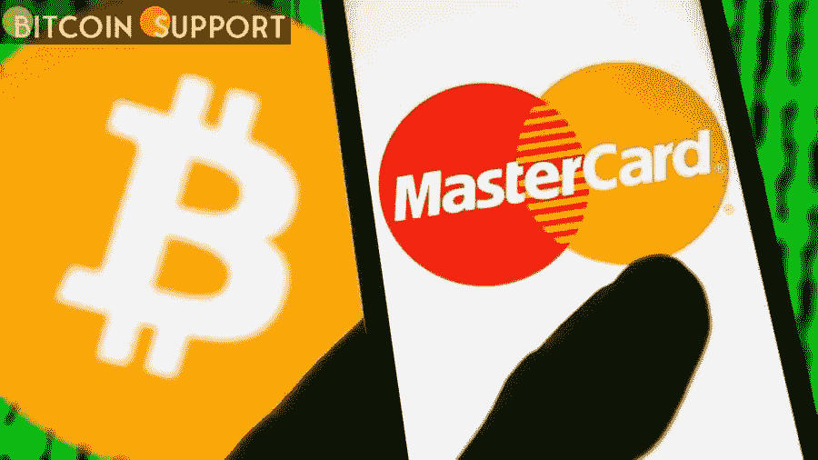

# 加密货币交易所 BTC 市场与万事达卡合作处理支付

> 原文：<https://medium.com/coinmonks/btc-markets-a-cryptocurrency-exchange-partners-with-mastercard-to-process-payments-5dd7c44b15d?source=collection_archive---------73----------------------->

**Visit our website:-** [**https://bitcoinsupports.com/**](https://bitcoinsupports.com/)

澳大利亚加密货币交易所 BTC 市场与万事达卡合作，使消费者能够通过直接借记、预付或信用卡支付直接从平台上购买比特币。

BTC 市场是一家位于澳大利亚的加密货币交易所，拥有超过 325，000 名客户和 190 亿澳元的交易数字资产。用户可以存入和提取澳元，而不会产生任何交易成本。

目前有 25 个交易对可用，支持散户和机构投资者。除了加密交易，客户还可以购买受支持的加密货币。

BTC 市场首席执行官卡罗琳·鲍勒(Caroline Bowler)对发展进行了评论:

**“随着比特币市场的不断发展和适应，客户越来越多地寻求更快、更简单的安全、快速访问加密货币的方法。我们很高兴与万事达卡合作，因为他们与我们一样致力于稳定、创新和客户安全，并将使我们能够为我们的客户提供新的选择，以参与这一新兴的数字资产类别。”**

[https://twitter.com/BTCMarkets/status/1508685862799757312](https://twitter.com/BTCMarkets/status/1508685862799757312)

**万事达卡将加密货币整合到其网络中**

今年早些时候，万事达卡与 CoinJar 合作开发了该国首批由澳大利亚加密货币交易所支持的加密货币支付卡之一。此外，这家支付提供商通过与泰国 Amber Group 和 Bitkub 的合作，在整个亚太地区扩展了其加密关联信用卡。今年 1 月，万事达卡与美国加密货币交易所比特币基地合作，让用户能够在比特币基地 NFT 市场购物。

**访问我们的网站:-**[**https://bitcoinsupports.com/**](https://bitcoinsupports.com/)

**免责声明:以上为作者观点，不应视为投资建议。读者应该自己做研究。**

> 加入 Coinmonks [电报频道](https://t.me/coincodecap)和 [Youtube 频道](https://www.youtube.com/c/coinmonks/videos)了解加密交易和投资

# 另外，阅读

*   [3 商业评论](/coinmonks/3commas-review-an-excellent-crypto-trading-bot-2020-1313a58bec92) | [Pionex 评论](https://coincodecap.com/pionex-review-exchange-with-crypto-trading-bot) | [Coinrule 评论](/coinmonks/coinrule-review-2021-a-beginner-friendly-crypto-trading-bot-daf0504848ba)
*   [莱杰 vs n rave](/coinmonks/ledger-vs-ngrave-zero-7e40f0c1d694)|[莱杰 nano s vs x](/coinmonks/ledger-nano-s-vs-x-battery-hardware-price-storage-59a6663fe3b0) | [币安评论](/coinmonks/binance-review-ee10d3bf3b6e)
*   [Bybit Exchange 审查](/coinmonks/bybit-exchange-review-dbd570019b71) | [Bityard 审查](https://coincodecap.com/bityard-reivew) | [Jet-Bot 审查](https://coincodecap.com/jet-bot-review)
*   [3 commas vs crypto hopper](/coinmonks/3commas-vs-pionex-vs-cryptohopper-best-crypto-bot-6a98d2baa203)|[赚取加密利息](/coinmonks/earn-crypto-interest-b10b810fdda3)