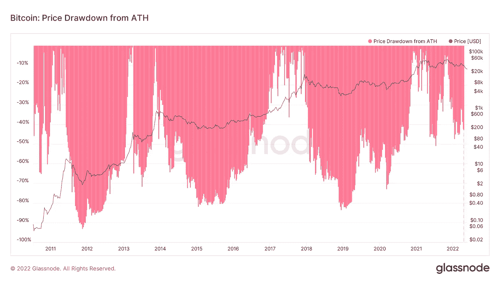

# BTC 可能会在 2022 年达到 14K 美元，但现在是时候收购它了，因为这是“最好的交易”分析师

> 原文：<https://medium.com/coinmonks/btc-may-reach-14k-in-2022-but-now-is-the-time-to-acquire-it-since-it-is-as-good-a-deal-as-it-a327c3fd1df8?source=collection_archive---------32----------------------->

BTC 可能会在 2022 年达到 14K 美元，但现在是时候收购它了，因为这是“最好的交易”分析师

根据一位加密量子作家的说法，对于那些准备投资的人来说，比特币目前是一种显而易见的投资。

研究表明，比特币(BTC)今年处于“周期底部”的边缘，这可能导致其从目前的水平暴跌 50%以上。

当链上分析平台 CryptoQuant 的成员 Venturefounder 在 6 月 1 日发推文时，他预测比特币将“投降”。

# **比特币“有史以来最高的 3 年投资回报率”已经实现**

Venturefounder 表示，根据之前比特币减半周期的趋势，今年应该是当前四年周期的看跌害群之马。

基于之前从历史高点的下跌，预计 BTC/美元将在 2022 年在 14，000 美元至 21，000 美元之间的某个点找到宏观底部。

比特币减半将在 670 天后发生。就前几个周期而言，我们领先于计划。"

在 2023 年的剩余时间里，BTC 将在 28 美元至 4 万美元之间波动，然后在 670 天内第二次减半之前回落至 4 万美元。
这样的预测，即使多头不喜欢，也不是完全没有先例。经过七个月的复苏，比特币上涨至 13，800 美元，然后在 2020 年 3 月回落至 3，600 美元，这是自 2018 年 12 月触及 3，100 美元以来的最低点。

$20,000.这是 2017 年 12 月的纪录，即使是 2019 年的当地高点也不足以打破它。

根据 Venturefounder 的说法，该水平可能会再次出现在现货价格图上。然而，今天准备乘风破浪进行投资的人，将来会站在历史的正确一边。

这是收购比特币的最佳时机，在我看来是未来 6 到 12 个月。"“我们可能没有处于周期底部，但我们在 BTC 周期底部的范围之内，”他继续说道。"可能是有史以来最好的 3 年投资回报率。"说到市场时机，这是你能期待的最好结果."

# 坏消息不断传来

与此同时，其他人已经确定，最低可能范围是 14，000 美元左右。

超级看涨信号？还是真正的崩溃？是两个相关的问题。本周在比特币，这里有五件事要记住。

作为当前 69，000 美元历史高点的一个百分比，这将表明损失超过 80%…

来自连锁分析公司 Glassnode 的数据显示，目前约 31，000 美元的价值代表了相对温和的下降。

*TC/USD drawdowns from all-time highs chart. Source: Glassnode*

一旦比特币/美元跌破 200 周移动平均线，Rekt Capital 估计潜在目标为 15，500 美元。

卖家可能很难把市场带到这么低的水平。凭借其在 BTC 的最大持股，MicroStrategy 发誓要买入任何接近 2 万美元门槛的股票。

此外，BitMEX 首席执行官阿瑟·海斯(Arthur Hayes)表示对 BTC 感兴趣，目前的价格为 2 万美元。

> 加入 Coinmonks [电报频道](https://t.me/coincodecap)和 [Youtube 频道](https://www.youtube.com/c/coinmonks/videos)了解加密交易和投资

# 另外，阅读

*   [3 商业评论](/coinmonks/3commas-review-an-excellent-crypto-trading-bot-2020-1313a58bec92) | [Pionex 评论](https://coincodecap.com/pionex-review-exchange-with-crypto-trading-bot) | [Coinrule 评论](/coinmonks/coinrule-review-2021-a-beginner-friendly-crypto-trading-bot-daf0504848ba)
*   [莱杰 vs n rave](/coinmonks/ledger-vs-ngrave-zero-7e40f0c1d694)|[莱杰 nano s vs x](/coinmonks/ledger-nano-s-vs-x-battery-hardware-price-storage-59a6663fe3b0) | [币安评论](/coinmonks/binance-review-ee10d3bf3b6e)
*   [Bybit Exchange 审查](/coinmonks/bybit-exchange-review-dbd570019b71) | [Bityard 审查](https://coincodecap.com/bityard-reivew) | [Jet-Bot 审查](https://coincodecap.com/jet-bot-review)
*   [3 commas vs crypto hopper](/coinmonks/3commas-vs-pionex-vs-cryptohopper-best-crypto-bot-6a98d2baa203)|[赚取加密利息](/coinmonks/earn-crypto-interest-b10b810fdda3)
*   最好的比特币[硬件钱包](/coinmonks/hardware-wallets-dfa1211730c6) | [BitBox02 回顾](/coinmonks/bitbox02-review-your-swiss-bitcoin-hardware-wallet-c36c88fff29)
*   [BlockFi vs 摄氏度](/coinmonks/blockfi-vs-celsius-vs-hodlnaut-8a1cc8c26630) | [Hodlnaut 审核](/coinmonks/hodlnaut-review-best-way-to-hodl-is-to-earn-interest-on-your-bitcoin-6658a8c19edf) | [KuCoin 审核](https://coincodecap.com/kucoin-review)