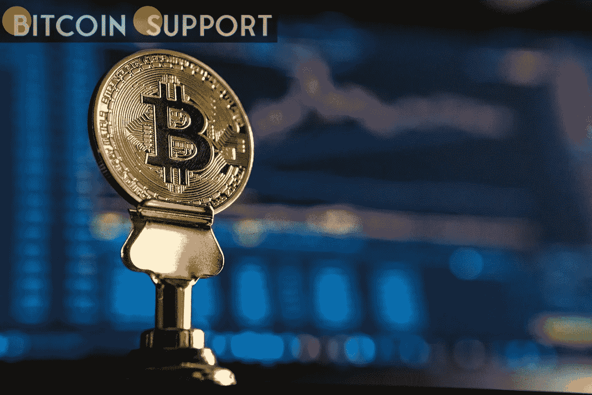
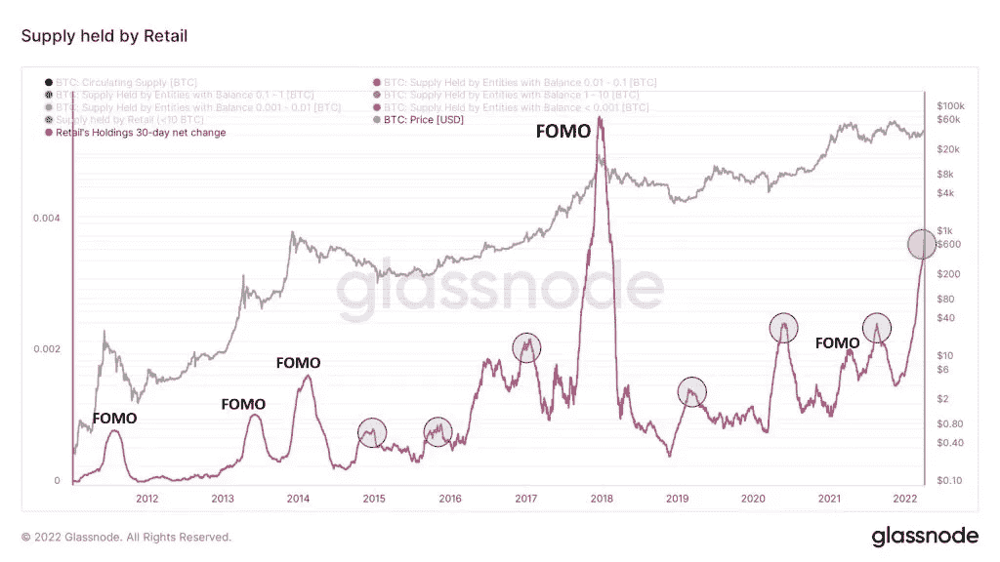
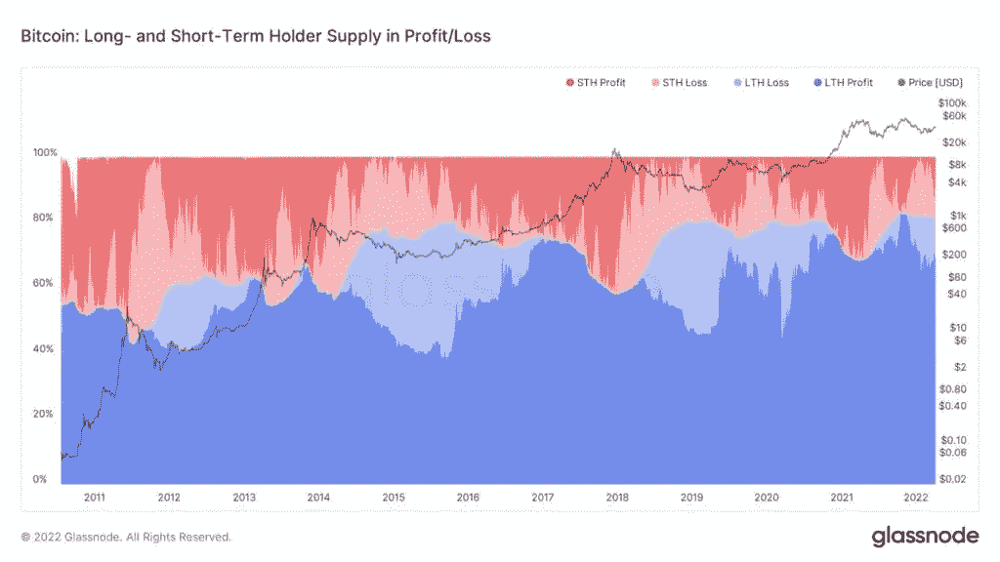

# 一位分析师称，尽管 FOMO 零售量激增，但 BTC 定价仍可能“注定失败”

> 原文：<https://medium.com/coinmonks/btc-pricing-may-still-be-doomed-according-to-an-analyst-despite-a-surge-in-retail-fomo-9faf072206a9?source=collection_archive---------44----------------------->

**Visit our website:-** [**https://bitcoinsupports.com/**](https://bitcoinsupports.com/)

规模较小的比特币企业正在迅速增加其 BTC 持有量，尽管这种情况在价格见顶之前也曾发生过。根据新的统计数据，比特币(BTC)正在经历普通投资者的恐慌性购买——但并非一切都像它看起来的那样。

4 月 4 日，Blockware 首席洞察分析师威廉·克莱门特(William Clemente)发现，规模较小的霍德勒持有的 BTC 数量显著增加。

**2022 年 FOMO 零售业的激增被称为“异数”**

通常被称为“散户”，拥有少于 1 BTC 的实体被视为普通客户，与公司或机构投资者相对。

根据连锁分析公司 Glassnode 的数据，2022 年，这些小企业占 BTC 总供应量的比例大幅攀升。Clemente 警告说，从历史上看，这类事件会与宏观经济价格见顶同时发生，但考虑到最近 BTC/美元的表现，这一次似乎有所不同。

“这是一张真正迷人的图表。零售(0-1 BTC)目前正以比特币历史上第二高的速度购买，”他补充道。

“就散户持股而言，多数增持都是在宏观经济见顶的时候发生的，但在很多时候，他们都是明智地买入的。这种激增代表了一种统计上的奇怪现象。”

**Visit our website:-** [**https://bitcoinsupports.com/**](https://bitcoinsupports.com/)

根据 Glassnode 的数据，零售市场的每个部分，从 1 BTC 到最低的 0.001 BTC，都在随着时间的推移扩大其市场份额，但主要增长发生在 2 月中旬。

现在，持有 0.1 到 1 个比特币的实体控制着差不多 800，500 个比特币。“要么我们在劫难逃，要么散户选择退出货币体系，将比特币用作储蓄账户。”我希望是后者，”克莱门特说。

随着比特币飙升至 50，000 美元，并超出了 2022 年的交易区间，短期持有人——那些进入市场不到 155 天的人——持有的利润丰厚的供应比例有所增加。根据 Glassnode 的统计数据，短期投资者从亏损转为盈利的情况在过去也发生过。

**Visit our website:-** [**https://bitcoinsupports.com/**](https://bitcoinsupports.com/)

**…当没有人在谷歌上搜索比特币**

的时候，虽然人们的注意力一直集中在接近 5 万美元的关键链上交易量水平的投资者行为上，但比特币的主流报道仍然明显缺席。

涵盖全球“比特币”搜索兴趣的谷歌趋势数据显示，自去年 11 月创下历史新高以来，参与度比任何时候都低。不仅如此，谷歌表示这一趋势仍在下降，如果这一趋势继续下去，比特币的相对搜索量将达到多年来的最低水平。

**访问我们的网站:-**[**https://bitcoinsupports.com/**](https://bitcoinsupports.com/)

**免责声明:以上为作者观点，不应视为投资建议。读者应该自己做研究。**

> 加入 Coinmonks [电报频道](https://t.me/coincodecap)和 [Youtube 频道](https://www.youtube.com/c/coinmonks/videos)了解加密交易和投资

# 另外，阅读

*   [用于 Huobi 的加密交易信号](https://coincodecap.com/huobi-crypto-trading-signals) | [HitBTC 审查](/coinmonks/hitbtc-review-c5143c5d53c2)
*   [如何在 FTX 交易所交易期货](https://coincodecap.com/ftx-futures-trading) | [OKEx vs 币安](https://coincodecap.com/okex-vs-binance)
*   [OKEx vs KuCoin](https://coincodecap.com/okex-kucoin) | [摄氏替代品](https://coincodecap.com/celsius-alternatives) | [如何购买 VeChain](https://coincodecap.com/buy-vechain)
*   [ProfitFarmers 回顾](https://coincodecap.com/profitfarmers-review) | [如何使用 Cornix Trading Bot](https://coincodecap.com/cornix-trading-bot)
*   [如何匿名购买比特币](https://coincodecap.com/buy-bitcoin-anonymously) | [比特币现金钱包](https://coincodecap.com/bitcoin-cash-wallets)