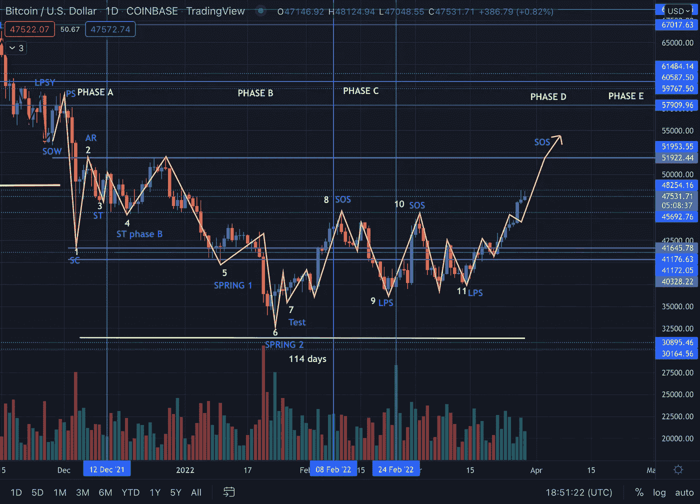
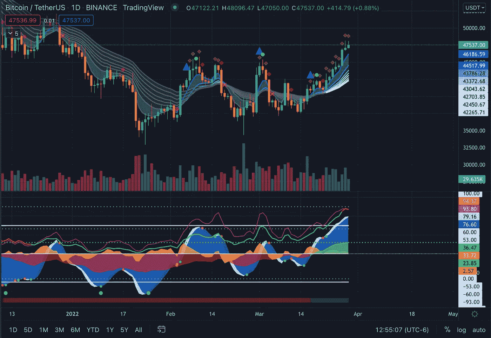
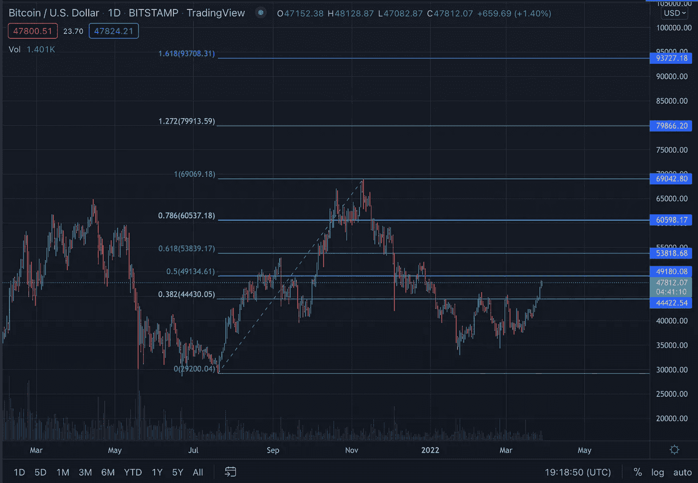

# BTC 泵在前面

> 原文：<https://medium.com/coinmonks/btc-pump-ahead-3ab599831eaa?source=collection_archive---------54----------------------->

经过长时间的积累/熊市阶段，BTC 价格似乎正在缓慢恢复，今年首次达到 48k 美元。

Wyckoff Accumulation Schematic. Phase D. Retrieved via Trading View

在我以前的文章中，我解释了威科夫积累模式的动力学& BTC 相应的行为。就目前而言，我们正处于 D 阶段，这一阶段的特征是需求始终主导着供给。价格和增加量(SOS)有很多进步，随之而来的是反应和弊端(LPS)。

在阶段 D，价格至少移动到交易范围的顶部。这一阶段的有限合伙人通常是开始或增加有利可图的多头头寸的绝佳场所。

期待什么？

BTC 看起来又非常乐观了。所以在接下来的几个月里期待一个泵吧！

Market Cipher A & B. Retrieved via Trading View.

市场密码显示看涨趋势。首先，我们可以看到 8 均线带的扩张(从灰色变成蓝色和白色)。资金流动浪潮是积极的，并且日益增长(蓝色浪潮)。资金流也是正的，WVAP(黄色波浪)也是正的。此外，市场密码 A 发出黄色菱形信号，表明牛市在继续。

Fibonacci Retracement. Retrieved via Trading View

基于 Fib 回撤，如果看涨趋势继续，我们可以预计价格将达到 49.1 千美元、53 千美元、60.5 千美元、69 千美元、79.8 千美元和 93.7 千美元，显然沿途有回撤。所以，准备好 HODL &获取利润。

爱与光，

机器语言(Machine Language)

> 加入 Coinmonks [电报频道](https://t.me/coincodecap)和 [Youtube 频道](https://www.youtube.com/c/coinmonks/videos)了解加密交易和投资

# 另外，阅读

*   [Bookmap 点评](https://coincodecap.com/bookmap-review-2021-best-trading-software) | [美国 5 大最佳加密交易所](https://coincodecap.com/crypto-exchange-usa)
*   最佳加密[硬件钱包](/coinmonks/hardware-wallets-dfa1211730c6) | [Bitbns 评论](/coinmonks/bitbns-review-38256a07e161)
*   [新加坡十大最佳加密交易所](https://coincodecap.com/crypto-exchange-in-singapore) | [购买 AXS](https://coincodecap.com/buy-axs-token)
*   [红狗赌场评论](https://coincodecap.com/red-dog-casino-review) | [Swyftx 评论](https://coincodecap.com/swyftx-review) | [CoinGate 评论](https://coincodecap.com/coingate-review)
*   [投资印度的最佳密码](https://coincodecap.com/best-crypto-to-invest-in-india-in-2021)|[WazirX P2P](https://coincodecap.com/wazirx-p2p)|[Hi Dollar Review](https://coincodecap.com/hi-dollar-review)