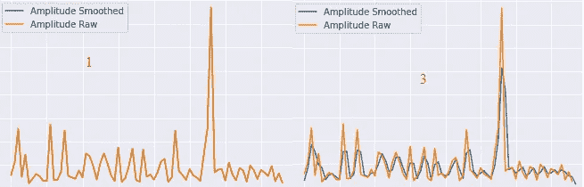
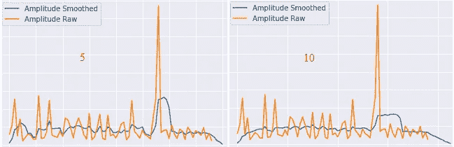
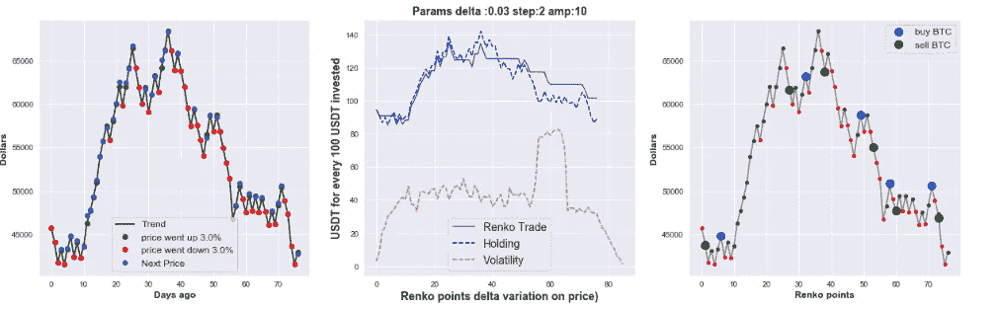
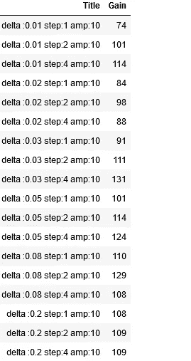
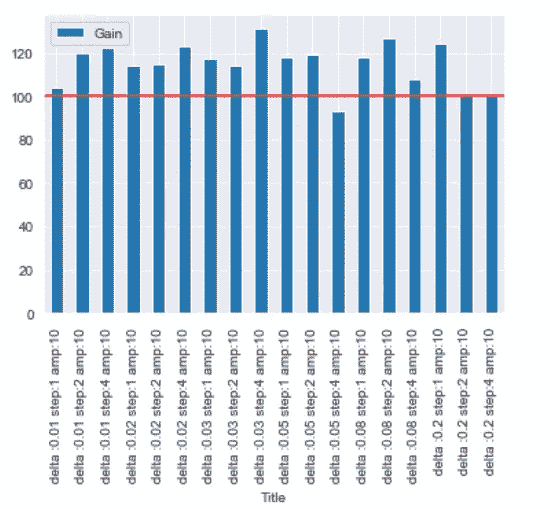

# BTC 伦科贸易简化版第 1 部分

> 原文：<https://medium.com/coinmonks/btc-renko-trade-simplified-part-1-478eb4120fef?source=collection_archive---------18----------------------->

当你有一个好主意的时候，最好的机会是，别人之前已经想到它并且已经实施了。我想对价格变化(或一些变量)做一个简单的 delta 检查，并通过连续 N 次的变化决定买/卖。然后我意识到这是一个简单的好主意，并开始搜索这个。然后我找到了 **Renko。**我发现有些实现把它们简化了，转换成函数调用。在互联网上有非常好的代码，我的是他们的混合物，使一次尝试多个参数。
完整代码在 github : [链接](https://github.com/mcelikkaya/medium_articles3/blob/main/renko_v4.ipynb)

From Wikipedia :**A Renko chart (Japanese: 練行足, romanized: renkōashi, also written 練り足 neriashi) is a type of financial chart of Japanese origin used in technical analysis that measures and plots price changes. A renko chart consists of bricks (煉瓦, renga), which proponents say more clearly show market trends and increase the signal-to-noise ratio compared to typical candlestick charts.**

主要参数有 2 个，
**【delta】**:dataset
**步骤**中重要的变化量:连续多少个“delta”变化，一定是买入或卖出的信号。
很简单地认为你的 **delta** 是 5%
这意味着你对 5%的变化很敏感。而你认为连续 3 次 5%的变化就是一个信号。
依次如下:
【100，102，104，106，108】**110，120，130，140** ，142， **142，130，120，110** ，104..]
在该子集[110，120，130，140]处，变化超过 5%的 3 个连续时隙。所以我们认为市场正在上涨。
这里[142，130，120，110]，变化是超过-5%的 3 个连续槽。所以我们认为市场正在下跌。这样你就可以建立自己的战略。你有多敏感，迭代多少次就一定有这个趋势。

代码的简单解释如下，方法太长，参数太多。你可以阅读 github 的内容，或者点击这里查看摘要。

上面的代码是一切的开始。我用代码解释每一个中间计算。如果你想跳过或检查代码。或者非常简短地读下面的“…”
………………………………………………

**y_data_orig** :一段时间内的原始价格，间隔 1 小时[2021–09–16 00:00:00，2021–09–16 01:00:00…2022–01–13 13:00:00，2022–01–13 13:40:00]

从 y_data_orig(全按价格比例)
**def convert _ to _ renko**(y _ data _ orig):
这里我们转换 renko 的基础数据。
y_data : average of(该区间的高低点)
start_prices:开盘价
amplitude:index _ high—index _ low
**def calculate _ delta _ diff**
这里我们计算每个点的 delta，生成 delta 数据数组。
**def data _ to _ regular**
Raw data 有所有的数据，这里我们只过滤里程碑。(其中增量变化发生在步骤数…)
**def get _ strategy**:
仅迭代变化点，如果它们满足我们的条件(增量变化 N 次)，则决定买入或卖出。

….

代码中还有一个振幅计算。振幅通过一个窗口平滑变量的变化。由于数据波动太大，如果不进行平滑处理，就很难看到任何东西。下面你可以看到 1，3，5，10 窗口的原始振幅和平滑值…

1 and 3 As Amplitude Smoothing

5 and 10 As Amplitude Smoothing

我还做了函数调用，这样我们就可以很容易地尝试多种组合。

通过玩上面的循环，你可以尝试任何你想要的组合。
**Deltas** :把你需要注意的变化
**Steps** :这个 delta step 发生了多少次，让你买入或者卖出
**Amps** :什么程度的平滑让你的数据合理。

当我们运行一个组合时，我们将得到如下图。

**Sample for delta,step,amplitude parameters**

第一张图标出了重要的点，这种逻辑在这些点上找到了里程碑。它们是存在 delta 变化的点。第二张图显示了如果我们使用 **Renko** 或 Hodling 会发生什么。波动性是平稳的市场状况。
第三张图显示了战略的决策点(买入/卖出)。请注意，买入/卖出仅发生在第 x 步增量变化时。大部分时间都有很长的涨跌，但是因为它们小于 delta，所以没有买卖。这可以被看作是这个模型的一个弱点，或者你可以降低 delta 并检查。

在尝试完所有组合后，会有一份显示比较结果的总报告。伦科和霍德林的比例。

这部分只是实现。我想单独讨论用法，所以请阅读第二部分。你可以检查代码，摆弄它，并根据你的理论进行修改。

> *加入 Coinmonks* [*电报频道*](https://t.me/coincodecap) *和* [*Youtube 频道*](https://www.youtube.com/c/coinmonks/videos) *了解加密交易和投资*

# 另外，阅读

*   [比斯勒评论](https://coincodecap.com/bitsler-review)|[WazirX vs coin switch vs coin dcx](https://coincodecap.com/wazirx-vs-coinswitch-vs-coindcx)
*   [赢取注册奖金——10 大最佳加密平台](https://coincodecap.com/earn-sign-up-bonus)
*   [最佳加密交易信号电报](/coinmonks/best-crypto-signals-telegram-5785cdbc4b2b) | [MoonXBT 评论](/coinmonks/moonxbt-review-6e4ab26d037)
*   [Coinswitch 俱吠罗评论](/coinmonks/coinswitch-kuber-review-1a8dc5c7a739) | [电网交易机器人](https://coincodecap.com/grid-trading) | [比特币基地收费](/coinmonks/coinbase-fees-831e77d4f2c5)
*   [Bitget 回顾](https://coincodecap.com/bitget-review) | [双子星 vs BlockFi](https://coincodecap.com/gemini-vs-blockfi) | [OKEx 期货交易](https://coincodecap.com/okex-futures-trading)
*   [OKEx vs KuCoin](https://coincodecap.com/okex-kucoin) | [摄氏替代品](https://coincodecap.com/celsius-alternatives) | [如何购买 VeChain](https://coincodecap.com/buy-vechain)
*   [币安期货交易](https://coincodecap.com/binance-futures-trading)|[3 commas vs Mudrex vs eToro](https://coincodecap.com/mudrex-3commas-etoro)
*   [在印度利用加密套利赚取被动收入](https://coincodecap.com/crypto-arbitrage-in-india)
*   [德国最佳加密交易所](https://coincodecap.com/crypto-exchanges-in-germany) | [WazirX P2P](https://coincodecap.com/wazirx-p2p)
*   [如何购买 Monero](https://coincodecap.com/buy-monero) | [IDEX 评论](https://coincodecap.com/idex-review) | [BitKan 交易机器人](https://coincodecap.com/bitkan-trading-bot)