# BTC 伦科贸易简化版第 2 部分

> 原文：<https://medium.com/coinmonks/btc-renko-trade-simplified-part-2-e640d4fc828b?source=collection_archive---------27----------------------->

在第一部分中，我们检查了基本算法，我只是想在一个新的页面中进行分析。
代号是 github。[链接](https://github.com/mcelikkaya/medium_articles3/blob/main/renko_v4.ipynb)我选择一个既有上涨趋势又有下跌趋势的区间。如下图所示，我选择的时间间隔是 **2021 年 9 月 16 日和 2022 年 1 月 13 日。**有变化的趋势。我想测试四样东西。

所有趋势都有涨有跌。

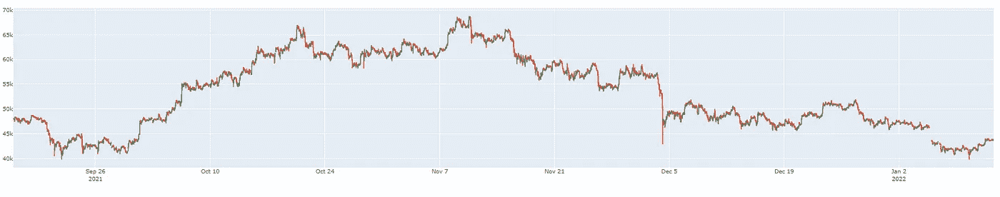

**BTC Price between 2021–09–16 and 2022–01–13**

削减上半年的数据，几乎所有的上升趋势，削减下半年，几乎所有的下降趋势…

所以我想在不同的组合上测试 Renko。
1)上下，/\原始数据
2)向上/

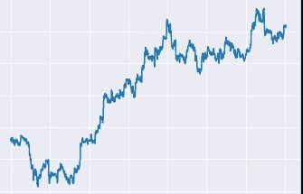

**Up Trend**

3)向下/

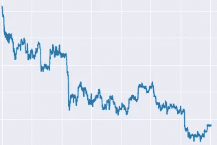

**Down Trend**

4)上下有些短..~~..~~

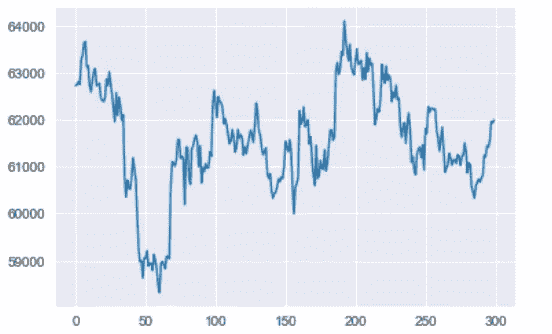

如果你想做相同或类似的事情，找到下面的单元格，取消必要部分的注释。或者粘贴您想要的数据。

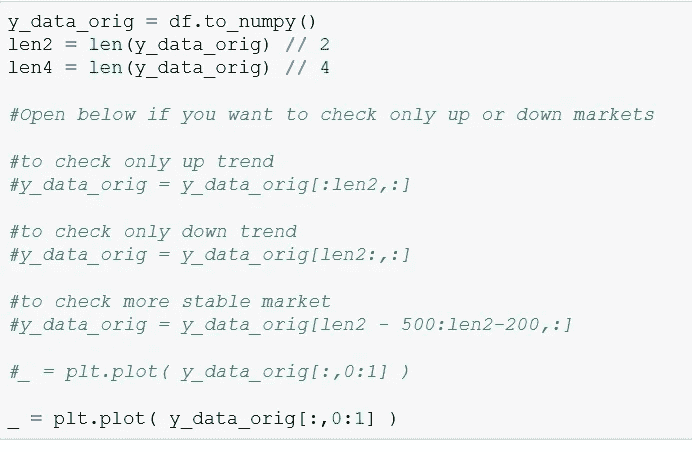

**有些图表非常糟糕，因为 Renko 条件从未满足，数组中没有数据，所以存在虚拟的、无意义的图表。甚至他们在发电方面也有例外。所以我用 try 块来跳过它们。这是因为，没有里程碑(没有我们想要的增量变化)和数组是空的。

让我们从第一种情况(默认)开始，市场有涨有跌。所以我们需要检查 Renko 何时决定以最佳方式买卖。
差值:0.03 步长:4 安培:10 131
差值:0.08 步长:2 安培:10 129

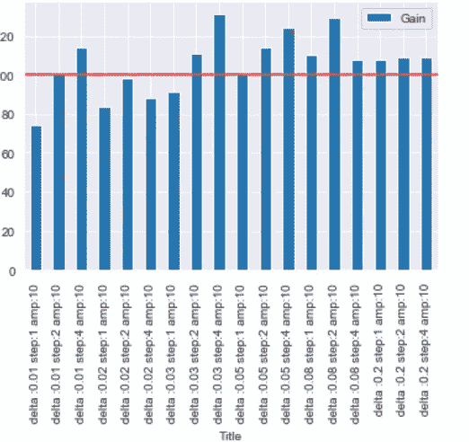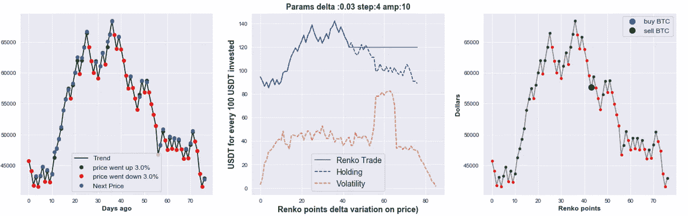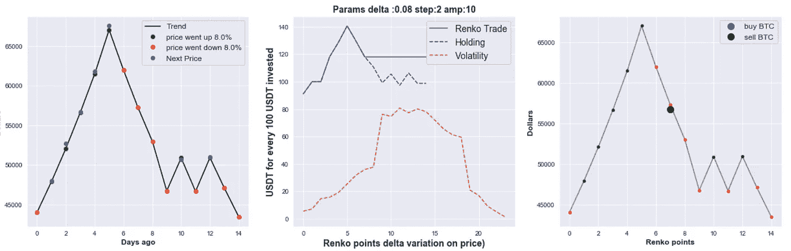

如果你检查这些组合，事实上它们是没有意义的(尽管它们看起来收益最大)。它碰巧似乎是偶然的。他们只做了一个决定，并保持现状。我觉得下面的组合更符合逻辑。它在几乎正确的时间对变化做出反应，并进行足够多的交易。(不多也不少)

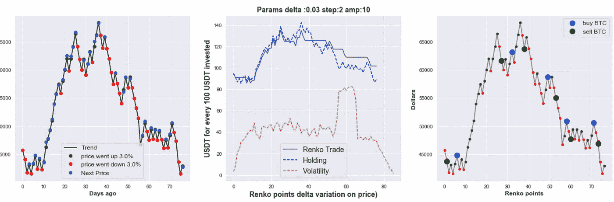

**现在让我们只检查上行市场。**

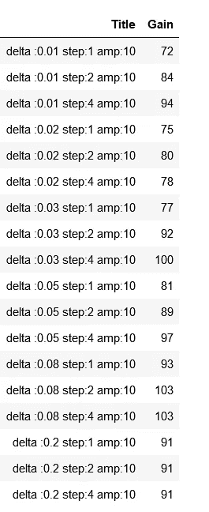

上面的数字有点没意义。我们的一些参数给出了很好的结果。但是由于市场总是上涨(因为我使用的切片),霍德林当然会赢。但我发现上述组合很好，因为买入/卖出决策很有意义。

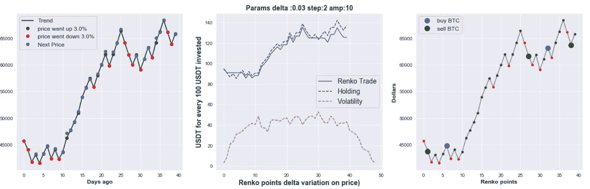

现在让我们只检查下行市场。

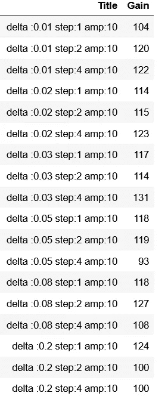

在这方面，这一比例也具有误导性。由于市场一直在下跌，如果伦科在任何时候出售，霍德林的表现当然会更差。因此，人们必须检查伦科何时做出合理的决定。

例如，即使钱丢了，我也觉得下面的决定很有意义。

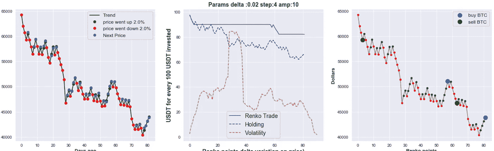

或者甚至下面很有反应似乎不错。

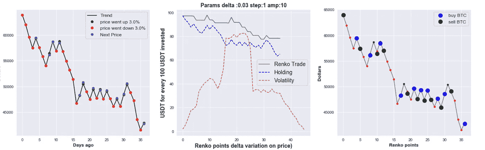

在这里，我想，我展示了一个简单的方法来测试不同数据集上的假设。事实上，我们可以通过 N 步逻辑将 delta 推广到更多的市场，或者以不同的方式改变 delta 的定义，因此我们可以有不同的更复杂的方法。例如，您还可以收集黄金和白银价格，并以更复杂的方式计算 Delta。
只要改变 delta 计算逻辑，就可以生成灵敏度 x 周期的策略。

> 加入 Coinmonks [电报频道](https://t.me/coincodecap)和 [Youtube 频道](https://www.youtube.com/c/coinmonks/videos)了解密码交易和投资

# 此外，请阅读

*   [最佳在线赌场](https://coincodecap.com/best-online-casinos) | [硬件钱包](/coinmonks/hardware-wallets-dfa1211730c6) | [喷气机器人点评](https://coincodecap.com/jet-bot-review)
*   [如何在 WazirX 上购买柴犬(SHIB)币？](https://coincodecap.com/buy-shiba-wazirx)
*   [比特币主根](https://coincodecap.com/bitcoin-taproot) | [前 6 位比特币信用卡](/coinmonks/bitcoin-credit-card-bc8ab6f377c6)
*   [最佳自由加密信号](https://coincodecap.com/free-crypto-signals) | [约比特评论](/coinmonks/yobit-review-175464162c62) | [比特评论](/coinmonks/bitbns-review-38256a07e161)
*   [火币密码交易信号](https://coincodecap.com/huobi-crypto-trading-signals) | [BitMEX 点评](https://coincodecap.com/bitmex-review)
*   [7 最佳零费用密码交换平台](https://coincodecap.com/zero-fee-crypto-exchanges) | [购买流量令牌](https://coincodecap.com/buy-flow-token)
*   [分散式交易所](https://coincodecap.com/what-are-decentralized-exchanges)|[Bitbns FIP](https://coincodecap.com/bitbns-fip)|[Pionex Review](https://coincodecap.com/pionex-review-exchange-with-crypto-trading-bot)
*   [10 个最适合购买信用卡加密的地方](https://coincodecap.com/buy-crypto-with-credit-card)
*   [OKEx Review](/coinmonks/okex-review-6b369304110f)|[ku coin 交易机器人](/coinmonks/kucoin-trading-bot-automate-your-trades-8cf0ca2138e0) | [期货交易机器人](/coinmonks/futures-trading-bots-5a282ccee3f5)