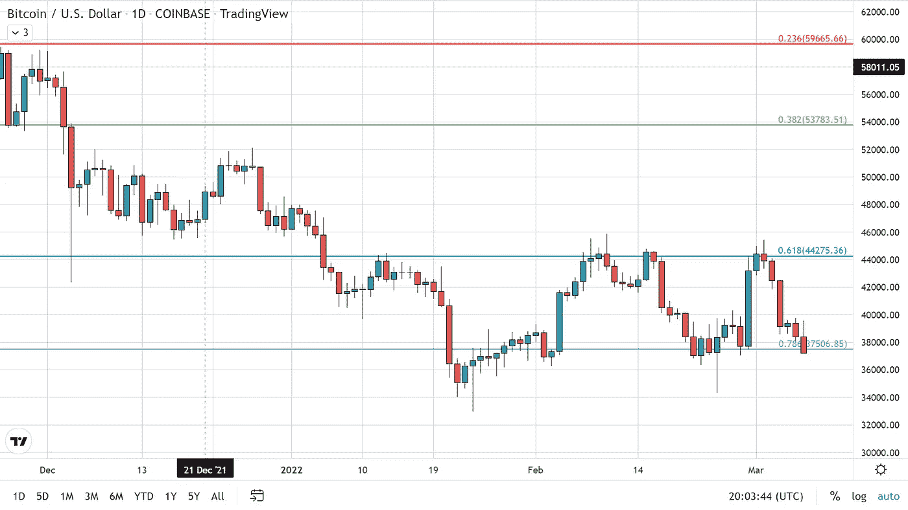
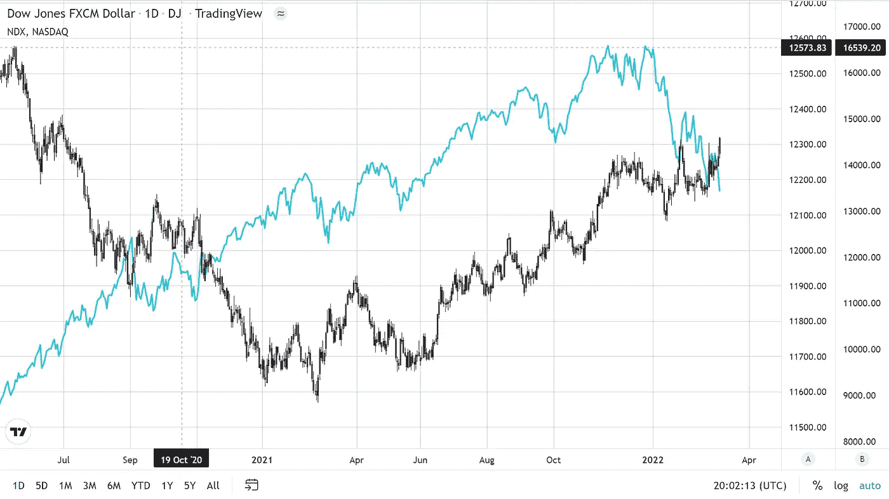
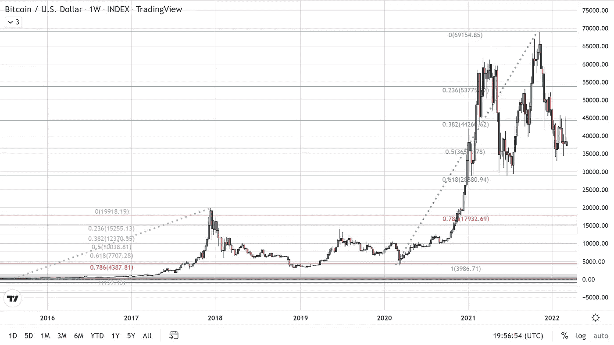

# BTC 似乎注定会有更低的价格

> 原文：<https://medium.com/coinmonks/btc-seems-destined-for-lower-prices-a66476bf83ac?source=collection_archive---------77----------------------->

在撰写本文时，BTC 在突破 37，500 美元的支撑位(78%的回撤位)后，交易价格为 37，222 美元。回撤使用了从底部 28000 美元延伸到 ATH 69000 美元的数据集。

上周带来看涨情绪的“免费资金”叙事似乎已经消退，交易员中出现了悲观和厄运叙事。随着美元、石油和黄金都达到多年来的高点，大宗商品正在飙升。

风险资产继续走低，纳斯达克综合指数下跌 2.5%，领跌美国股市。上周，纳斯达克综合指数(Nasdaq Composite)和比特币出现了短暂的脱钩迹象。然而，这只是一个白日梦，就目前而言，相关性不能再强了，因为纳斯达克和比特币当天都下跌了约 2.6%。

这对比特币未来的价格方向来说是一个不好的迹象，因为欧洲的冲突和美联储即将实施的紧缩政策肯定会继续拖累风险更高的资产。比特币将触底并最终走高，但底部离这里还很远，正如之前的假设，为了完成从 4000 美元到 69000 美元的 ATH 的 78%回撤，比特币可能会跌至 18000 美元。

除了 2020 年 3 月开始的最近一次反弹，每次长期抛物线反弹后都触及 78%的回撤。