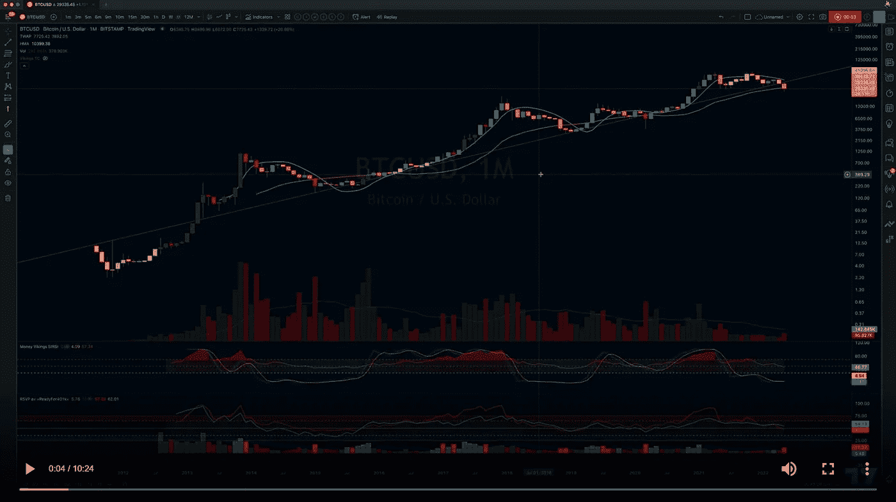

# 2022 年 6 月及以后的 BTC 技术分析

> 原文：<https://medium.com/coinmonks/btc-technical-analysis-for-june-2022-and-beyond-f35ea04d9268?source=collection_archive---------42----------------------->

没那么牛。。。

[https://www.tradingview.com/chart/SPY/BdYKaWAD-Eye-on-the-SPY-What-I-m-seeing-and-the-potential-moves/](https://www.tradingview.com/chart/SPY/BdYKaWAD-Eye-on-the-SPY-What-I-m-seeing-and-the-potential-moves/)

阵亡将士纪念日周末快乐！今天，我来看看[比特币](https://www.tradingview.com/chart/BTCUSD/MvTn4WXf-BTCUSD-Where-are-we-at-and-what-are-we-doing/)在哪里，有哪些可能性。我个人认为我们还没有走出困境。从更大的角度来看趋势，我们正处于明显的下降趋势。我在等着看比特币是否会在 Fib 回撤时进一步跌破. 382 和. 5 水平。这可能是第一次…