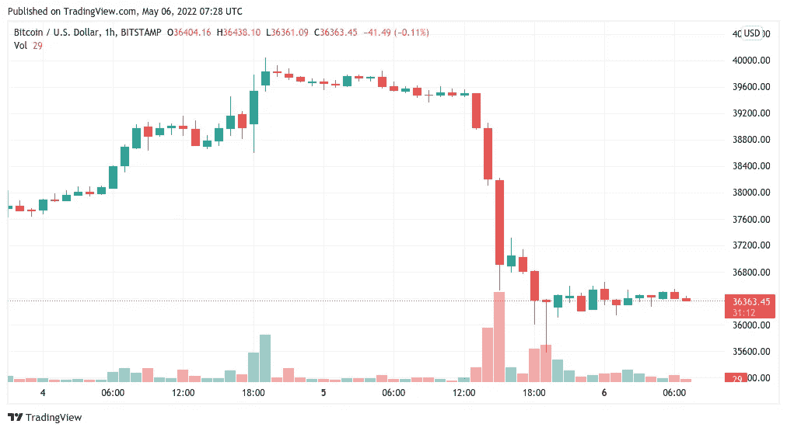
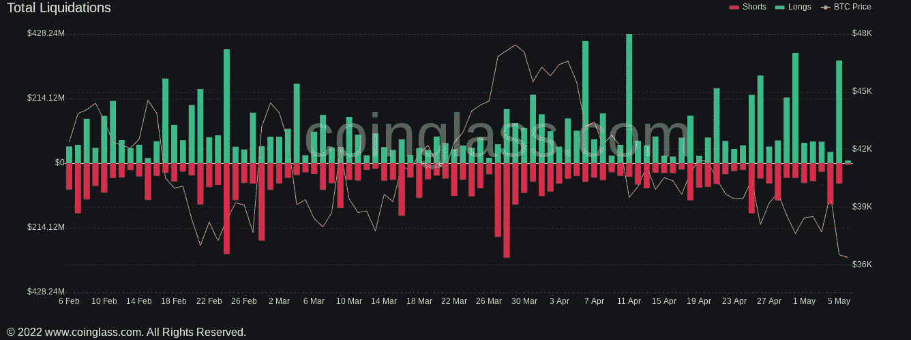

# BTC 成交量在 2022 年创下历史新高，投资者预期投降已经结束

> 原文：<https://medium.com/coinmonks/btc-volume-hits-record-high-in-2022-amid-expectations-capitulation-is-over-1984a7ea93be?source=collection_archive---------38----------------------->

**For full blog visit:-**[**https://bitcoinsupports.com/btc-volume-hits-record-high-in-2022-amid-expectations-capitulation-is-over/**](https://bitcoinsupports.com/btc-volume-hits-record-high-in-2022-amid-expectations-capitulation-is-over/)

比特币还在崩溃的边缘吗？在股市经历了本世纪仅出现两次的状况后，BTC 回归常态。随着人们对美国金融市场状况的担忧日益加剧，一名交易员警告称，比特币(BTC)跌破 36000 美元“闻起来像是投降”。

**分析师:股票“强制平仓”**

比特币在 5 月 5 日华尔街交易时段与股票同步跌至 10 周低点后，反弹至 2 月份的水平。基于美联储加息的预期，前一天开始的对加密和股票的抛售似乎超出了交易员的计划。标准普尔 500 指数当天下跌了 3.5%，而纳斯达克 100 指数下跌了 5%。除了股票，美国 10 年期国债期货下跌 1%，这是一个罕见的现象，导致一些市场参与者暂停考虑。Sundial Capital Research 创始人杰森·戈弗特(Jason Goepfert)指出，在过去的四分之一世纪里，这样的一连串事件只发生过两次——2008 年全球金融危机和 2020 年 3 月的 COVID 灾难。

“有人在爆，这是强行平仓，”他在推特上写道。

[https://Twitter . com/jasongoepfert/status/1522285687566909442](https://twitter.com/jasongoepfert/status/1522285687566909442)

因此，比特币引发的连锁反应可能是投降事件，许多人此前曾表示，由于美国经济状况的变化，这是至关重要的。“对我来说，这意味着屈服，或者至少是非常严厉的信息，”范德波普说。他还注意到，下跌导致 BTC/美元出现自 12 月初以来最大的 4 小时蜡烛线。成交量是一个关键因素，必须恢复，以创造一个更有说服力的投降场景。与此同时，TradingView 表示，比特币市场一夜之间又恢复了一些平静。

**For full blog visit:-**[**https://bitcoinsupports.com/btc-volume-hits-record-high-in-2022-amid-expectations-capitulation-is-over/**](https://bitcoinsupports.com/btc-volume-hits-record-high-in-2022-amid-expectations-capitulation-is-over/)

**在 1 月高点时平仓 BTC 多头头寸**

然而，在评估下跌对霍德勒的影响后，似乎当天的损失并没有导致完全的市场重置。加密货币之间的清算仍然相对平静，在撰写本文时，BTC 在 24 小时内处理了 1.9 亿美元。这是前几个月的最高日交易总额，但低于 1 月份的 3.2 万美元。根据连锁监测服务 Coinglass 的数据，其余的 2 亿美元是由 altcoin pairs 产生的。

**For full blog visit:-**[**https://bitcoinsupports.com/btc-volume-hits-record-high-in-2022-amid-expectations-capitulation-is-over/**](https://bitcoinsupports.com/btc-volume-hits-record-high-in-2022-amid-expectations-capitulation-is-over/)

“不管我在短期内说什么，宏观继续看跌，”著名交易商 Crypto Chase 指出。

**“将会有反弹、爆裂、挤压和短期的欢欣鼓舞，但我不认为我们会在大崩溃之前看到宏观逆转，或美联储逆转其在加息/量化宽松/减少余额方面的立场。”**

**完整博客访问:-**[**https://bitcoinsupports . com/BTC-volume-hits-record-high-in-2022-amid-expectations-uncommition-is-over/**](https://bitcoinsupports.com/btc-volume-hits-record-high-in-2022-amid-expectations-capitulation-is-over/)

**免责声明:以上为作者观点，不应视为投资建议。读者应该自己做研究。**

> 加入 Coinmonks [电报频道](https://t.me/coincodecap)和 [Youtube 频道](https://www.youtube.com/c/coinmonks/videos)了解加密交易和投资

# 另外，阅读

*   [3 商业评论](/coinmonks/3commas-review-an-excellent-crypto-trading-bot-2020-1313a58bec92) | [Pionex 评论](https://coincodecap.com/pionex-review-exchange-with-crypto-trading-bot) | [Coinrule 评论](/coinmonks/coinrule-review-2021-a-beginner-friendly-crypto-trading-bot-daf0504848ba)
*   [莱杰 vs n rave](/coinmonks/ledger-vs-ngrave-zero-7e40f0c1d694)|[莱杰 nano s vs x](/coinmonks/ledger-nano-s-vs-x-battery-hardware-price-storage-59a6663fe3b0) | [币安评论](/coinmonks/binance-review-ee10d3bf3b6e)
*   [Bybit Exchange 审查](/coinmonks/bybit-exchange-review-dbd570019b71) | [Bityard 审查](https://coincodecap.com/bityard-reivew) | [Jet-Bot 审查](https://coincodecap.com/jet-bot-review)
*   [3 commas vs crypto hopper](/coinmonks/3commas-vs-pionex-vs-cryptohopper-best-crypto-bot-6a98d2baa203)|[赚取加密利息](/coinmonks/earn-crypto-interest-b10b810fdda3)
*   最好的比特币[硬件钱包](/coinmonks/hardware-wallets-dfa1211730c6) | [BitBox02 回顾](/coinmonks/bitbox02-review-your-swiss-bitcoin-hardware-wallet-c36c88fff29)
*   [BlockFi vs Celsius](/coinmonks/blockfi-vs-celsius-vs-hodlnaut-8a1cc8c26630)|[Hodlnaut 点评](/coinmonks/hodlnaut-review-best-way-to-hodl-is-to-earn-interest-on-your-bitcoin-6658a8c19edf) | [KuCoin 点评](https://coincodecap.com/kucoin-review)