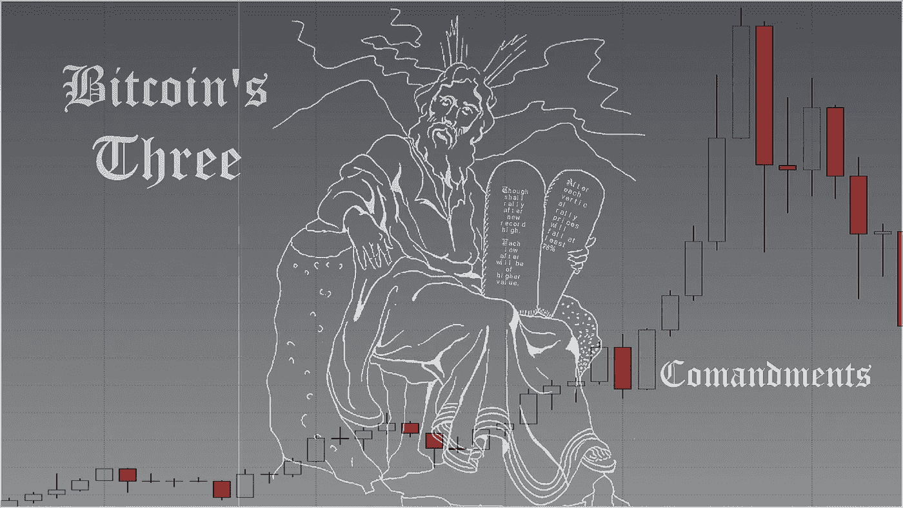
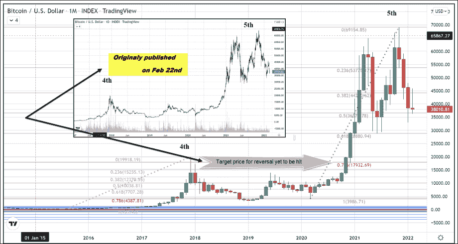
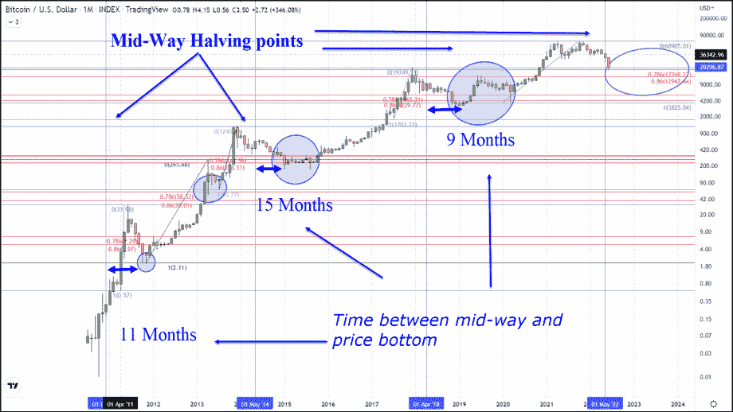
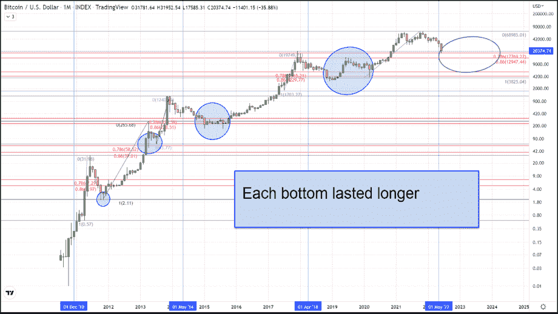
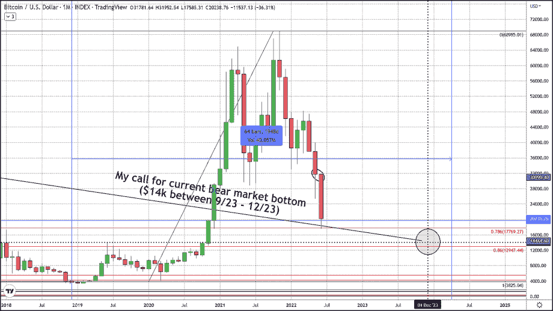

# BTC 的三大真理依然不变

> 原文：<https://medium.com/coinmonks/btcs-3-truths-remain-unbroken-7908360b1116?source=collection_archive---------62----------------------->

“我们正处于这些抛物线周期的第五阶段。在 2020 年 12 月，我们的交易超过了之前的历史高点(20，00 美元)，月蜡烛线翻倍，第一条规则已经满足了。然而，最后两个特征表明，比特币仍有可能从目前的市场纪录高位完全回调。为了让这些常数继续保持自比特币进入我们的世界以来的真理，无论是在金融上还是在哲学上，我们预计目前已经进行了三个多月的调整将以不高于 18000 美元也不低于 3000 美元的价格结束。”—摘自今年 2 月 22 日出版的《 [*比特币三大牢不可破的真理*](https://thegoldforecast.com/crypto/2022/bitcoins-three-unbreakable-truths) *》。*

任何对我们致力于比特币交易的免费服务感兴趣的人，只需点击这个[链接](https://www.thegoldforecast.com/bitcoin)。

> 交易新手？尝试[加密交易机器人](/coinmonks/crypto-trading-bot-c2ffce8acb2a)或[复制交易](/coinmonks/top-10-crypto-copy-trading-platforms-for-beginners-d0c37c7d698c)

*原载于*[*https://thegoldforecast.com*](https://thegoldforecast.com/crypto/2022/btcs-3-truths-remain-unbroken)*。*

> 加入 Coinmonks [电报频道](https://t.me/coincodecap)和 [Youtube 频道](https://www.youtube.com/c/coinmonks/videos)了解加密交易和投资

# 另外，阅读

*   [Bookmap 评论](https://coincodecap.com/bookmap-review-2021-best-trading-software) | [美国 5 大最佳加密交易所](https://coincodecap.com/crypto-exchange-usa)
*   [加密交易机器人](/coinmonks/crypto-trading-bot-c2ffce8acb2a) | [造币评论](https://coincodecap.com/coingate-review)
*   最佳加密[硬件钱包](/coinmonks/hardware-wallets-dfa1211730c6) | [Bitbns 评论](/coinmonks/bitbns-review-38256a07e161)
*   [新加坡十大最佳加密交易所](https://coincodecap.com/crypto-exchange-in-singapore) | [收购 AXS](https://coincodecap.com/buy-axs-token)
*   [红狗赌场评论](https://coincodecap.com/red-dog-casino-review) | [Swyftx 评论](https://coincodecap.com/swyftx-review)