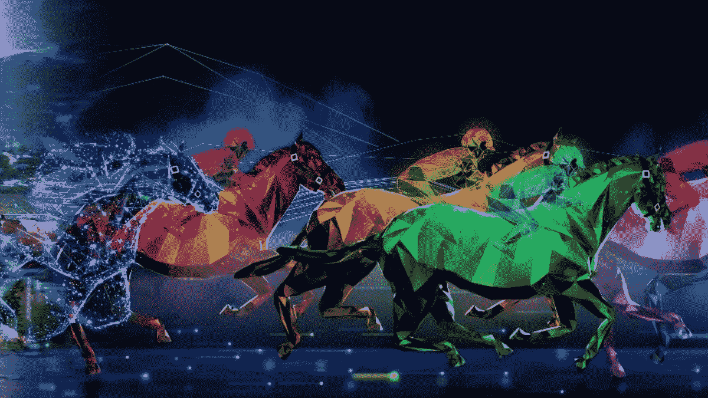

# 百威啤酒的 Clydesdales 从以太坊 NFT 赛车游戏 Zed Run 中获得动力

> 原文：<https://medium.com/coinmonks/budweisers-clydesdales-gets-its-power-from-the-ethereum-nft-racing-game-zed-run-4c871db70a3e?source=collection_archive---------45----------------------->

像 Zed Run 这样的 NFT 市场已经成为一个众所周知的名字，因为他们是游戏行业的领导者。然而，有一个啤酒品牌最近透露了它与 NFT 游戏的赞助协议。此外，游戏将采用百威啤酒的 Clydesdale 吉祥物，以及游戏内的竞争，独家商品，等等。

## **百威的道路**

百威啤酒在 NFT 领域走了一条独特的路，从购买 beer.eth ENS 域名到发布自己的收藏品，加入一个 DAO，并将 NFT 的形象融入一个 [**超级碗广告**](https://en.wikipedia.org/wiki/Super_Bowl_commercials) 。现在，由于与一个著名的加密游戏达成了营销协议，这个啤酒品牌开始比赛了。

## **计划**

百威啤酒宣布，它已经计划将克莱德代尔马加入基于以太坊的 NFT 游戏[**，如 Zed Run**](https://bit.ly/3MRtfRa) 。该游戏之前与百威啤酒一样，与百威英博旗下的啤酒品牌 Stella Artois 合作。

## **新宣布的交易**

作为新宣布的交易的一部分，百威啤酒将发布基于其标志性的 Clydesdale 吉祥物的游戏中的马皮，以及游戏中的百威啤酒主题赛道。这些品牌还将在游戏内挑战方面进行合作，总奖金为 185，000 美元，桌面上有独家联合品牌商品。

## 克里斯·劳伦声明

Zed Run creator Virtually Human Studios 的首席执行官兼联合创始人克里斯·劳伦特(Chris Laurant)在一份声明中表示，“与象征美国梦的标志性品牌百威啤酒一起创造性地工作，为我们不断扩大的 Zed Run 社区开辟了更多机会。”

## **Zed 运行**

用户必须拥有一匹 NFT 赛马才能参加**[**Zed Run**](https://zed.run/)。对于艺术品、收藏品和互动视频游戏商品等物品，NFT 可作为所有权凭证。它们还可以用来促进品牌参与活动，如作为社区的会员通行证、现场或虚拟活动的门票，或促进社区会员通行证的方式。**

## ****百威啤酒通行证****

**6 月 9 日，Zed Run 提供了一个百威啤酒通行证 NFT 出售，有 2500 个 NFT，每个 225 美元，外加以太坊网络交易费。已经拥有百威啤酒遗产的收藏家可以 NFT，在向公众开放之前，Zed Run Genesis NFT 赛马或 Zed Run NASCAR 通行证将被优先购买。**

**此外，在 7 月，百威通行证 NFT 持有者将获得一个百威啤酒 Clydesdale 皮肤，以及一件虚拟 t 恤，化身在[**以太坊元宇宙游戏**](https://bit.ly/3HnCaIW) 中可以穿着。**

## ****啤酒品牌的未来提案！****

**该啤酒品牌将在 7 月和 8 月赞助两场游戏内挑战赛，每场比赛有 45，000 美元的奖金池，以及 12 月的锦标赛，奖金池为 95，000 美元，获胜者可以免费获得一年的啤酒。与此同时，在 11 月，NFT 持有者将能够购买独家商品。**

**百威啤酒和 Zed Run 将提供**“燃烧赚取”**激励——一旦活动在 2023 年初完成，并且所有承诺的效用都已实现，则选择尚未披露的奖励“燃烧”或永久销毁百威啤酒 NFT 山口。**

## ****啤酒品牌的举动！****

**自去年秋天以来，百威啤酒已经在 NFT 领域采取了几项行动，首先是购买了 beer.eth [**以太坊名称服务**](https://ens.domains/) ，这类似于可以分配给加密钱包的 web 域名。**

**当时，该品牌的 Twitter 个人资料图片是来自汤姆·萨克斯:火箭工厂项目的 NFT。百威啤酒很快跟进推出了自己的传统罐装 NFTs，作为“百威啤酒的关键”**进行营销，并提供各种奖励和津贴。****

## ******它做了什么，得到了什么？******

****百威轻很快跟进，推出了自己的 NFT 通行证，然后与以太坊 NFT 项目名词合作，成为其分散集体的一员。作为交易的一部分，百威啤酒在 2 月份的超级碗广告中使用了“名词眼镜”，这得到了名词 NFT 所有者的批准，并导致百威啤酒获得了一个免费的名词——当时在瑞士联邦理工学院价值 39.4 万美元。****

## ******数据！******

****根据 CryptoSlam 的数据，迄今为止，Zed Run 已经在二级市场 NFT 产生了超过 3 亿美元的交易量。为了继续发展，虚拟人类工作室在 7 月份从安德森·霍洛维茨和其他人那里获得了 2000 万美元的首轮融资。****

> ****加入 Coinmonks [电报频道](https://t.me/coincodecap)和 [Youtube 频道](https://www.youtube.com/c/coinmonks/videos)了解加密交易和投资****

# ****另外，阅读****

*   ****[氹欞侊贸易评论](https://coincodecap.com/anny-trade-review) | [火币保证金交易](/coinmonks/huobi-margin-trading-b3b06cdc1519)****
*   ****[分散交易所](https://coincodecap.com/what-are-decentralized-exchanges) | [比特 FIP](https://coincodecap.com/bitbns-fip) | [Pionex 评论](https://coincodecap.com/pionex-review-exchange-with-crypto-trading-bot)****
*   ****[用信用卡购买密码的 10 个最佳地点](https://coincodecap.com/buy-crypto-with-credit-card)****
*   ****[最好的卡达诺钱包](https://coincodecap.com/best-cardano-wallets) | [Bingbon 副本交易](https://coincodecap.com/bingbon-copy-trading)****
*   ****[印度最佳 P2P 加密交易所](https://coincodecap.com/p2p-crypto-exchanges-in-india) | [柴犬钱包](https://coincodecap.com/baby-shiba-inu-wallets)****
*   ****[八大加密附属计划](https://coincodecap.com/crypto-affiliate-programs) | [eToro vs 比特币基地](https://coincodecap.com/etoro-vs-coinbase)****