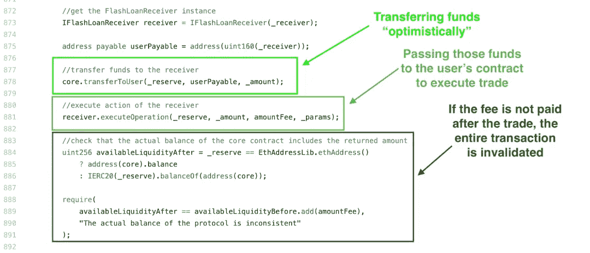

# 在 Uniswap 上构建一个闪贷套利机器人

> 原文：<https://medium.com/coinmonks/build-a-flash-loan-arbitrage-bot-on-uniswap-9f749ee20ab9?source=collection_archive---------0----------------------->

## **0x01 什么是套利？**

套利交易与闪贷或区块链毫无关系。当同样的两种资产在两个不同的交易所有不同的交易价格时，就存在这样的套利交易。

例如，让我们看两个交易所: [Uniswap](https://coincodecap.com/uniswap) 、 [Sushiswap](https://coincodecap.com/how-to-swap-on-sushiswap) ，它们运行相同的合同代码。虽然它们是两个不同的交易所，但是我们可以使用相同的代码来执行相同的交易。此外，由于 Sushiswap 是一个较新的交换平台，因此为其编写的机器人可能较少。

套利的工作原理是这样的:一个乙醚在 Unisawp 中值 80Dai，在 Sushiswap 中值 100Dai。我们在 Unisawp 上购买 1 套，然后立即在 Sushiswap 上卖出，获利 20 天(减去汽油和费用)，这是典型的利润套利交易。

## **0x02 闪贷 vs 闪换**

Aave 协议上的闪贷收取 0.09%的手续费，并且需要至少三次操作。1 向 Aave 借钱；2.在 Dex 3 上交易。对另一个指数进行套利交易以实现利润，并偿还相同的资产。如果你借给戴，你需要偿还戴

快速掉期交易允许交易者在为所用资产付款之前，接收资产并在其他地方使用。Uniswap 上的 Flash 掉期没有固定费用，但收取 0.3%的掉期费。与快速贷款相比，这可以被视为“免费”贷款，

因为交易费是从交易订单中扣除的，不必单独支付。最后一个区别是:我们可以偿还 flashswap 中的任何资产。如果我们用这个来赎回 ETH 买戴，我们可以用戴或者 ETH 来偿还。都是用“乐观转移”。

> *交易新手？试试* [*密码交易机器人*](/coinmonks/crypto-trading-bot-c2ffce8acb2a) *或* [*复制交易*](/coinmonks/top-10-crypto-copy-trading-platforms-for-beginners-d0c37c7d698c)

## **0x03 闪贷及合同**

要了解闪贷，你需要了解以太坊交易的本质。所有以太坊交易都源自一个外部拥有的账户(EOA)，这是一个人工操作的以太坊地址。

以太坊交易可以从一个 EOA 转移到另一个，就像你向朋友付款一样。以太坊交易也可以从 EOA 到执行合同中的代码。那个合约可以调用另一个合约，以此类推，直到你用完交易费(气)。

## 以太坊交易结构

**From** :交易发送方。它是一个 20 字节的地址，代表发起该交易的账户。

**至**:该笔交易的接收方。它也是一个 20 字节的地址。根据用途的不同，它可以是另一个 EOA，一个合同帐户，或者只是空着。

**Value** :卫(1 乙醚= 1⁰ ⁸卫)从“from”转入“to”的资金金额。如果“到”是一个 EOA，它只是一个资金转移。如果“To”是合同地址，则它是传递给已部署合同的资金金额。合同被编码以便它能接受资金。

**数据/输入**:该数据字段主要用于与合同相关的活动。对于契约的新部署，它是字节码和编码的参数。对于契约函数的执行，它包含函数签名和编码的参数。在资金转移中为空。

**气价**和**气限**:两者都与处理该交易的成本有关。矿工执行的交易的每个处理步骤都有一个预定义的气体单位(例如，从永久存储器获取数据的“sload”花费 20 个气体单位)。天然气价格是每单位天然气的价格(单位为魏)。这是交易发送者愿意支付的单价。燃气限额是本次交易中消耗的最大燃气单位。您的交易花费的最大气体单位不会超过气体限制，作为在交易处理中出现任何差异时的保护措施。

## 三种类型的交易

*   EOA 之间的资金转移
*   在以太网上部署合同
*   对已部署的合同执行功能

快速贷款在执行过程中需要多次函数调用，这在 EOA 是不可能的。相反，我们将使用多步骤流程部署合同。我们发起从 EOA 到 Aave 合约的交易以进行套利，但我们提供了部署合约的地址，还需要提供足够的 ETH 来覆盖交易的天然气成本，由于交易的复杂性，这可能非常昂贵(记住，交易取决于需要多少计算)。

## **0x04 OP 传输**

闪贷和闪换都使用“OP 转移”技术，可用于无担保贷款或交换。只要用户在交易结束前偿还所需资金。

在第 884 行，用户契约已经执行完它的代码，现在事务流返回到 Aave 契约，它在代码中有一个 ***require*** 语句，从支票中提取用户契约的费用。乐观转移到此结束。如果用户合约确实完成了这个套利交易，那么 Aave 合约就能够扣除费用。如果没有完成，这条 ***要求*** 语句将会失败，这意味着整个交易将会失败。

乐观传输发生在第 170–171 行，由 **_safeTransfer 函数**完成。下一行是 Uniswap 合约，使用转账余额调用用户合约(即 Flash Swap)

同样，交易流将在 Uniswap 合同上暂时挂起，并转移到用户合同上执行。一旦在用户合同上执行，交易流将返回到 Uniswap 合同。然后，Uniswap 合同检查新的余额，并试图获得掉期费用(180–181)

如果用户套利合约未能转账相应金额，182 行的 ***要求*** 语句失败，整个交易恢复。这是 OP 转移的关键。全靠用户合约套利交易在交易前转移相应资金。如果不成功，则交易无效，将恢复到令牌转移前的状态。但是，如果成功，乐观转移仍然存在，用户获得他们的利润。

ref:[**https://docs.uniswap.org/**](https://docs.uniswap.org/)

[**https://aave.com/flash-loans/**](https://aave.com/flash-loans/)

 [## aave-protocol/lending pool . sol at master aave/aave-protocol

### 此时您不能执行该操作。您已使用另一个标签页或窗口登录。您已在另一个选项卡中注销，或者…

github.com](https://github.com/aave/aave-protocol/blob/master/contracts/lendingpool/LendingPool.sol#L843) 

> 加入 Coinmonks [电报频道](https://t.me/coincodecap)和 [Youtube 频道](https://www.youtube.com/c/coinmonks/videos)了解加密交易和投资

# 另外，阅读

*   [WazirX vs coin dcx vs bit bns](/coinmonks/wazirx-vs-coindcx-vs-bitbns-149f4f19a2f1)|[block fi vs coin loan vs Nexo](/coinmonks/blockfi-vs-coinloan-vs-nexo-cb624635230d)
*   [本地比特币评论](/coinmonks/localbitcoins-review-6cc001c6ed56) | [加密货币储蓄账户](https://coincodecap.com/cryptocurrency-savings-accounts)
*   什么是融资融券交易
*   [维护卡审核](https://coincodecap.com/uphold-card-review) | [信任钱包 vs 元掩码](https://coincodecap.com/trust-wallet-vs-metamask)
*   [Exness 回顾](https://coincodecap.com/exness-review)|[moon xbt Vs bit get Vs Bingbon](https://coincodecap.com/bingbon-vs-bitget-vs-moonxbt)
*   [如何开始用加密贷款赚取被动收入](https://coincodecap.com/passive-income-crypto-lending)