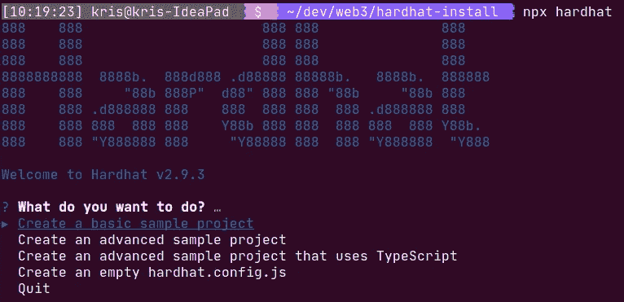
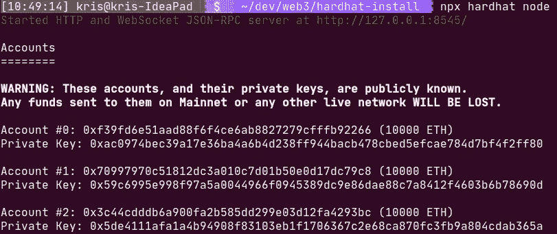
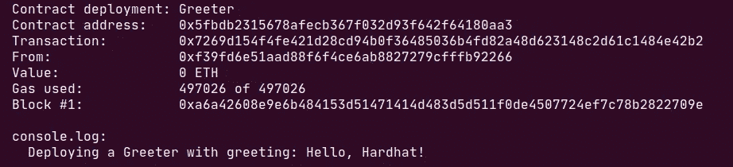
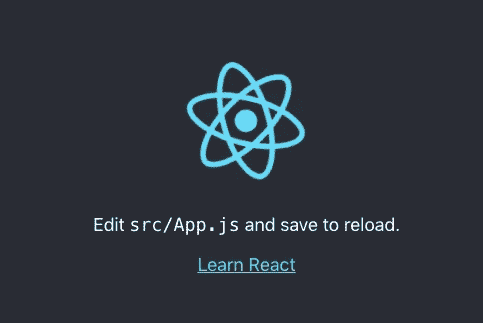
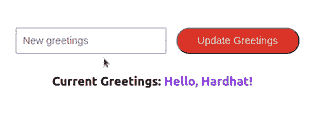

# 用 Solidity、Hardhat、React 和 Web3JS 构建一个 Web 3 应用程序

> 原文：<https://medium.com/coinmonks/build-a-web-3-application-with-solidity-hardhat-react-and-web3js-61b7ff137885?source=collection_archive---------5----------------------->


Photo by [eskay lim](https://unsplash.com/@eskaylim?utm_source=medium&utm_medium=referral) on [Unsplash](https://unsplash.com?utm_source=medium&utm_medium=referral)

在本文中，您将学习如何使用 **Solidity** 、 **Hardhat** 、 **React** 和 **Web3.js** 库来设置 Web3 应用程序。尽管我们的应用程序看起来很简单，但它将提供很多价值。你将学习如何连接一个 Web3 应用程序的点。将来，您可以将它作为更复杂项目的起点。

*注:如果你来这里只是为了代码，可以从我的 GitHub* *中抓取* [*。此外，您会发现文章中缺少的 CSS 文件。*](https://github.com/krisograbek/web3-playground/tree/main/update-greetings)

*注 2:要跟随文章，JavaScript 的基础知识应该足够了。此外，您的计算机上需要 node.js 和 npm。否则，您将无法调用上述命令。*

测试 Web 3 应用程序最方便的方式是运行本地区块链。它比真正的网络更快，并提供可靠的堆栈跟踪和错误消息。要运行本地区块链，我们将使用 Hardhat 网络。

让我们开始我们的项目吧！

## **准备智能合同。**

我们将利用哈德哈特的合同样本。

要在您的项目中使用 hardhat，您必须使用`npm`安装它

```
$ npm install hardhat
```

之后，您将能够使用 hardhat 命令。安全帽开发者推荐在你的项目中使用`npx hardhat [options]`。但是，我们必须首先初始化一个项目。打开您的终端并键入:

```
$ npx hardhat
```

您应该会看到类似这样的内容:



Initializing a new Hardhat project.

为了简单起见，我们将使用一个基本的示例项目。选择此选项，然后按 enter 键。您需要选择更多选项:

```
✔ What do you want to do? · Create a basic sample project
✔ Hardhat project root: -  <you can just press enter>
✔ Do you want to add a .gitignore? (Y/n)- <I usually press ‘y’ because it’s going to my github>
✔ Do you want to install this sample project’s dependencies with npm (hardhat [@nomiclabs/hardhat-waffle](http://twitter.com/nomiclabs/hardhat-waffle) ethereum-waffle chai [@nomiclabs/hardhat-ethers](http://twitter.com/nomiclabs/hardhat-ethers) ethers)? (Y/n)-  <press ‘y’ because we’ll need them>
```

至此，我们已经有了一个基本的 hardhat 项目和一个示例 Smart 契约。检查出`contracts/Greeter.sol`找到它。在`scripts/sample-script.js,`中，有一个脚本来部署合同。我们需要以下步骤:

*   编写合同。为了从前端与我们的契约进行交互，我们需要两件事情:**契约 ABI** 和**契约地址**。我在[这篇文章](https://kris-ograbek.medium.com/freecodecamps-solidity-blockchain-smart-contracts-beginner-to-expert-course-summary-part-2-da6e642efdea)里写了更多关于它的内容。要在终端中编译合同类型，请执行以下操作:

```
$ npx hardhat compile
```

它将在`artifacts/contracts/Greeter.sol/`文件夹中创建两个文件。合同 ABI 在`Greeter.sol`档。稍后，我们将在前端使用它。

*   **运行一个安全帽节点**。我已经解释过了，运营本地区块链是切实可行的。幸运的是，Hardhat 允许我们通过一个简单的命令来实现这一点:

```
$ npx hardhat node
```

您应该会看到类似这样的内容:



A local Hardhat node.

默认情况下，它会创建一个包含 20 个帐户的本地区块链。如果你读绿色的信息，你会找到位置。默认情况下，它位于端口 8545 上。让我们进入下一步。

*   **部署合同**。我们将使用前面提到的脚本来完成这项工作。

*重要提示:请打开一个新的终端。保持上一步中的节点运行是很重要的。*

```
$ npx hardhat run scripts/sample-script.js — network localhost
```

如果运行正常，您应该会在终端中看到以下消息:

```
Greeter deployed to: 0x5FbDB2315678afecb367f032d93F642f64180aa3
```

请注意，合同地址可能不同。如果您让我们的本地 hardhat 节点保持运行，您应该会看到以下输出:



Information about a newly deployed contract in our Hardhat node.

在第二行中，我们看到与之前相同的合同地址。我们有合同 ABI 和地址。因此，我们准备好去前端部分！

## 构建前端。

**运行基本的 React 应用程序。**

一如既往，我们必须从安装开始。让我们创建一个 React 项目。

```
$ npx create-react-app my-project
$ cd my-project
```

这是启动 React 项目的一种常见方式。它安装了许多必要的依赖项，并允许我们运行 React 脚本。此外，在`src/App.js`中，它是我们应用程序的起点。要运行该应用程序，请在终端中键入:

```
$ npm start
```

然后，在你的浏览器中打开`http://localhost:3000`，你就会看到。



Create React App template application.

**向项目中添加 Web3.js。**

为了添加 Web 3 部件，我们将安装 **web3.js** 库。

```
$ npm install web3
```

然后，我们必须像这样把它进口到`App.js`。

Importing Web3 from web3.js.

**修复 Web3 导入。**

遗憾的是，截至 2022 年 4 月，此次导入失败。我在这个 [StackOverflow 回答](https://stackoverflow.com/questions/70557596/couldnt-import-web3-library-in-react-application/70760506#70760506)中找到了两个变通办法。让我们使用第一个，它需要将 react 脚本降级到第四个版本。我们需要三个步骤:

1.  删除`node_modules`文件夹。
2.  在`package.json`中，用 react-scripts 将该行更新为`"react-scripts”: “4.0.3”`
3.  通过在终端中键入`$ npm install`再次安装节点模块。

**添加合同 ABI 和地址。**

还记得我告诉过你我们需要合同 ABI 和地址来与之交互吗？是时候将它们添加到我们的项目中了。我最喜欢的做法是在`src`文件夹中创建`utils`。然后，我向其中添加以下文件:

```
-utils/
 |- constants.js
 |- Greeter.json
```

`Greeter.json`是我们用 Hardhat 创建的文件。因此，从安全帽项目中，我们复制了`artifacts/contracts/Greeter.sol/Greeter.json`文件，并将其传递到`src/utils/`文件夹中。然后，在`constants.js`中，我们添加:

Contract ABI and address in constants.js

酷，我们已经在 React 应用程序中联系了 ABI 和地址。我们需要他们从 web3.js 创建一个契约实例。同样，契约地址来自部署部分。

**创建 web3 合同。**

至此，我们已经具备了创建新合同的一切条件。让我们更新一下`App.js`文件的顶部。

Create a new web3js contract.

我们将该过程分为以下步骤:

*   创建 web3 实例。通过写`new Web("ws://localhost:8545")`，我们传递了提供者。在我们的例子中，它是我们之前启动的本地节点。我们希望通过 WebSocket 连接，这就是为什么我们键入`ws://…`而不是`http://...`
*   创建新的合同实例。这时候我们终于通过了 ABI 的合同和地址。

如果一切都是正确的，我们现在应该能够与我们用 Hardhat 部署的契约进行交互。

重要提示:不要忘记在你的控制台中运行一个 Hardhat 节点。没有它，WebSocket 将无法连接。

**调用公共视图函数。**

让我们看看迎宾员合同。

Default Greeter.sol file.

它有两个功能:

*   `function greet() public view … {}`**视图**关键字至关重要。表示`greet()`是一个**只读功能**。这意味着我们不会改变区块链上的任何东西。
*   `function setGreeting(string memory _greeting) public {}`与前面的例子相反，`setGreeting()`旨在改变区块链上的价值观。

让我们从第一个函数开始。我们准备一个按钮来调用我们的智能合约的`greet()`函数。为此，我们在 JavaScript 中创建了`greetMe()`函数。它从 Solidity 调用`greet()`函数并返回其值。基本示例如下所示:

```
const greetMe = async () => {
  const greetMsg = await greeterContract.methods.greet().call();
  return greetMsg;
}
```

如您所见，我们使用了在上一步中创建的契约实例。在浏览器里看起来怎么样？


Calling the greet() function and displaying its result.

我们的“问候我！”按钮调用 JavaScript 中的`greetMe()`函数。然后，我们显示返回值。虽然函数很短，但是有两个重要的事情要提一下:

*   它是异步的。注意`async`和`await`符号。在执行下一行代码之前，我们必须等待契约的响应，
*   为了调用合同函数，我们必须使用合同名称、`methods`关键字、函数名称和`call()`关键字。

**改变区块链上的价值观。**

你已经知道如何从区块链读取数据。但是，如果你想更新数据，即改变区块链的状态，该怎么办呢？我们`setGreeting()`在坚固中的功能使我们能够做到这一点。让我向您展示这个函数在 JavaScript 中是如何执行的。

```
await greeterContract.methods.setGreeting(newGreetings).send(
{ from: ‘0xf39fd6e51aad88f6f4ce6ab8827279cfffb92266’ })
```

让我们仔细看看:

*   我们需要`await`关键字，因为我们必须等待区块链的响应才能继续前进，
*   我们将`greetings`变量改为`newGreetings`值，
*   我们使用关键字`send()`代替前面例子中的`call()`，
*   我们在`from`键后传递呼叫者的地址。我从我们的 Hardhat 节点获取了第一个用户。

我们每改变一个区块链的状态，就进行一次**交易**。我们必须通知其他**区块链节点**:“嘿，我(地址)正在试图改变这个值。希望你不要介意……”一个区块链上的每笔交易都要花一些**油费**。

好的，让我们看看在我们的项目中更新区块链值是如何工作的。在对 JavaScript 部分进行必要的调整后，`App.js`文件看起来像这样。

The Frontend part of our app.

让我来分解一下新的部分:

*   我们添加了`updateGreets()`函数来调用智能契约中的`setGreetings()`，
*   我们使用两个常见的 React 挂钩:`useState`和`useEffect.`后者在页面加载后设置初始问候。前者让我们更新 React 应用程序的状态。我鼓励你学习更多关于 React 钩子的知识。

好了，我们完成了这个项目。在浏览器里看起来怎么样？



Updating the Greetings on our local Blockchain.

# 最后的想法

厉害！如果你还在读书，你学到了很多！虽然我们的项目看起来并不壮观，但它教会了如何连接 Web 3 应用程序的点。

你有什么问题吗？把它们放到评论区。

## 参考

[1] [安全帽文档](https://hardhat.org/getting-started/)

[2] [React 钩子文档](https://reactjs.org/docs/hooks-intro.html)

> 加入 Coinmonks [电报频道](https://t.me/coincodecap)和 [Youtube 频道](https://www.youtube.com/c/coinmonks/videos)了解加密交易和投资

# 另外，阅读

*   [CoinLoan 评论](https://coincodecap.com/coinloan-review) | [YouHodler 评论](/coinmonks/youhodler-4-easy-ways-to-make-money-98969b9689f2) | [BlockFi 评论](https://coincodecap.com/blockfi-review)
*   [XT.COM 评论](https://coincodecap.com/profittradingapp-for-binance)币安评论 |
*   [SmithBot 评论](https://coincodecap.com/smithbot-review) | [4 款最佳免费开源交易机器人](https://coincodecap.com/free-open-source-trading-bots)
*   [比特币基地僵尸程序](/coinmonks/coinbase-bots-ac6359e897f3) | [AscendEX 审查](/coinmonks/ascendex-review-53e829cf75fa) | [OKEx 交易僵尸程序](/coinmonks/okex-trading-bots-234920f61e60)
*   [如何在印度购买比特币？](/coinmonks/buy-bitcoin-in-india-feb50ddfef94) | [瓦济克斯审查](/coinmonks/wazirx-review-5c811b074f5b)