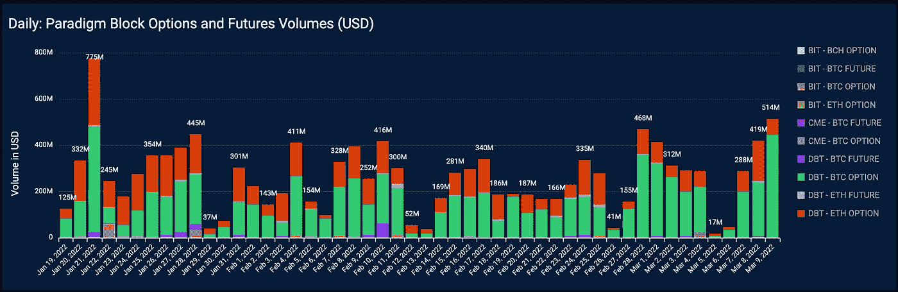

# 建造，宝贝，建造。

> 原文：<https://medium.com/coinmonks/build-baby-build-8add1688c421?source=collection_archive---------86----------------------->

咻！

我们在后视镜中看到了加密货币的行政命令，嘿，伙计们，这是个好消息！

白宫正在认真对待加密，并呼吁政府审查加密货币的风险和好处。该报告列出了一些他们会关注的问题，但没有什么是我们没有预料到的。

从文件中跳出来的一件事是专注于通过密码开发给美国带来竞争优势。它读起来就像我们有绿灯去创新和建设，宝贝，建设。

另一个很好的收获是没有安装任何障碍。当然，美国政府将关注监管，但潮流已经转向那里。越来越多的密码参与者支持监管。明确规定。给我们一些路标，我们可以打开油门，以比现在更快的速度推动创新。

加密货币以广泛的反弹显示了它们的支持。比特币涨幅超过 8%，加密衍生品市场火爆。我们在[范式](https://www.paradigm.co/company)记录了今年第二高的交易量。

#加密#加密衍生品#比特币#以太坊#市场