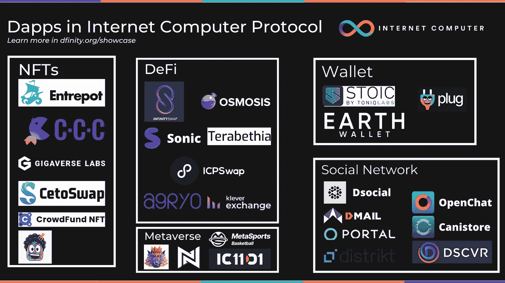
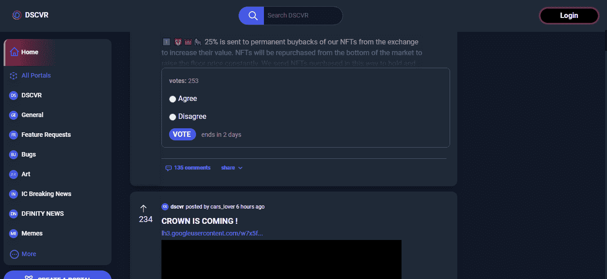
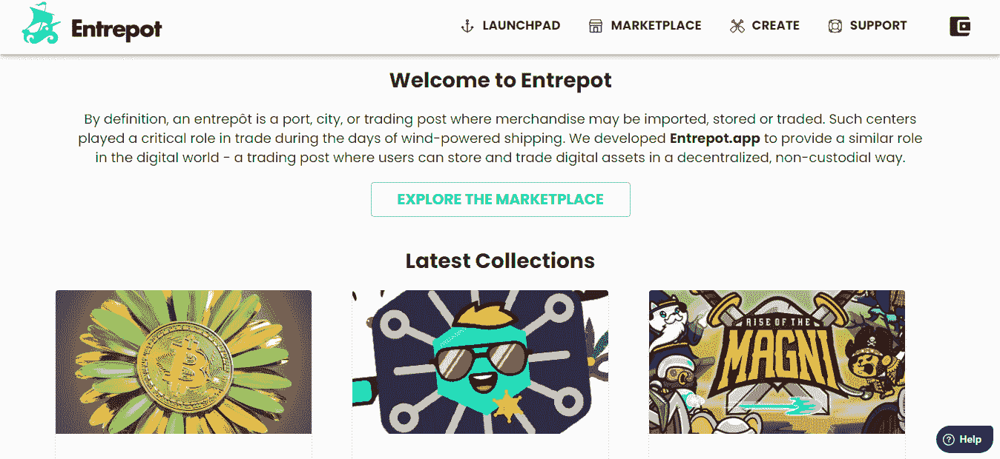
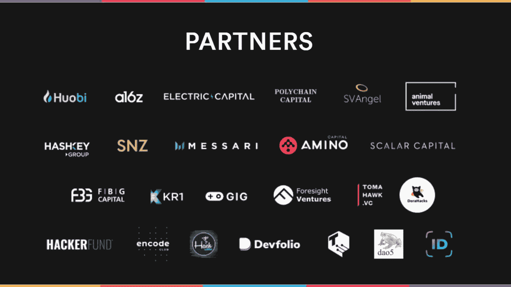

# 构建您自己的 dapp web3，通过 Supernova 黑客马拉松赢得 600 万美元的奖金和资金

> 原文：<https://medium.com/coinmonks/build-your-own-dapp-web3-and-win-6m-in-prizes-and-funding-with-the-supernova-hackathon-3258e52f2d16?source=collection_archive---------29----------------------->

## 用 Supernova Hackathon 资助你的 web3 区块链项目

你是在建立一个**区块链 web3 dapp 项目**还是想要开始？

从 5 月 10 日到 6 月 20 日，由 DFINITY 组织的 Supernova Hackathon 将举行，奖金为 600 万美元🌌。

你将有机会在互联网计算机协议上创建自己的 **100%链上 dapp** :世界上最快的、无限可扩展的区块链，它有可能解决区块链三难问题:安全性、可扩展性和去中心化。

# 觉得没准备好？这个机会也向 web3 区块链初学者开放:

为期六周的研讨会已经开始，这将让你获得在互联网计算机中创建你的第一个 dapp、创建一个 nft 和更多所需的一切。课程将被录音，这样你就可以及时了解所有的材料。

你将有机会发展你的想法或加入一个项目开发团队，在 discord 频道你会找到一个专门的板块。

# 有用的信息

地点:在线
团队建设:不和[https://discord.com/invite/cA7y6ezyE2](https://discord.com/invite/cA7y6ezyE2)约会:Devpost[https://supernova.devpost.com/](https://supernova.devpost.com/)

# 我可以在互联网电脑上创建哪种 dapp？

> 在互联网计算机上，你可以在可互操作的容器(智能合同)内创建你在 web2、web3 上创建的任何东西。

## 查看生态系统中已经存在的 dapps:

[DSCVR](https://h5aet-waaaa-aaaab-qaamq-cai.raw.ic0.app/):Reddit 的去中心化版本，用户是所有者。建立在互联网计算机上，可从任何浏览器访问。

a footage of the website

[InfinitySwap](https://infinityswap.one/) :一个在互联网计算机上创建、下注和交换代币的 AMM 平台。由 Polychain Capital 和 9YardsCapital 支持

[转口港](https://entrepot.app/):设计、部署和管理传统 NFT 和令牌的链上工具和服务。

了解更多关于 https://dfinity.org/showcase/的信息

# 超新星黑客马拉松的主题是什么？

黑客马拉松是为那些想在以下方面有所创新的人举办的:

*   web3
*   挑战
*   nft，游戏，元宇宙
*   分散的社会
*   促进集成电路基础设施
*   创建一个社会影响计划

对于获胜者:

*   600 万美元的奖金等着大家去拿
*   有机会被 ICP 生态系统所了解并获得早期用户。
*   除了奖金之外，还有获得助学金的机会。

> 发现 15 个合作伙伴，如火币，梅萨里，电力资本，多链资本。

如果你是一个数字企业家或开发者或 web3 爱好者，这对你来说是一个机会。

# 了解更多信息并应用:

[https://dfinity.org/supernova/](https://dfinity.org/supernova/)
https://supernova.devpost.com/

> 加入 Coinmonks [电报频道](https://t.me/coincodecap)和 [Youtube 频道](https://www.youtube.com/c/coinmonks/videos)了解加密交易和投资

# 另外，阅读

*   [最佳比特币保证金交易](/coinmonks/bitcoin-margin-trading-exchange-bcbfcbf7b8e3) | [萝莉点评](/coinmonks/lolli-review-e6ddc7895ad8) | [比特币保证金交易](https://coincodecap.com/bityard-margin-trading)
*   [创造并出售你的第一个 NFT](https://coincodecap.com/create-nft) | [密码交易机器人](https://coincodecap.com/best-crypto-trading-bots)
*   [如何在 CoinDCX 上购买柴犬(SHIB)币？](https://coincodecap.com/buy-shiba-coindcx)
*   [CBET 评论](https://coincodecap.com/cbet-casino-review) | [库库恩 vs 比特币基地](https://coincodecap.com/kucoin-vs-coinbase) | [拜比特 vs 比特币基地](https://coincodecap.com/bybit-vs-coinbase)
*   [折叠 App 回顾](https://coincodecap.com/fold-app-review) | [LocalBitcoins 回顾](/coinmonks/localbitcoins-review-6cc001c6ed56) | [Bybit vs 币安](https://coincodecap.com/bybit-binance-moonxbt)