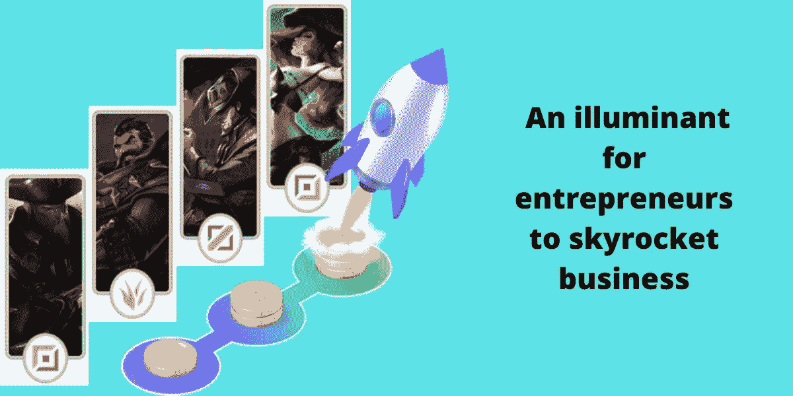
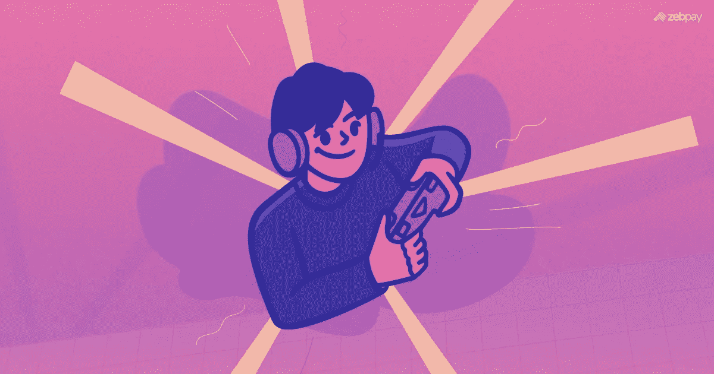

# 构建您自己的 IGO 发射台——企业家业务腾飞的光源

> 原文：<https://medium.com/coinmonks/build-your-own-igo-launchpad-an-illuminant-for-entrepreneurs-to-skyrocket-business-c56638f69e1e?source=collection_archive---------49----------------------->

source :appdupe

为数字创业者和密码创业者为未来的游戏项目设计出如此出色的解决方案而鼓掌。区块链博彩项目过剩，收入增加。最初，在数字时代的开端，开发加密项目的斗争是常见的。如今，有明确的解决方案，通过获得用户的财政支持来激活项目。

有许多 IGO Launchpad development 公司瞄准寻求资金的项目所有者。这个平台通过吸引观众和获得项目资金来帮助他们。IGO 的这种筹资模式只有在游戏项目上是例外的。今天，Play2Earn 和元宇宙是区块链产业的关键概念。你可以急切地浏览这个博客，为你的企业寻找解决方案。将您的业务放在王座上，并随着 IGO Launchpad 的迷人趋势进入加密空间。

## 🏷️ **初始游戏发售发射台**

随着游戏项目交易的激增，完成项目的机会来了。筹资工具 IGO Launchpad 是一个可能包含加密项目的在线平台。这个平台有很多功能可以增加它的可信度。与其他模型如 ICO、IDO 和 IEO 相比，IGO 非常适合区块链游戏。

用户将为项目提供资金，作为回报，他们将获得代币，可以在未来出售。改变一下，从潜在投资者那里获得资金。IGO launchpad 为所有人提供了同等的参与机会。他们可以是独资经营者、小规模企业或大规模企业主。

source zedpay

今天，Play2Earn 和元宇宙的概念是开发任何游戏项目的唯一革命性工具。游戏玩家对边玩边赚表现出极大的兴趣，也喜欢沉迷于三维元宇宙游戏。虚拟现实视频游戏是密码领域的引领者。

## 🏷️Revealing 是 2022 年最大的 IGO 发射台

✔️ **GameFi**

GameFi 是一个熟悉的平台，也是 Red Kite Launchpad 的继任者。在这个平台上，投资者可以购买代币以及游戏内资产来投资该项目。他们需要购买实用令牌 GAFI 才能进入 GameFi 竞技场。

✔️ **播种**

和 GameFi 一样，Seedify 也是一个新兴的 IGO 发射台。Seedify 平台已经在 2021 年上半年成功运行了四个发射台。该平台不仅有助于众筹，也有助于向用户营销项目。SFUND 是 Seedify 的本地令牌，用户可以购买令牌来参与。Seedify 是一个 9 级系统，级别越高，获得的奖励越多。

✔️ **游戏启动者**

这个平台学起来挺有意思的。因为除了代币之外，游戏中还有可以兑换资金的 NFT 资产。这个平台的原生令牌是游戏。

✔️ **金恩首发**

这个平台在推广 DeFi 和区块链游戏方面表现出色。它还处于发展的初级阶段，但他们仍然为即将到来的游戏项目提供了巨额资金。

## 🏷IGO 启动板的️The 属性

由于该平台提供的特性，企业主们对其非常关注。有一些显著的属性使得这个平台非常丰富。

✔️ **交叉兼容性**:你创建的 IGO Launchpad 可以兼容其他区块链网络，如 Cardano、Polygon、Solana 或币安。白色标签解决方案有助于以这种方式设计 IGO 发射台。

✔️ **数字钱包**:默认有一个加密钱包，可以方便投资时资金的存储。

✔️ **多样的下注模块**:launch pad 允许用户通过下注代币赚取奖励或佣金。代币用于下注的时间越长，用户获得的奖励就越多。

✔️ **自动流动性池**:平台通过获得资金并同时用代币兑换资金来维护流动性池。

✔️ **反欺诈措施**:该平台具有内置功能，可根除不当行为和欺诈活动。

 [## 在 BSC 上使用 IDO Launchpad 的功能——企业家的一种引人注目的方法

### 有时，加密项目的环境会发生变化。早些时候，用户很难信任…

medium.com](/security-token-offering/wield-the-features-of-ido-launchpad-on-bsc-a-striking-approach-for-entrepreneurs-adf71f618934) 

## 🏷️**IGO launch pad 的开发过程**

以下是有效概述 IGO 启动平台开发的步骤。只要配合这个程序，你就能在创业中打出最好的一击。

💡构思或创建路线图

💡白皮书起草

💡令牌开发和平台设计

💡令牌分配

💡推广项目的营销

💡令牌列表

💡使用测试版进行测试并消除错误

💡部署政府间组织发射台

## 🏷️ **结论**

从今以后，我可以向你保证，你在正确的轨道上到达你的目的地。因为 IGO launchpad 中包含了大量的功能和额外津贴。除了 IGO 没有更好的平台来提升游戏项目。迟早，你可能会通过爆发你的业务达到 2022 年的顶级趋势。

使用 maestros 开发最好的 IGO launchpad，与您的竞争对手建立联盟。跃进顶级 [IGO launchpad development](https://www.appdupe.com/igo-launchpad-development?utm_source=google&utm_medium=medium&utm_campaign=monika) 可以将您的业务推向巅峰的公司和服务。

> 加入 Coinmonks [电报频道](https://t.me/coincodecap)和 [Youtube 频道](https://www.youtube.com/c/coinmonks/videos)了解加密交易和投资

# 另外，阅读

*   [印度最佳 P2P 加密交易所](https://coincodecap.com/p2p-crypto-exchanges-in-india) | [柴犬钱包](https://coincodecap.com/baby-shiba-inu-wallets)
*   [八大加密附属计划](https://coincodecap.com/crypto-affiliate-programs) | [eToro vs 比特币基地](https://coincodecap.com/etoro-vs-coinbase)
*   [最佳以太坊钱包](https://coincodecap.com/best-ethereum-wallets) | [电报上的加密货币机器人](https://coincodecap.com/telegram-crypto-bots)
*   [交易杠杆代币的最佳交易所](https://coincodecap.com/leveraged-token-exchanges) | [购买弗洛基](https://coincodecap.com/buy-floki-inu-token)
*   [3Commas 对 Pionex 对 Cryptohopper](https://coincodecap.com/3commas-vs-pionex-vs-cryptohopper) | [Bingbon 评论](https://coincodecap.com/bingbon-review)