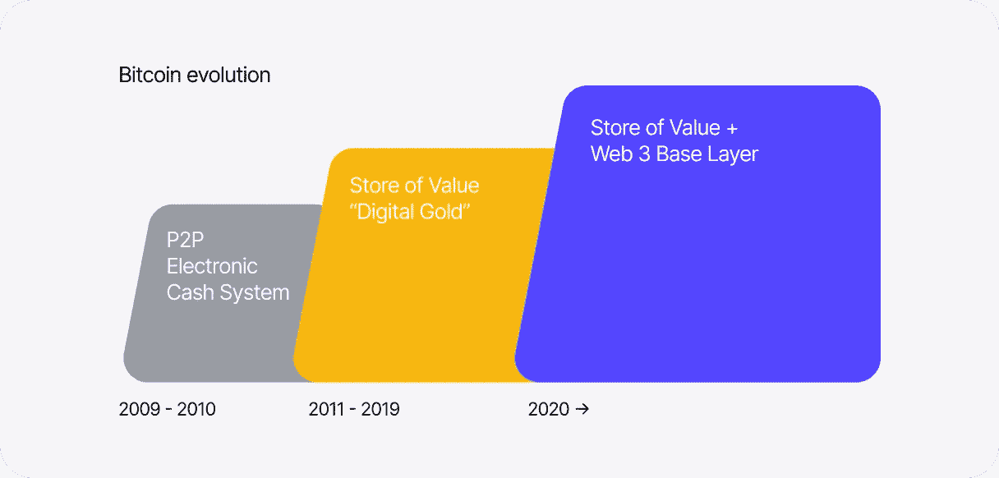

# 比特币的建设者——Stacks Ventures 最新投资组合公司

> 原文：<https://medium.com/coinmonks/builders-on-bitcoin-stacks-ventures-latest-portfolio-companies-488c8e444f49?source=collection_archive---------5----------------------->

*Image Source:* [*Hiro*](https://www.hiro.so/blog/the-reign-of-centralized-apps-is-ending)

【2022 年 6 月

自从 Stacks 基金会发布备受期待的 [Stacks 2.0 白皮书](https://twitter.com/muneeb/status/1338570059187417090)已经整整一年半了，该白皮书建立在两年的研发基础上，并通过 [Stacks](https://stacks.co/) 为比特币带来了实用性，mainnet 将在 31 天后推出。快进到 2022 年，生态系统继续成形，见证了整个 Web 3.0 中许多类别的发展和新数字经济的增长。

Image Source: [Stacks](https://docs.stacks.co/docs/understand-stacks/proof-of-transfer)

在过去的三个半月里，我们在 Stacks Ventures 与分布在世界各地的 20 多个雄心勃勃的团队密切合作，他们将目光投向了比特币。今天，我们公开欢迎这些新公司加入 Stacks Ventures 投资组合和 greater Stacks 大家庭。其中[有 12 家专注于整合 CityCoins](https://cointelegraph.com/news/citycoins-expanding-services-via-11-new-incubated-projects) 为世界各地的城市、城市居民和服务开设新的“应用商店”。

明天，[6 月 15 日和 6 月 16 日](https://www.eventbrite.com/e/stacks-ventures-online-demo-days-registration-327523801507)将开始一场展示活动，每家公司都将向投资者和 Web 3.0 社区展示他们对比特币&栈生态系统的最新开发、贡献和应用，从核心基础设施到中间件再到应用程序的所有技术栈层；

*   **基础设施&应用** — *重新思考一切，从忠诚度计划、商业、游戏(+GameFi)、电信、气候和碳市场、NFT 新易货贸易、身份、娱乐&音乐到基因测试和创建合法的 Dao。*
*   **CityCoins&Crypto city**—*利用 city coins 为服务不足的社区提供 WiFi，激励新的教育模式，健康的奖励机制& wellness，以及新公民即平台(CaaP)商业模式。*
*   **解锁比特币**——*圣杯是能够在智能合约中使用本地的链上比特币来解锁其他资产和网络已经享受了多年的比特币功能——从链上分析到挖掘，到 DLC(离散日志合约)和专用钱包。*

事不宜迟，有请按字母顺序排列的 Stacks 社区的最新成员。完整列表可点击查看[。](https://stxac.notion.site/Meet-Our-Startups-Cohort-2-79763029aee24cb893d21ff348ab32ef)

**1Huddle** 将你需要知道的一切变成看似简单却高效的手机游戏。在 Web 2.0 的过去 6 年中，我们已经使用神经科学&游戏机制来破坏学习&教育空间，并得到了美国空军、麦迪逊广场花园、Audible、Loews Hotels &等组织的信任——每天使用游戏来培训和教育他们的员工。通过启动 Web 3.0，我们将为加密世界提供首个同类最佳的 Learn 2 Earn 解决方案。玩游戏。发展知识和技能。赚取加密。HODL &重复。【1huddle.co】了解更多

***火箭筒探戈。**根据 [DappRadar](https://dappradar.com/blog/dappradar-x-bga-games-report-q1-2022?utm_source=twitter&utm_medium=social&utm_campaign=news) 的数据，2022 年 3 月，区块链游戏吸引了 122 万独立活跃钱包(UWA)，占行业活跃度的 52%！欢迎，巴祖卡探戈，谁是建立一个新的游戏赚取(P2E)游戏生态系统。他们已经完成了两款游戏，首席执行官之前为超过 4500 万用户建立了 Vainglory，并筹集了 7000 万美元的风险投资。*在* [*了解更多 bazookatango.com*](https://www.bazookatango.com/)*

***Wallio(蓝色工作室)**是第一个为家庭提供的比特币钱包，为分散自治地产(DAE)奠定了基础。这种家庭加密钱包为家庭提供下一代家庭资产和遗产管理产品，利用 DAO 公共所有权结构。我们认为，加密不应该只是为了个人财富，而是为了世代财富和家庭计划。*在* [*了解更多*](https://www.bluestudios.io/)*

*DLC.link 与 Stacks 合作，将智能合约引入比特币。我们正在建造一座桥梁，让清算合约在比特币上结算，释放一万亿美元的 BTC 用于 DeFi。所有交易都将是安全的、分散的，没有托管风险。使用我们的桥梁，初创公司将能够为比特币市场构建各种应用，如抵押贷款、货币对冲和衍生品应用。想想一个多 sig 的比特币钱包加上去中心化的神谕，全部由 Clarity 控制。*了解详情请点击* [*dlc.link*](https://www.dlc.link/)*

*打造一种新型的互联网服务提供商。我们与当地的社区支持者合作，让整个城市的居民都能安全、有效地使用高速互联网，以便他们能够生活、工作和学习。只需拥有一枚 CityCoin，居民就可以登录 E8 不断增长的全市联网计划。当地居民现在将能够访问并最终拥有他们每天使用的互联网基础设施的一部分。我们将在迈阿密推出，并计划进军纽约市和奥斯汀。*在* [*了解更多 e8internet.com*](https://www.e8internet.com/)*

*Efani (CipherZero)正在建设下一代无线网络，作为美国最安全的私人手机服务。Efani 现在正在扩展和集成 CityCoins，让任何人都可以成为自己的 5G 手机信号塔和移动运营商，通过设计消除移动网络的监控。*了解更多请点击*[【efani.com】T21](https://www.efani.com/)*

***ePioneers** 带来了比特币结算的碳补偿链，帮助企业满足 ESG 要求，私人投资者积累了高收益的气候资产 DeFi。通过我们位于区块链的碳排放市场，我们能够与小土地所有者合作，将自然证券化，降低认证成本，并使高质量的碳信用可交易、透明和包容。*在* [*了解更多*](https://epioneer.io/)*

***FLATLAY** 是激活创作者、影响者和客户社区的社交商务市场。该平台为任何人提供发布工具，让他们可以在几秒钟内开始一个数字店面，同时为品牌和零售商提供一个 SaaS 门户，激活客户和倡导者社区，以获取内容来推动销售。*

*在与 CrashPunks 一起为 Stacks 生态系统推出了第一个 NFT 门控店面后，他们已经授权给 FLATLAY 来支持 droplinked。通过与智能合同相关的产品的分散注册，droplinked.com 为品牌和艺术家提供了基础设施网关，让他们的社区迁移到 Web 3.0，拥抱物理和数字商品的未来。*在* [*了解更多*](https://t.co/8BfdbqN6zT)*

***Forever** 是一家实体 Play2Earn (P2E)游戏工作室，使用 Web 3.0 技术和游戏机制开发并发布了一系列病毒游戏，供用户在 IRL 与朋友一起玩，并成为最好的自己。他们的第一场比赛是纽约市和迈阿密市之间的台阶比赛。*在* [*了解更多*](https://forever.today/)*

*frens 是 Web 3.0 经济的营销平台。我们消除了不断增长的 NFT、游戏、DeFi 和 DAO 社区中的猜测，并使这些项目以更少的努力可持续地增长。我们推出了一款名为 Discord bot 的产品，用于验证 NFT 钱包，激励会员获取，并提供这些社区中正在发生的事情以及是谁在促成这些事情的可见性。*在* [*朋友处*](https://www.frens.place/) 了解更多信息*

*Gamma(前身为 STXNFT)是一个领先的市场，创作者和数字收藏者可以在这里找到、列出和出售由比特币区块链担保的 NFT。Gamma 还为创作者提供了一个铸造平台，无需任何代码即可推出他们的 NFT 系列，并提供了一个社交平台，旨在成为世界 Web 3.0 社交身份的中心，以 NFTs 为中心。*了解更多请点击*[*γio*](https://gamma.io/)*

***GenoMarket** 正致力于生物安全和隐私的交叉领域，开发一个隐私合规 BioNFT 平台，用于收集和管理医疗数据和生物样本。该公司目前专注于基因检测和 COVID 领域。*在*[*geno bank . io*](https://t.co/CqJD2a4NwV)了解更多信息*

***肉汁**(之前的 ETHR Music)是一个基于比特币的音乐流媒体服务，具有社交收听功能。艺术家可以很容易地将他们的歌曲制作成 NFT，并在他们的全球平台上分享。社交优先的聆听体验将取代社交发现和唱片公司资助的 NFT 销售。这些 NFT 也将成为更精确地管理、转售和获取业绩和版权红利的机制。*了解更多*[T5【ethrmusic.com/】T6](https://ethrmusic.com/)*

***NeoSwap** 是一种新的易货交换机制，发现并促进复杂的多方交易，使 NFT 发现和高级交易引擎的所有参与者受益。*在* [*了解更多 neoswap.ai/*](https://www.neoswap.ai/)*

*Ryder 正在通过其可穿戴社交钱包将现实生活互动引入 crypto，从而引领下一代钱包。用户将能够使用他们的身份进入空间，点击以交换令牌，轻击以与朋友交换 NFT，甚至在丢失种子短语的情况下利用社交恢复。*了解更多请点击*[【ryder.id/】T21](https://www.ryder.id/)*

*StackerDAO 实验室正在将分散自治组织(DAO)引入比特币。StackerDAO Labs 正在解决这个令人头痛的问题，并通过提供(1)快速 DAO 法律&合规设置，使启动和操作 DAO 变得更加容易；(2)一个简单 DAO 的无代码 DAO 生成&管理平台；以及(3)复杂 Dao 的开发工具和定制解决方案。StackerDAO 实验室:在比特币上建立你的社区。*在* [*了解更多 twitter.com/StackerDAOLabs*](https://twitter.com/StackerDAOLabs)*

***Stacks Degens** 是一家区块链科技公司，致力于开发与区块链 Stacks 整合的游戏应用。在我们的亮点游戏德根赛车中，玩家可以在我们的复古风格的赛车游戏中比赛他们的德根 NFT，与社区中的其他人比赛，并获得比特币或堆栈-原生令牌的奖励。*在* [*了解更多 stacksdegens.com/*](https://stacksdegens.com/)*

***Stats On Chain** 是 DeFi 和 Web 3.0/NFT 堆栈和比特币分析的目的地。我们是一个区块链情报工具，提供可操作的区块链数据、仪表盘和关于比特币保护的区块链堆栈上 Defi 和 NFT 的见解。我们使用 SQL 查询工具、仪表板、链上指标和 API 提供完整的链上可见性。*了解更多*[T5【stacksonchain.com/】T6](https://stacksonchain.com/)*

*Swapi 正在利用区块链书库来融合传统的忠诚度计划。通过推出新的通用令牌，Swapi 允许各种规模的商家，从超本地到全国企业集团，从一个易于安装、位于 SaaS 的 plug & play 忠诚度联盟平台受益。Swapi 允许加密在日常交易中获得，并兑换为独家商户奖励，从而允许商户更长时间地保留参与的客户。*在* [*了解更多 swapi.global/*](https://www.swapi.global/)*

***Syvita Mining** 是领先的 CityCoins 和 Proof Of Transfer Lite (PoXL)令牌挖掘和投资组合管理平台。使用我们的采矿池开采城市硬币或任何 PoXL 代币，以消除损失并减少采矿结果的可变性。Syvita Mining 自成立以来已经部署了超过 400 万个 STX。*了解更多请点击*[【syvitamining.com/】T21](https://syvitamining.com/)*

*移动钱包是连接 NFT DeFi 和其他使用堆栈构建并由比特币保护的去中心化应用程序(dApps)的最佳方式。使用 ALEX 或 Arkadiko 等分散式交易所交换代币，并在 Gamma 和 Byzantion 上交易不可替代代币(NFT)。用户也可以挖掘和赚取你的迈阿密硬币和纽约硬币的收益。*在* [*了解更多 xverse.app/*](https://www.xverse.app/)*

*Zeer 是公共安全领域的下一次革命。只需轻触一个按钮，Zeer live 就会将位置和视频数据传输给急救人员，这样您就可以快速获得帮助。为了确保没有人可以质疑你的故事，Zeer 为犯罪现场证据(视频、照片等)提供了区块链保管链解决方案。)数据匿名上传到 Stacks Blockchain 上，并在你准备好的时候为你提供向任何人讲述你的故事的钥匙。*在* [*了解更多 zeersafe.com/*](https://www.zeersafe.com/)*

*在[演示日](https://www.eventbrite.com/e/stacks-ventures-online-demo-days-registration-327523801507)见大家！*

## *新闻中的堆栈:*

*   *[Clarity 品牌更新](https://stacks.org/new-clarity-brand)——Clarity 智能合约:强大、可决策、可预测，现在也很漂亮。*
*   *【Kourier 项目——探索在栈顶建立区块链索引服务的新途径。*
*   *[比特币奖励初创公司 GoSats 在首轮融资前筹集了 400 万美元](https://startupstorymedia.com/insights-bitcoin-rewards-startup-gosats-raises-4-mn-in-pre-series-a-funding/)*
*   *[半可替换代币:现实世界很乱！](https://app.sigle.io/mijoco.btc/08FTNZkfhmaGd9p2q3kLB)*
*   *[Stacks Ventures 转一转，迎来 Ryan Shea，Stacks 生态圈初具规模。](/coinmonks/stacks-ventures-turns-one-welcomes-ryan-shea-and-the-stacks-ecosystem-takes-shape-46722a7dbe9)*
*   *[STX 与主要电子商务平台购物整合。io](https://stacks.org/stacks-shoppingio)*
*   *[比特币试图成为“统治所有人的一个链条”](https://techcrunch.com/2022/05/10/bitcoins-backers-trying-to-turn-it-into-one-blockchain-to-rule-all-crypto/)*

**关于****Stacks Ventures—****我们投资并支持初创公司为比特币构建新的应用和用例。我们为团队提供了一个资源增长平台，包括 Stacks 加速器，这是一个为期三个月的密集项目，由 Stacks 生态系统中的领先实体提供支持。欲了解更多信息，请访问*[*stacks ventures . io*](https://stacksventures.io/)*。**