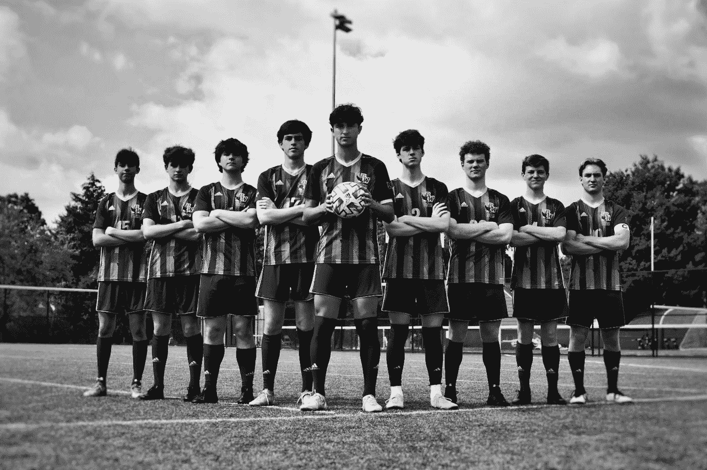

# 建立足球队投资组合——财富创造——第 5 部分

> 原文：<https://medium.com/coinmonks/building-a-soccer-team-portfolio-wealth-creation-part-5-cdb673adfe39?source=collection_archive---------32----------------------->

一个超级懒惰的全天候投资组合，永远保持投资！

Photo by [leah hetteberg](https://unsplash.com/@leahhetteberg?utm_source=medium&utm_medium=referral) on [Unsplash](https://unsplash.com?utm_source=medium&utm_medium=referral)

> ***目标*** *:打造超懒核心组合*
> 
> *1。旨在抑制通货膨胀*
> 
> *2。长期财富创造*
> 
> *3。超被动*
> 
> *4。低流失率*
> 
> *5。多元化发展*