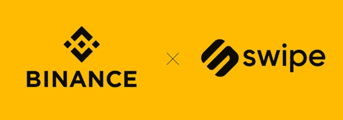
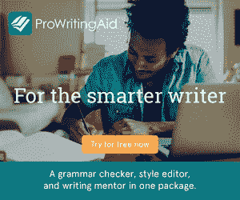

# 通过 OpenSea 建立一个帝国(带 MetaMask 钱包)

> 原文：<https://medium.com/coinmonks/building-an-empire-via-opensea-with-a-metamask-wallet-8d5dffc86e6d?source=collection_archive---------46----------------------->

自从我涉足 NFT 时代以来，已经有将近三个月的时间了。我丈夫紧跟数字潮流，所以我知道这个夏天我会让自己忙着跟上它们。虽然我会继续疯狂地工作，但有些东西我正在积极地学习，你(和许多其他人)也应该学习。

# 做你的研究，选择适合你的钱包。

所以，如果你没有注意到，我让 NFT 的氛围在我身上滋长。自从它在 2021 年底在美国浮出水面以来，我从未想过我会抓住风并对它产生兴趣。现在，我希望在赶潮流之前做好功课。

我为我的钱包选择了 MetaMask，特别是因为 TextNow 和我没有适当的沟通条件(我的号码在 2 月至 4 月下旬期间住在潘多拉的盒子里，所以我不得不使用互联网号码和不稳定的 Wi-Fi 来开展业务)。我的备选路线包括比特币基地，然后就到此为止。我使用 MetaMask 的原因是方便。由于在等待期间我的号码不可用，MetaMask 挽救了这一天，并减轻了我作为一名初学 NFT 车主和经销商的压力。

[Source: Crypto Economy // Omar Jones (2020)](https://crypto-economy.com/binance-acquires-london-based-crypto-payments-card-company-swipe/)

# 哇…这是个圈套！？

在创建了一个 MetaMask 和一个 [OpenSea](https://opensea.io/xPurrfectEsmeraldax) 账号之后，我在这个平台上瞎折腾了一阵(显然没把它当回事)。显然，在张贴了近 20 件作品，超过 5 万份这些作品的副本(有些是出售的，有些是展示的)后，我了解到如果你现金短缺(或者希望完全避免汽油费)，你可以使用 Polygon。

耶，另一种在我口袋里存点钱的方法，没人知道我有多贱(眨眼，眨眼)！

这是我不知道的，直到我开始问自己问题，并在我的 OpenSea 帐户中进行研究。**我怎么能随时取钱或取现呢？**看，世界上没有足够的“如何做”文章来为初学者介绍这种情况。

> 交易新手？尝试[加密交易机器人](/coinmonks/crypto-trading-bot-c2ffce8acb2a)或[复制交易](/coinmonks/top-10-crypto-copy-trading-platforms-for-beginners-d0c37c7d698c)

## 胸部的币安！

今天，就在这一秒，我在 YouTube 和谷歌上搜索如何从 MetaMask 套现。我是说和 Zelle 或者 Cash App 一样吗？如果我按下“发送”,我能立刻拿到我的钱吗？还是我会失去我辛辛苦苦赚来的每一分钱？

根据 MemeCoin 国王的说法，如果你使用 MetaMask，你需要下载一个中间人来将你的硬币转换成现金。我真的不知道这个。他提到了 T2 币安 T3，这是一个适用于 iOS 和 Android 的在线加密货币交易所。他**没有提到的是**币安在某些地区是可用的，尤其是如果你在美国。当我输入我的 addy(地址)时，我的心碎了，这家数十亿美元的公司不支持德克萨斯州(美国最大的存钱罐之一)。

# 回到绘图板…

太好了，回到起点。我正在学习关于 MetaMask 和 OpenSea 的新知识。然而，我希望有一本全面的手册来指导一些即将到来的艺术家、音乐家、虚拟现实狂热分子和播客创作者关于这些小事。尽管如此，我还是更愿意一边学习，一边在我的博客和 BLOCK6 上发布，这样，如果更多的未来艺术家适应了万维网上的发展趋势和习惯，他们就不会感到完全迷失、沮丧或措手不及。

# 币安的替代方案

币安有几个选择，尤其是如果你住在一个无人支持的地区。

1.  **比特币基地交易所:**强大而简单的加密货币买卖和交易平台。然而，可怕的中高收费和缓慢的反应从客户服务。
2.  **LocalBitcoin:** 可供那些希望在自己所在地区购买比特币的人使用。这可以把你和其他比特币卖家联系起来。
3.  **Bittrex:** 新手或临时投资者的绝佳选择。Bittrex 的固定费用很低，而且有大量的加密货币和法定货币。

*您好，感谢您的阅读！如果你对我的 NFT 之旅感到好奇，请访问*[*NFT 官方收藏:MeowFTs*](/@EGBleu22/starting-my-meowfts-journey-c2e5391ff899) *和* [*使用 YouTube 增强你的数字钱包。此外，如果你需要专业博客或官方学者英语导师，别忘了顺便访问并提交委托请求。*](/@EGBleu22/using-youtube-to-enhance-your-digital-wallet-68e14177bb3)

[I love writing, don’t you? Let’s work together soon!](https://prowritingaid.com/en/App/Features?afid=8620)