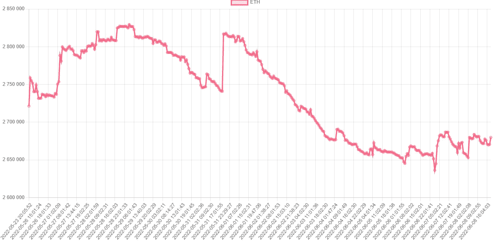
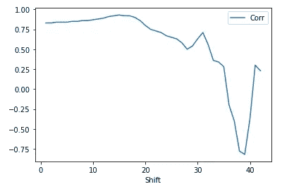

# 建设币安储备跟踪机器人。(第二部分)

> 原文：<https://medium.com/coinmonks/building-binance-reserves-tracking-bot-part-2-14742fffab45?source=collection_archive---------13----------------------->

如果你能看到每种加密货币的币安账户储备会怎样？分析称，这些数字的大幅增加与未来的保证金要求相关，因此这可能是一种比火车全速行驶更快跳出火车的机制。

Photo by [Dylan Calluy](https://unsplash.com/@dylancalluy?utm_source=medium&utm_medium=referral) on [Unsplash](https://unsplash.com?utm_source=medium&utm_medium=referral)

几周前，我决定尝试这样做，从以太坊开始。只使用公共数据 API 和一些简单的 Python 代码，我创建了一个 viz 来显示币安持有的以太坊储备的总美元价值。

> *我刚刚在 Udemy 上发布了一个新课程，叫做* [*【实用网页抓取教程】*](https://www.udemy.com/course/practical-web-scraping-course/?referralCode=8EDD61CDBBB81B6998CA) *。它包含视频教程，其中包含 web 抓取的编码技巧，可以帮助您立即构建基于数据的应用程序。您可以从这篇文章和我的其他教程中找到代码和想法，并以一种方便的可视化格式显示出来。*

在上一部分中，我已经介绍了创建数据检索脚本的步骤，如何托管它以及安排它每小时执行一次。请花时间阅读它，以便更好地理解一般的数据流:

 [## 建设币安储备跟踪机器人。第一部分

### 我对数据的热情帮助我开发了几种工具来捕捉这些重要的信息…

destiq.medium.com](https://destiq.medium.com/building-binance-reserves-tracking-bot-part-1-4e8e633f8229) 

本文将向您展示可视化原始数据的工具和方法。

# 数据

与我在第一部分中采用的方法不同，这次我选择使用 ORM——对象关系映射工具。它被称为 Peewee，它似乎既直观又强大，足以进行快速概念验证。

我已经编译了一个快速 flask 代理应用程序，它将为我提供来自 PostgreSQL 数据库的数据。这是它的代码库:

如您所见，我的 flask 应用程序有一个名为“/records”的路径，它根据第 23 行定义的模型访问数据库并提取记录。我做了一些计算，只是为了让结果看起来更好，然后以 JSON 格式返回它们。

这种方法不是真正的防失败，因为我想展示一个解决方案的概述，而不是提供一个工作产品。对于生产用途，您还需要:

*   为终结点的结果添加缓存；
*   添加对 API 参数的验证；
*   添加一些 try/except 逻辑，以确保每个场景都得到处理；

# 前端

对于我在宠物项目上的快速迭代，我经常使用堆栈“Heroku

作为前端解决方案的主干，我使用了 create-react-app。在这个故事中，您可以看到我如何更详细地使用这个 npm 包:

 [## 如何在 24 小时内创造 SaaS？第一部分

### 超高速发展

levelup.gitconnected.com](https://levelup.gitconnected.com/how-to-create-saas-within-24-hours-part-1-46ab9d32d1f6) 

这里有一个片段，您可以复制/粘贴到您的 POC 中:

诚然，我可以花更多的时间在这个项目的视觉效果上，但这不是我的主要想法。

Hourly plot for Binance reserves

# 主办；主持

虽然对于许多人来说，托管看起来是最难的部分，但对于 Heroku 来说，这并不复杂。它允许您利用 docker 容器，对于 Flask + React 解决方案，这似乎是最佳选择。这里有一个 docker-compose 脚本，它将为您创建一个可以部署到 Heroku Hub 的隔离制品:

# 分析学

我在最近的一篇文章中探讨了以太坊链上指标，外汇储备是其中最有用的指标之一。看起来它们与价格行为有滞后的相关性，这可能是一个很好的预测指标。虽然币安实际上不能代表整个市场，但它包含了大约 50%的市场，因此可以很好地预测实际储备的规模。

对于特定的使用案例，以太币储备与价格的相关性是如何随着时间推移而变化的:

Correlation of Eth Reserves to Price

该图显示，当大部分 Eth 开始加密时，它通常与大约 38 天内的价格呈反向相关。虽然这个指标不能作为唯一的事实来源，但它对一般的价格估算非常有用。

# 结论

要跟踪 web3 数据，你不需要像 CryptoQuant 那样昂贵的 API。虽然他们有很多花哨的统计数据和比单个 Ethscan 追踪器多得多的数据来源，但你仍然可以捕捉到对你的交易决策有用的数据。

*如果你对本教程有疑问，请告诉我，不要忘记订阅未来的文章，因为它让我有了超越理性的动力！*

> 加入 Coinmonks [电报频道](https://t.me/coincodecap)和 [Youtube 频道](https://www.youtube.com/c/coinmonks/videos)了解加密交易和投资

# 另外，阅读

*   [币安 vs FTX](https://coincodecap.com/binance-vs-ftx) | [最佳(SOL)索拉纳钱包](https://coincodecap.com/solana-wallets)
*   [比诺莫评论](https://coincodecap.com/binomo-review) | [斯多葛派 vs 3Commas vs TradeSanta](https://coincodecap.com/stoic-vs-3commas-vs-tradesanta)
*   [Capital.com 审查](https://coincodecap.com/capital-com-review) | [港加密借贷平台](https://coincodecap.com/crypto-lending-hong-kong)
*   [如何在 Uniswap 上交换加密？](https://coincodecap.com/swap-crypto-on-uniswap) | [A-Ads 审核](https://coincodecap.com/a-ads-review)
*   [WazirX vs coin dcx vs bit bns](/coinmonks/wazirx-vs-coindcx-vs-bitbns-149f4f19a2f1)|[block fi vs coin loan vs Nexo](/coinmonks/blockfi-vs-coinloan-vs-nexo-cb624635230d)