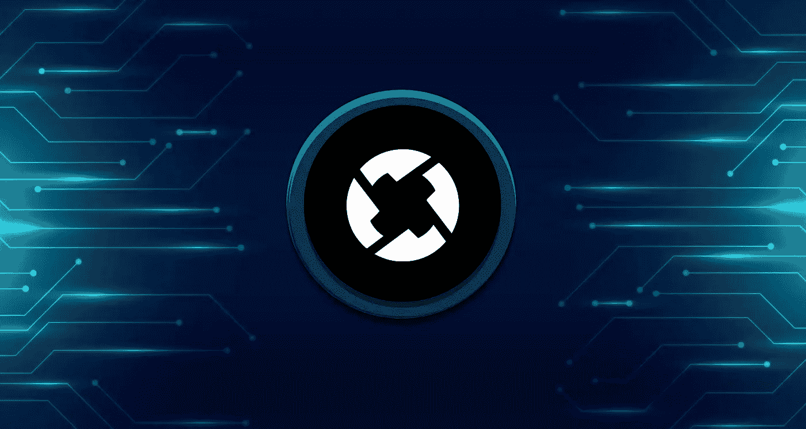
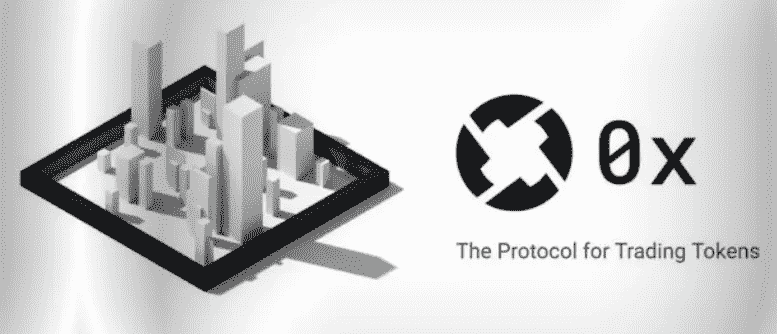

# 使用 0x 协议(ZRX)构建分散式交换

> 原文：<https://medium.com/coinmonks/building-decentralized-exchanges-with-0x-protocol-zrx-ed1eefe54649?source=collection_archive---------39----------------------->

0x 协议(ZRX)是为区块链上的分散式交换设计的开放协议。该协议是在智能合约的帮助下开发的，使开发人员能够操作简单的分散业务，轻松交易 ERC20 令牌。

此外，比特币的出现为其他区块链协议铺平了道路，如 ripple 和以太坊，这两个协议都在迅速改变我们对金融的看法。例如，到目前为止，以太坊上已经建立了超过 1000 个去中心化的应用程序，所有这些应用程序都在 ERC20 智能合约的帮助下建立了自己的原生加密货币。这种以太坊代币有几百个，所以必然会有低成本无缝兑换的需求。0x 协议(ZRX)通过其平台满足了这一需求。

# 什么是 0x 协议(ZRX)？

简单地说，0x 协议(ZRX)是一个开放的协议，它是为以太坊区块链上的分散式交换而设计的。这个区块链是在智能合约的帮助下开发的。此外，它使各种开发商能够经营分散的业务，以便人们可以毫不费力地交易 ERC20 令牌。0x 协议(ZRX)是一个有前途的项目的主要原因是它的分散性。如果你购买了一种虚拟货币，很有可能你使用的是集中交易。除了异常快速和易于使用之外，缺点是这些集中的交易所可能会被关闭；他们可能会卷走顾客的钱。0x 网络的本地加密货币被称为 ZRX，它主要用于向中继支付费用以促进交易。然而，这些令牌服务于另一个目的:0x 协议的分散治理。

# 0x 协议的历史

0x 协议 ZRX 是一个被采用的令牌，它让您对协议如何发展有发言权，令牌的持有者也可以用他们的令牌来赚取 ETH 流动性。

## [继续阅读 procommun.com](https://procommun.com/2022/03/technology/building-decentralized-exchanges-with-0x-protocol-zrx/)

> 加入 Coinmonks [电报频道](https://t.me/coincodecap)和 [Youtube 频道](https://www.youtube.com/c/coinmonks/videos)了解加密交易和投资

# 另外，阅读

*   [Bookmap 评论](https://coincodecap.com/bookmap-review-2021-best-trading-software) | [美国 5 大最佳加密交易所](https://coincodecap.com/crypto-exchange-usa)
*   最佳加密[硬件钱包](/coinmonks/hardware-wallets-dfa1211730c6) | [Bitbns 评论](/coinmonks/bitbns-review-38256a07e161)
*   [新加坡十大最佳密码交易所](https://coincodecap.com/crypto-exchange-in-singapore) | [收购 AXS](https://coincodecap.com/buy-axs-token)
*   [红狗赌场评论](https://coincodecap.com/red-dog-casino-review) | [Swyftx 评论](https://coincodecap.com/swyftx-review) | [CoinGate 评论](https://coincodecap.com/coingate-review)
*   [投资印度的最佳加密软件](https://coincodecap.com/best-crypto-to-invest-in-india-in-2021)|[WazirX P2P](https://coincodecap.com/wazirx-p2p)|[Hi Dollar Review](https://coincodecap.com/hi-dollar-review)
*   [加拿大最好的加密交易机器人](https://coincodecap.com/5-best-crypto-trading-bots-in-canada) | [库币评论](https://coincodecap.com/kucoin-review)