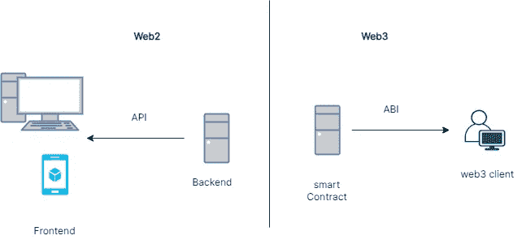
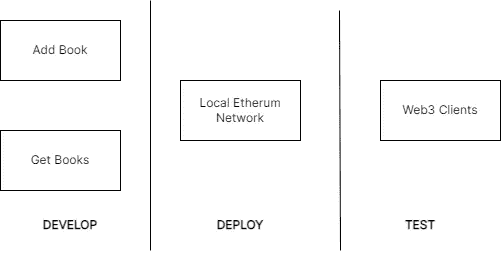

# 使用 Web2 设计思想构建、部署简单的 Web3 智能合约并与之交互。

> 原文：<https://medium.com/coinmonks/building-deploy-and-interact-with-a-simple-web3-smart-contract-using-a-web2-design-thinking-9638a8cda9e3?source=collection_archive---------0----------------------->


# 介绍

网络 3。分散式应用。智能合同。这些术语你可能听说过。好吧，如果你没有，那么你真的需要做一些挖掘，然后继续本教程。你可以从这篇中等文章开始[。但是，如果你想直接把脚伸进水里，欢迎你！](https://woonkly.medium.com/what-are-dapps-and-how-can-they-improve-services-e99046ff5cb)

在本教程中，我们将构建一个简单的书店 Solidity 智能契约，它等同于构建 web 2 应用程序的后端部分。

> 一个简单的书店 Solidity 智能合同，用户可以将书籍添加到商店[一个列表]中，并获得商店中的书籍列表。

帮助我们理解智能合约的组成部分。正在编译。在部署 it 的同时，使用一些业内最好的工具。

这里是 GitHub 上代码的[链接。](https://github.com/mrsimi/hardhat_intro)

## 先决条件:

*   熟悉 Web2 开发(后端、API 知识或其交互、如何构建 Web2 应用)
*   熟悉区块链、智能合约、Web3 和以太坊的概念。
*   熟悉 JavaScript 或 Solidity。
*   安装了节点的 Visual Studio 代码，版本 12.0 或更高。

# 项目设计

> 成长意味着改变，而改变包含风险，从已知走向未知。(乔治·希恩)

## 我们知道些什么？

如果您通过了先决条件中列出的所有标准，那么您已经了解了 Web2 开发。但是重复一下，在 web2 中，我们主要处理前端和后端。

后端是容纳我们的主要逻辑，并对数据库、文件托管平台、支付平台等进行修补的地方。然后后端将其公开为一个**应用程序编程接口(API)。**

前端是 web2 架构的第二部分。它(前端)获取 API，构建应用程序的面向 web 部分，即你看到的漂亮的 Airbnb 网站。这就是你谈论 HTML，CSS 和 JavaScript 的地方。

## **未知。**

构建 Web3 应用是未知的。但是如果我们从 Web2 的角度来考虑这个问题会怎么样呢？事实证明我们可以。

所以同样的，我们将 Web2 的架构分为前端和后端。为了传递知识，我们可以将 Web3 应用程序分成智能合同(后端)和 Web3 客户端(前端)。

现在在这种情况下，后端[智能合约]正在向前端公开**应用程序二进制接口(ABI)** 。

智能合约位于区块链上，是我们应用程序的 Web3 动力库，而前端可以是任何客户端，从移动应用程序到浏览器，再到区块链钱包。

> 在 web2 中，我们认为后端(对于我们的逻辑)和前端都使用 API 进行通信。对于 Web3，我们认为智能合约(作为我们的后端，容纳我们的逻辑)和 Web3 客户端是我们的前端。



Web2 vs Web3

因此，我们构建简单智能契约的项目就像构建 Web2 应用程序的后端。

## 设计。

因为我们的智能合同能够做两件事:

*   向书店列表中添加一本书
*   把书店里所有的书都拿来

写完我们的智能合同后。我们部署到一个本地以太网，并使用 web3 控制台客户端消费它。



APP PARTS

## 工具

要编写智能合约，我们必须用我们所构建的区块链能够理解的编程语言来编写。所以聪明的合同语言必须是它下面的区块链人的语言。对于我们的情况，我们正在以太坊区块链上构建，它理解 Solidity 和 Vyper(在您阅读本文时可能有更多选项)。

**但是为了这个教程，我们将使用坚固性。结帐这里的编程语言语法**[](https://docs.soliditylang.org/en/latest/)**。**

**我们将使用的开发框架是 **hardhat** 框架。把框架想象成一个拥有所有工具和一切(调试工具、错误处理、插件集成等)的工作室。)您智能合约开发所需的。**

**总之，我们的:**

*   **编程语言:可靠性(有 JavaScript 或 OOP 语言背景会有帮助)。**
*   **开发环境:Hardhat(其他包括 Remix 和 Truffle)。**

**接下来，我们设置我们的开发环境。**

# **设置**

## **使用 hardhat 框架设置项目**

****1 —初始化您的项目并安装 hardhat****

**为您的项目创建一个新文件夹，并在该目录下打开您的终端。然后运行:**

```
npm init --yes
npm install --save-dev hardhat
```

**这将创建 package.json 文件和 node_modules**

****2 —创建您的 hardhat 配置并安装其他必要的库****

**还在你终端的同一个目录里。奔跑**

```
npx hardhat
```

**你会被问到一个问题:**你想做什么？****

**选择**创建一个空的 hardhat.config.js** 选项，因为我们计划从零开始做一些东西，这不是很酷吗？**

**最后，让我们安装一些插件，以帮助我们与我们的合同互动。运行:**

```
npm install --save-dev @nomiclabs/hardhat-ethers ethers @nomiclabs/hardhat-waffle ethereum-waffle chai
```

****3 —更新 hardhat.config.js****

**最后，对于我们的设置，让我们更新 hardhat.config.js，为我们安装的库提供指导。从 hardhat 文档中，我们只需要在配置文件的顶部添加这一行:**

```
require("@nomiclabs/hardhat-waffle");
```

**所以我们的配置文件现在应该看起来像这样**

```
require("@nomiclabs/hardhat-waffle");/*** @type import('hardhat/config').HardhatUserConfig*/module.exports = {solidity: "0.7.3",};
```

# **发展**

****步骤 1 文件夹设置****

1.  **在 Vs 代码中打开你的项目(这里你可以安装一些 solidity 扩展(不需要))。**
2.  **创建一个名为 **contracts** 的文件夹:这是您所有合同的存放位置**
3.  **在 contracts 文件夹下创建一个文件(使用任何名称，我的名称是 BookStore.sol):这是我们将要编写智能合同代码的地方。**

****步骤 2 编写智能合约代码****

**把智能契约(从现在开始的契约)想象成 OOP 中的类。类有属性、方法、字段等。**

**因此，我们的合同有:**

*   **保存图书详细信息(标题和年份)的属性。我们将在 solidity 中使用 Struct。结构可以保存许多不同的数据类型。**
*   **另一个属性是一组书籍。结构数组**
*   **两个方法:AddBook()接受一个图书类型，将其添加到数组中并返回图书，GetBooks()返回数组中所有图书的列表。**

**这是代码:**

**你应该检查合同页面的坚固性[结构来理解顶层(第 1 -3 行)。虽然基本上在第 2 行，我们只是告诉哪个版本的可靠性工作，在这种情况下，任何版本等于或大于 7 都可以。](https://docs.soliditylang.org/en/latest/structure-of-a-contract.html)**

**第 3 行是我们告诉 solidity 使用实验特性，因为我们在第 19 行接受一个 Struct 作为参数。删除第 3 行并查看错误(奇怪的错误)。**

**第 1 行是关于许可的，solidity 文档的这一部分可以解释这一点**

> **如果智能合约的源代码可用，则可以更好地建立对智能合约的信任。因为提供源代码总是会涉及到版权方面的法律问题，所以 Solidity 编译器鼓励使用机器可读的 SPDX 许可证标识符。每个源文件都应该以注释开头，说明其许可证:**

**如果你在这里，到目前为止，你明白所做的一切。您已经成功地编写了一份智能合同。耶！**

**我们来编译一下。**

****第 3 步:编制我们的合同。****

**转到您的终端，运行这行代码**

```
npx hardhat compile
```

**如果一切按计划进行，您的终端中应该会有这样的消息。**

```
Compiling 2 files with 0.7.3
Compilation finished successfully
```

**也检查你的文件夹，有些东西应该已经改变了。是的，添加了**工件**和**缓存**文件夹。**

**工件文件夹是你编译实体代码的地方。检查工件文件夹中的合同文件夹(工件>合同)。您应该看到两个带有您的合同名称的 json 文件。在我们的例子中，如果你使用了 BookStore.sol，你将会得到 **BookStore.dbg.json** 和 **BookStore.json.****

*   **书店. json 是你的 ABI。记得吗？我们在开头提到的应用程序二进制接口。**
*   **第二个文件 BookStore.dbg.json 用于调试。你知道我们为什么要使用像 hardhat 这样的框架，我们在开始时也提到过。**

**通读 ABI [BookStore.json]，感受一下它的样子。查看 Solidity 文档，深入了解 ABI。这是客户在您部署合同后希望从您那里得到的。**

> **您的 ABI 是在您将智能合约部署到区块链网络(如以太坊)后，Web3 客户端希望从您那里获得的。**

# **部署**

**接下来，我们将部署智能合同。**

**hardhat 框架为我们提供了多种选择，从部署到本地以太网、测试网到实时部署。所有这些的区别在于证书，这些证书在 hardhat 文档中是不言自明的。**

**为了我们的教程，我们将部署到一个由 hardhat 提供的本地网络。**

****步骤— 1 创建文件夹，添加部署文件****

1.  **首先，创建一个名为 **scripts:** 的文件夹，这是我们的部署脚本所在的位置——我们稍后会指向它。**
2.  **将 deploy.js 文件添加到 scripts 文件夹:这是我们的部署代码所在的位置。**

****步骤 2 添加部署代码****

**对于部署，我们需要一个以太坊帐户，其中有以太，因为部署成本以太。在我们的例子中，我们已经从 ether . js[我们之前安装的库]中测试了以太坊帐户。如果我们要使用一个测试网络或一个真实的帐户，我们必须在部署代码中连接我们的以太坊帐户。**

**然后，我们获得合同并将其部署到网络中。**

**在部署时，我们获得了我们在网络上部署的合同的地址。**

****步骤 3 部署到本地网络。****

1.  **在同一个目录中打开一个新的终端，运行下面的代码来启动本地 hardhat 节点并保持其打开状态:**

```
npx hardhat node
```

**2.在同一目录中打开另一个终端。这是我们运行其他部署命令的地方。**

*****请记住保持[1]中的节点打开，因为这将保持由 hardhat 提供给我们的本地以太坊节点打开，同时请记住，此节点不管理状态，即每次运行本地节点时，您都必须重新部署您的合同并重新与之交互。*****

**在您的新终端中运行下面的代码，以部署在本地主机网络上(请记下[1]中的终端，以查看代码是否已更新到本地以太坊区块链)**

```
npx hardhat run --network localhost scripts/deploy.js
```

**你的回答应该是这样的:**

```
Deploying contracts with the account:  0xf39Fd6e51aad88F6F4ce6aB8827279cffFb92266
Account balance:  10000000000000000000000
BookStore address:  0x5FbDB2315678afecb367f032d93F642f64180aa3
```

**回想一下书店地址，因为我们将使用它与部署的智能契约进行交互。**

****保持这两个终端打开，然后我们进入与智能合约交互的最后步骤。****

# **与我们的智能合同互动**

**此时，我们将使用命令行来消费我们的智能契约。在以后的教程中，我们将使用其他客户端，如 web 应用程序、移动应用程序，您可以在我的空间上保持关注。**

**我假设从**部署到本地网络**部分的两个终端仍然是活动的。**

****步骤 1 设置智能合同交互环境。****

1.  **通过运行以下代码连接到本地主机网络:**

```
npx hardhat console --network localhost
```

**我们签订合同的网络。 **localhost** 是我们给网络起的名字。去检查**部署到本地网络**部分以确认。**

**您现在应该有一个交互式终端。**

**2.通过运行以下代码连接到协定:**

```
const BookStore = await ethers.getContractFactory("BookStore")
```

**书店明明是我们合同的名字，说你用了别的名字，那就用那个。它返回一个未定义的。**

**3.将智能合同地址附加到合同。回忆部署到本地网络中的地址，步骤 2。在我们的例子中，地址是**0x 5 fbdb 2315678 afec b 367 f 032d 93 f 642 f 64180 aa 3。****

**运行下面的代码来完成任务**

```
const bookStore = await BookStore.attach("0x5FbDB2315678afecb367f032d93F642f64180aa3")
```

****步骤 2 调用智能合约函数****

**我们必须在智能合同中发挥作用。AddBook()和 GetBooks()。目前我们没有书籍，AddBooks()方法接受 Book 类型的结构参数。所以我们会这么做。**

**让我们补充一下。在终端中运行下面的代码**

```
var newBook = {title: 'Becoming', year: 2009}
```

**然后**

```
(await bookStore.addBook(newBook)).toString()
```

**最后，让我们通过跑步拿到所有的书**

```
await bookStore.getBooks()
```

**这将显示您添加的图书。瞧啊。！！！**

**只要您的两个终端在运行，您就可以继续向智能合同添加图书并获取图书列表。**

***PS:如果关闭了你的 hardhat 节点，就得重启会话；部署和互动会议。***

**[这里是 GitHub 上代码的链接](https://github.com/mrsimi/hardhat_intro.git)**

# **进步和补充**

**我们有一个很好的起点，这里有一些你可以进一步了解的东西。**

****CRUD 的剩余 UD:** 目前为止我们可以创建和读取(CR 或 CRUD)。您可以继续实现[书店中图书的更新和删除]的 UD。**

****获取单本书**:另一个可以探索的功能是如何获取单本书。这可能很棘手，因为 solidity 数组数据类型不像大多数 OOP 那样丰富，所以也许有库可以使用，或者你可以写一个。**

**编写一个简单的 HTML/CSS 和普通的 JavaScript 客户端(不使用 JS 框架):这是另一个问题，你可以把这个项目做得更深入一些。UI 比主机好玩。**

# **结论**

**在本教程中，我们已经能够从 web2 的角度理解智能合约。创建一个简单的智能合约，我们可以在其中添加和获取记录，将它部署到本地网络，并使用 web3 客户端与之交互。**

**因此，我们掌握了基础知识，可以单独解决每个问题——编写智能合同、部署和消费。希望你能在你的 web3 项目中运用这些经验和想法。**

**和往常一样，我希望这是一个有见地的阅读。**

**再一次，[这里是 GitHub 上代码的链接](https://github.com/mrsimi/hardhat_intro.git)**

> **加入 Coinmonks [电报频道](https://t.me/coincodecap)和 [Youtube 频道](https://www.youtube.com/c/coinmonks/videos)了解加密交易和投资**

## **另外，阅读**

*   **[在美国如何使用 BitMEX？](https://blog.coincodecap.com/use-bitmex-in-usa) | [BitMEX 评论](https://blog.coincodecap.com/bitmex-review)**
*   **[最佳期货交易信号](https://blog.coincodecap.com/futures-trading-signals) | [流动性交易所评论](https://blog.coincodecap.com/liquid-exchange-review)**
*   **[南非的加密交易所](https://blog.coincodecap.com/crypto-exchanges-in-south-africa) | [BitMEX 加密信号](https://blog.coincodecap.com/bitmex-crypto-signals)**
*   **[MoonXBT 副本交易](https://blog.coincodecap.com/moonxbt-copy-trading) | [阿联酋](https://blog.coincodecap.com/crypto-wallets-in-uae)的加密钱包**
*   **[雷米塔诺评论](https://blog.coincodecap.com/remitano-review)|[1 英寸协议指南](https://blog.coincodecap.com/1inch) | [购买 Floki](https://blog.coincodecap.com/buy-floki-inu-token)**
*   **[5 大最佳社交交易平台](https://blog.coincodecap.com/best-social-trading-platforms) | [瓦济克斯 NFT 印度](https://blog.coincodecap.com/wazirx-nft-india)**
*   **[10 本关于加密的最佳书籍](https://blog.coincodecap.com/best-crypto-books) | [英国 5 个最佳加密机器人](https://blog.coincodecap.com/uk-trading-bots)**
*   **[Koinly 回顾](https://blog.coincodecap.com/koinly-review) | [Binaryx 回顾](https://blog.coincodecap.com/binaryx-review) | [Hodlnaut vs CakeDefi](https://blog.coincodecap.com/hodlnaut-vs-cakedefi-vs-celsius)**
*   **[比斯勒评论](https://blog.coincodecap.com/bitsler-review)|[WazirX vs coin switch vs coin dcx](https://blog.coincodecap.com/wazirx-vs-coinswitch-vs-coindcx)**
*   **[赢取注册奖金——10 大最佳加密平台](https://blog.coincodecap.com/earn-sign-up-bonus)**
*   **[最佳加密交易信号电报](/coinmonks/best-crypto-signals-telegram-5785cdbc4b2b) | [MoonXBT 评论](/coinmonks/moonxbt-review-6e4ab26d037)**
*   **[Coinswitch 俱吠罗评论](/coinmonks/coinswitch-kuber-review-1a8dc5c7a739) | [电网交易机器人](https://blog.coincodecap.com/grid-trading) | [比特币基地费用](/coinmonks/coinbase-fees-831e77d4f2c5)**
*   **[Bitget 回顾](https://blog.coincodecap.com/bitget-review)|[Gemini vs block fi](https://blog.coincodecap.com/gemini-vs-blockfi)|[OKEx 期货交易](https://blog.coincodecap.com/okex-futures-trading)**