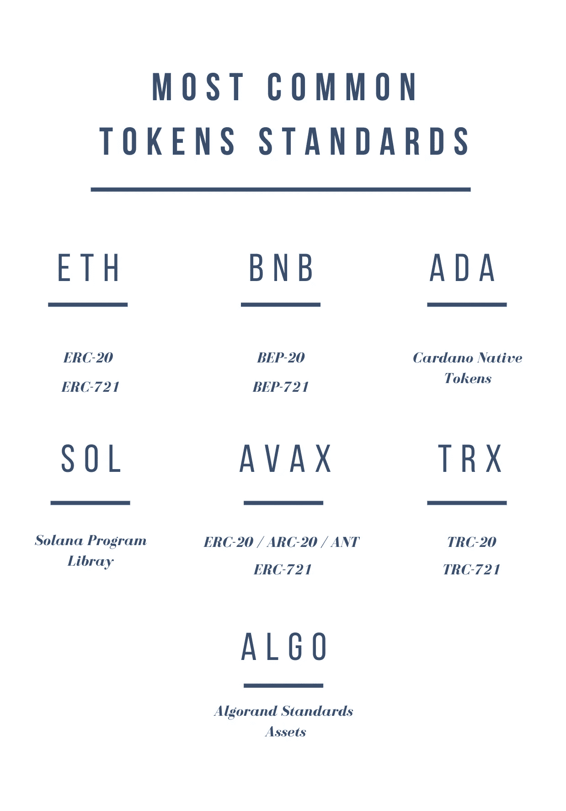

# 建立在区块链之上:令牌数据标准研究

> 原文：<https://medium.com/coinmonks/building-on-a-blockchain-a-look-into-tokens-data-standards-e3c9f94f7a14?source=collection_archive---------31----------------------->

尽管比特币是一项突破性的技术，但它存在固有的局限性，因为它只能处理简单的交易。具体来说，虽然用户可以使用比特币协议在地址之间转移比特币，但比特币本身并不支持智能合约的附加功能。因此，它也无法处理不涉及比特币的交易的交易方。

为了使区块链协议支持在其网络上启动数字资产，协议开发者必须创建一个或多个标准数据结构，然后应用开发者可以使用这些数据结构来启动新令牌。协议开发人员有必要创建这些标准，以便处理事务的验证人员所使用的协议软件可以读取和理解涉及应用程序级令牌的事务。

大多数网络至少支持两种标准:一种用于可替换令牌，一种用于不可替换令牌。ERC-20 和 ERC-721 是以太坊网络上常用的令牌标准，分别用于可替换令牌和不可替换令牌。

通常，**可替换令牌**数据标准包括数量和余额。例如，它可能显示一个帐户持有 1.8 BTC 和 357.3 USDT。

**不可替换令牌**标准要求每个令牌都有唯一的标识号。帐户信息将列出帐户持有的每个 NFT 的 ID，而不是声明帐户有一定数量的不可兑换货币。

使用网络可用的数据标准，任何人都可以在该网络上创建和发布令牌。

# 反馈

让我知道你的想法[在这里](https://www.philippeho.com/contact)并且在[推特](https://twitter.com/1philippeho)上关注我！

## **附录:标准链接**

**以太坊**:[https://ethereum.org/en/developers/docs/standards/tokens/](https://ethereum.org/en/developers/docs/standards/tokens/)

**https://academy.binance.com/en/glossary/bep-20 智能链条** : [币安](https://academy.binance.com/en/glossary/bep-20)&[https://academy.binance.com/en/glossary/bep-721](https://academy.binance.com/en/glossary/bep-721)

**卡尔达诺**:[https://docs.cardano.org/native-tokens/learn](https://docs.cardano.org/native-tokens/learn)

**索拉纳**:【https://spl.solana.com/token】T2

**雪崩**:[https://docs . avax . network/build/references/coreth-arc 20s/](https://docs.avax.network/build/references/coreth-arc20s/)

**Tron**:[https://Tron protocol . github . io/documentation-en/contracts/TRC 20/](https://tronprotocol.github.io/documentation-en/contracts/trc20/)

**阿尔格兰德**:[https://developer.algorand.org/docs/get-details/asa/](https://developer.algorand.org/docs/get-details/asa/)

> 加入 Coinmonks [电报频道](https://t.me/coincodecap)和 [Youtube 频道](https://www.youtube.com/c/coinmonks/videos)了解加密交易和投资

# 另外，阅读

*   [3 商业评论](/coinmonks/3commas-review-an-excellent-crypto-trading-bot-2020-1313a58bec92) | [Pionex 评论](https://coincodecap.com/pionex-review-exchange-with-crypto-trading-bot) | [Coinrule 评论](/coinmonks/coinrule-review-2021-a-beginner-friendly-crypto-trading-bot-daf0504848ba)
*   [莱杰 vs n rave](/coinmonks/ledger-vs-ngrave-zero-7e40f0c1d694)|[莱杰 nano s vs x](/coinmonks/ledger-nano-s-vs-x-battery-hardware-price-storage-59a6663fe3b0) | [币安评论](/coinmonks/binance-review-ee10d3bf3b6e)
*   [Bybit Exchange 审查](/coinmonks/bybit-exchange-review-dbd570019b71) | [Bityard 审查](https://coincodecap.com/bityard-reivew) | [Jet-Bot 审查](https://coincodecap.com/jet-bot-review)
*   [3 commas vs crypto hopper](/coinmonks/3commas-vs-pionex-vs-cryptohopper-best-crypto-bot-6a98d2baa203)|[赚取加密利息](/coinmonks/earn-crypto-interest-b10b810fdda3)
*   最好的比特币[硬件钱包](/coinmonks/hardware-wallets-dfa1211730c6) | [BitBox02 回顾](/coinmonks/bitbox02-review-your-swiss-bitcoin-hardware-wallet-c36c88fff29)