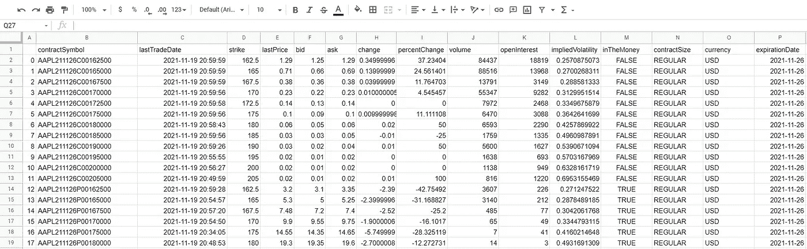

# 构建选项链数据集

> 原文：<https://medium.com/coinmonks/building-option-chain-datasets-a2bc941954a1?source=collection_archive---------8----------------------->

# 项目摘要

Sample of the unabridged results

这个项目收集、清理和导出用户选择的选项链。您可以一次询问一个选项，或者输入一个符号列表，然后得到一个包含所有结果的数据帧/导出 CSV。

点击查看代码[。](https://github.com/pkalkunte18/options-dataset-builder)

# 参数详细信息

**toCSV** ，为 true 时，将单个或一组选项导出为 CSV 文件。如果为 false，函数将返回数据框选项。这允许您将这些代码导入到自己的代码中，并根据需要将这些函数作为管道的一部分来使用，如果您希望这样做的话，而不仅仅是导出结果。默认情况下设置为 True。

**timeIt** ，如果为真，将告诉您代码执行了多长时间。如果你想让它执行，比方说，每个月计算出购买该月的期权，你需要确保它能在合理的时间内运行。为了给出当前速度的上下文，对于 5000 个选项，编译大约需要 7 个小时。默认情况下设置为 False。

**bareMinimum** 为 true 时，仅返回期权合约的名称、执行价、价格、出价、要价和到期日。如果您要调用 1000 个以上的符号，请打开它(它会减少花费的时间，并将导出的数据减少一半)，否则您可以获得提供的全部数据。图片的 bareMinimum 设置为 false。默认情况下设置为 False。

最后， **rawData** ，当设置为 true 时，返回所有数据，不进行清理。该计划中包括的清理是:放弃任何看涨期权低于当前价格或看跌期权高于当前价格的期权，并放弃迷你期权。默认情况下设置为 False。

快乐期权连锁聚会！