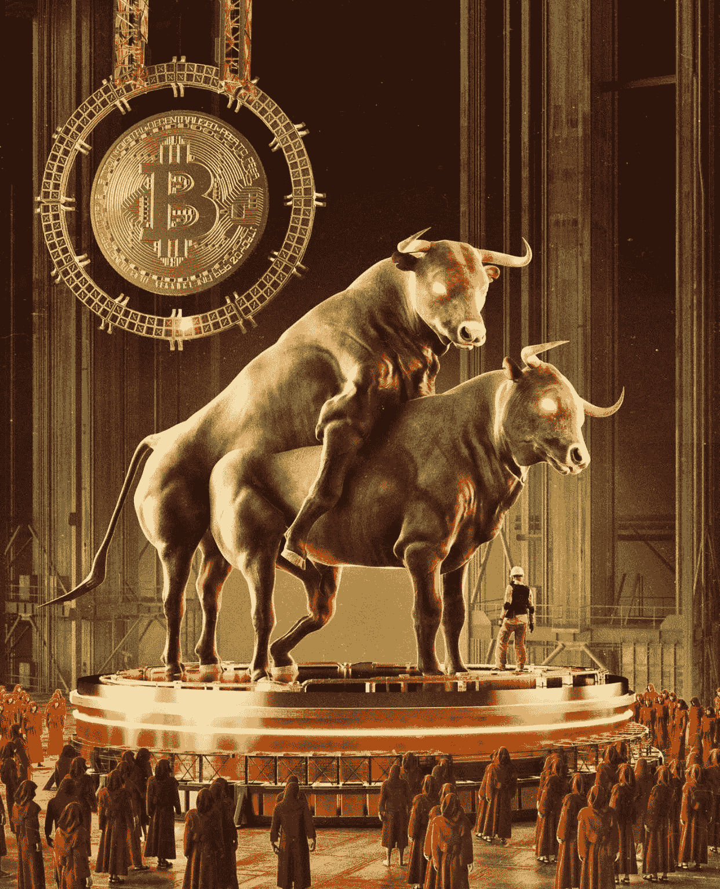

# 加密货币和 NFT 市场的牛市

> 原文：<https://medium.com/coinmonks/bull-season-in-cryptocurrencies-and-nft-markets-a4d2a17465e7?source=collection_archive---------48----------------------->

随着比特币的减半过程和以太坊的 2.0 更新，政府和大公司接受加密货币，监管新的发展和越来越多的兴趣，加密货币的牛市不可避免地会到来。

那么，加密货币牛市的到来将如何影响 NFT？让我们以 Eth 为例。

随着 Eth 进入牛市，在短期内，最初以美元计价的 NFTs 将变得更便宜。换句话说，地板价格将开始下降。随着流动性转向 eth、btc，并最终转向 altcoins，NFT 将耗尽流动性。卖不出去的收藏者会把底价拉得更低。在整个过程的最后，僵尸收藏将会消亡，只有真正有价值的项目才会继续壮大。如果加密货币稳定下来，NFT 的牛市将会掀起一波更大的浪潮。

那么当牛市来临的时候，我们应该做些什么呢？

通过对我们投资组合中的 NFT 系列进行分类，首先处理掉我们认为不太好的系列是合乎逻辑的。(此时，可能会出现损失。)卖掉我们持有的蓝筹 NFT 可能是合理的，但我个人更倾向于持有。如果有不止一只蓝筹股 NFT，它们中的一些仍然可以在价格处于最高点时卖出，并可以在 NFTs 的熊市期间买入。

正如我们从之前的熊市-牛市周期中可以理解的那样，最好的卖出时机是在牛市中，市场上涨时，熊市中，市场下跌时，是最好的买入时机。

> 加入 Coinmonks [电报频道](https://t.me/coincodecap)和 [Youtube 频道](https://www.youtube.com/c/coinmonks/videos)了解加密交易和投资

# 另外，阅读

*   [最佳期货交易信号](https://coincodecap.com/futures-trading-signals) | [流动性交易回顾](https://coincodecap.com/liquid-exchange-review)
*   【Huobi 的加密交易信号 | [Swapzone 审查](/coinmonks/swapzone-review-crypto-exchange-data-aggregator-e0ad78e55ed7)
*   最佳[密码交易机器人](https://coincodecap.com/best-crypto-trading-bots) | [购买索拉纳](https://coincodecap.com/buy-solana) | [矩阵导出评论](https://coincodecap.com/matrixport-review)
*   [Coldcard 评论](https://coincodecap.com/coldcard-review) | [BOXtradEX 评论](https://coincodecap.com/boxtradex-review)|[uni swap 指南](https://coincodecap.com/uniswap)
*   [比特币基地评论](/coinmonks/coinbase-review-6ef4e0f56064) | [德里比特评论](/coinmonks/deribit-review-options-fees-apis-and-testnet-2ca16c4bbdb2) | [FTX 评论](/coinmonks/ftx-crypto-exchange-review-53664ac1198f)
*   [联合国硬币评论](https://coincodecap.com/unocoin-review) | [最佳加密赌注硬币](https://coincodecap.com/best-crypto-staking-coins)