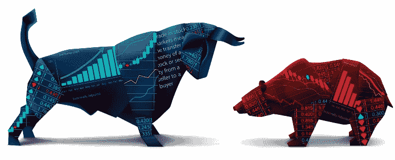
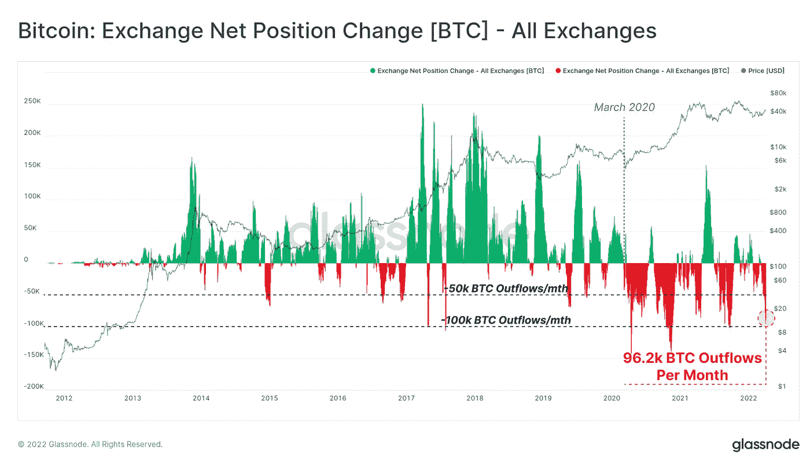
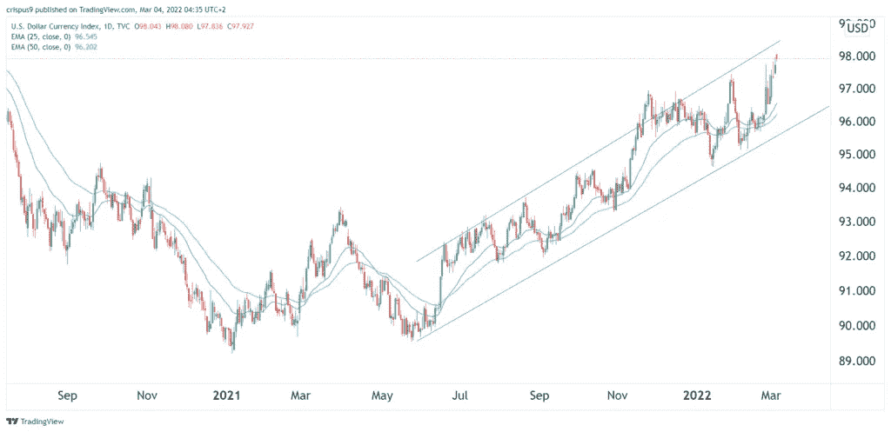
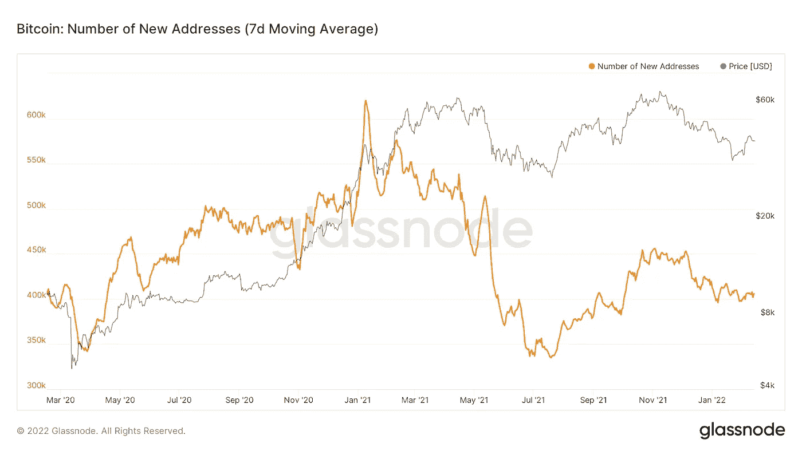

# 牛市对熊市…密码市场接下来会发生什么？

> 原文：<https://medium.com/coinmonks/bull-vs-bear-what-will-happen-next-in-the-crypto-markets-619537695199?source=collection_archive---------54----------------------->

公平地说，过去几个月在 crypto 非常具有挑战性。当比特币上涨 10%时，我们会听到有人喊，“牛万岁”，但几个小时后，我们会看到 8%的回调，有人喊，“哦，不，熊回来了！”！!'

要搞清楚市场在做什么已经变得几乎不可能。花 15 分钟在推特或电报上，事情会变得更加混乱。永久看跌者和永久看涨者之间的持续战斗，他们都给出了很好的论据来说明为什么他们的观点是正确的，这使得很难知道哪一方会占上风。

尽管如此，还是有一些明确的事实支持这两种观点。下面，我将为双方概述 3 个论点，让你有机会对当前的市场状况做出更明智的判断。

所以，女士们先生们…表演时间到了！！从市中心的交易景观竞技场为您带来现场直播，年度拳击赛即将开始。坐下来放松一下，让我们准备好战斗吧！！！

## 蓝色角落里，体重 2000 磅的公牛队！！！

1.  机构投资

在过去的 12 个月里，许多大公司已经开始将比特币加入他们的投资组合。Micro-strategy 是最大的投资者之一，截至 2021 年 12 月，比特币的平均成本约为 49，000 美元。最近几周，尽管市场悲观，他们和许多其他机构仍在继续增加投资组合。

这些机构不会随机投资，他们会聘请专家团队来帮助制定投资策略。如果他们乐于以这些价格购买比特币，我相信他们看到了比特币的长期价值，不会对最近的价格波动感到担忧。

2.技术分析(每月)

任何图表上的月时间框架都是交易者或投资者可以研究的最重要的时间框架。它为加密货币的强度提供了最可靠的分析。

就目前情况来看，比特币和以太坊位于 20 均线上方，整体看涨。如果这可以作为支撑，我相信抛售压力最终会枯竭，我们将看到从这些水平反弹，这可能会看到 FOMO，这将使加密市场强劲运行。然而，如果比特币在本月收盘时跌破 20 均线(目前为 38，575 美元)，我强烈预计比特币将跌至 55 均线(目前为 26，000 美元)，这将导致许多 alt 币大幅贬值。

3.链上分析

Green shows amount of bitcoins being added back to exchanges such as Binance, whilst red shows Bitcoins being taken away from exchanges and stored in hard wallets.

上图是比特币和 crypto 最乐观的论点之一。简而言之，比特币正以创纪录的水平从分散式交易所被移除。这是一个利好消息，因为这意味着交易所中可供买卖的比特币减少，这最终将导致流动性冲击。如果这种情况发生，预计比特币价格将飙升。这也是对所有 alt 币的利好，因为比特币在加密方面是王者，如果比特币价格开始上涨，alt 币的价格也会全面上涨。

这可能不会在短期内立即影响价格，但从中长期来看，我毫不怀疑这最终将开始影响价格，并可能在不久的将来成为长期牛市的催化剂。

站在红色角落，体重 1500 磅的熊队！！！

1.  宏观经济因素

The DXY has been on a major run of late and shows no signs of stopping. Unfortunately, this is not good for risk on assets such as Bitcoin.

很明显，美元目前正显示出强势，似乎是许多人的投资选择。只要这种情况持续下去，比特币将很难看到任何上涨势头。显然，这种强势不会永远持续下去，我们希望看到美元的局部顶部正在形成，并正在发生逆转。

除此之外，乌克兰和俄罗斯的战争给全球经济带来了不确定性，在不确定时期，比特币似乎不是投资者的选择。战争中的和平协议可能是密码市场重新乐观的催化剂，所以请关注这个空间。

最后，许多国家通胀率的上升导致大多数普通人的闲置资本减少。不幸的是，像 crypto 这样的市场往往受益于现金流问题最小的时期。这就是为什么我们在疫情封锁期间看到了加密技术的繁荣，因为许多人手头有更多的“闲钱”。

2.技术分析(每周和每天)

当分析每周和每天的市场图表时，它不是一个胆小的网站。死亡交叉(20 和 55 均线)开始在许多硬币上形成，这可能导致某种形式的投降。

除此之外，许多关键的支持领域也已经丧失，尤其是在比特币上。市场的一个可取之处是，交易量普遍较低，因此当交易量水平不支持下跌趋势时，反转更有可能发生。

3.缺乏散户

New bitcoin Wallet addresses have been in decline since the bitcoin price peak in the spring of 2021.

过去 12 个月里，散户投资者一直在离开加密市场。很明显，牛市峰值和加入 crypto 的散户投资者数量之间存在相关性。如果我们要看到像 2020/2021 年那样的挤兑，那么散户投资者就需要为这种挤兑提供资金。很难说什么会导致这种情况发生，但希望某种形式的价格上涨会让人们再次谈论加密，并导致该领域的新投资。

**结论**

我长期看好加密技术，并相信从长远来看，会有很大的收益。

我的短期前景将完全取决于 4 月底比特币的月度收盘。如果收盘低于 20 均线，我会平仓所有多头头寸，重新评估。然而，如果我们能守住 20 均线，我相信我们最终会看到买入压力超过卖出压力，我们将有望看到比特币朝着 52k-56k 区域稳步运行。

如果比特币达到 50k 左右，看看它会做些什么将非常重要。如果我们在这一点上看到大量抛售，比特币开始滚动，我觉得我们可能会进入熊市结构，这可能需要一段时间才能走出。如果比特币轻松突破 50k 中间区域，我认为新的 ATHs 就在眼前。

Crypto Twitter 是我见过的最悲观的。大多数有影响力的人都呼吁低于 30k 的比特币，有些人甚至大胆到 20K！！我个人认为这不会发生。2021 年夏天比特币形成的底部(29000 美元)是我的新低。那里有一个很大的支持区域，很难失去。

在加密游戏中，你能做的最好的一步就是与大众对赌。如果听到的都是熊市的恐怖故事，那么可能是时候做多了，因为市场喜欢与人们的预期相反。

目前所有的可能性都摆在 crypto 的桌子上，所以继续研究和密切关注图表很重要，这样你就能为接下来发生的事情做好最好的准备。

请记住，本文是为了娱乐和教育目的。这篇文章中没有给出任何财务建议，所以请 DYOR。

> 加入 Coinmonks [电报频道](https://t.me/coincodecap)和 [Youtube 频道](https://www.youtube.com/c/coinmonks/videos)了解加密交易和投资

# 另外，阅读

*   [Bookmap 点评](https://coincodecap.com/bookmap-review-2021-best-trading-software) | [美国 5 大最佳加密交易所](https://coincodecap.com/crypto-exchange-usa)
*   最佳加密[硬件钱包](/coinmonks/hardware-wallets-dfa1211730c6) | [Bitbns 评论](/coinmonks/bitbns-review-38256a07e161)
*   [新加坡十大最佳加密交易所](https://coincodecap.com/crypto-exchange-in-singapore) | [购买 AXS](https://coincodecap.com/buy-axs-token)
*   [红狗赌场评论](https://coincodecap.com/red-dog-casino-review) | [Swyftx 评论](https://coincodecap.com/swyftx-review) | [造币厂评论](https://coincodecap.com/coingate-review)
*   [投资印度的最佳密码](https://coincodecap.com/best-crypto-to-invest-in-india-in-2021)|[WazirX P2P](https://coincodecap.com/wazirx-p2p)|[Hi Dollar Review](https://coincodecap.com/hi-dollar-review)