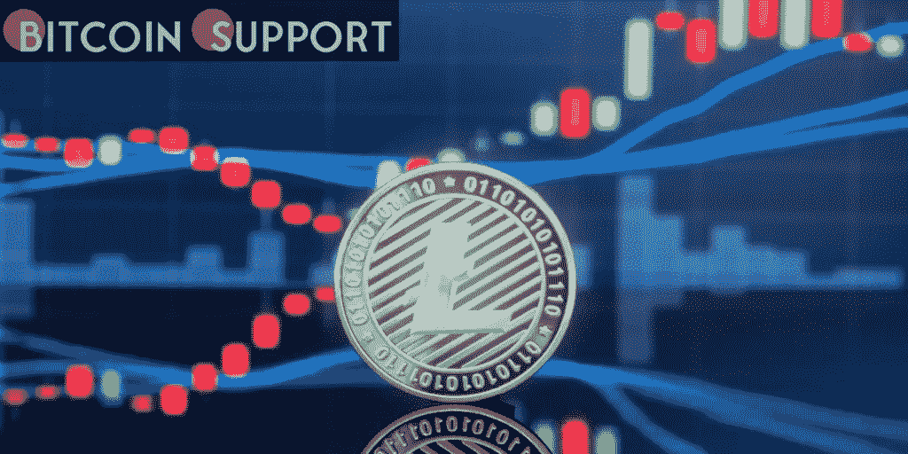
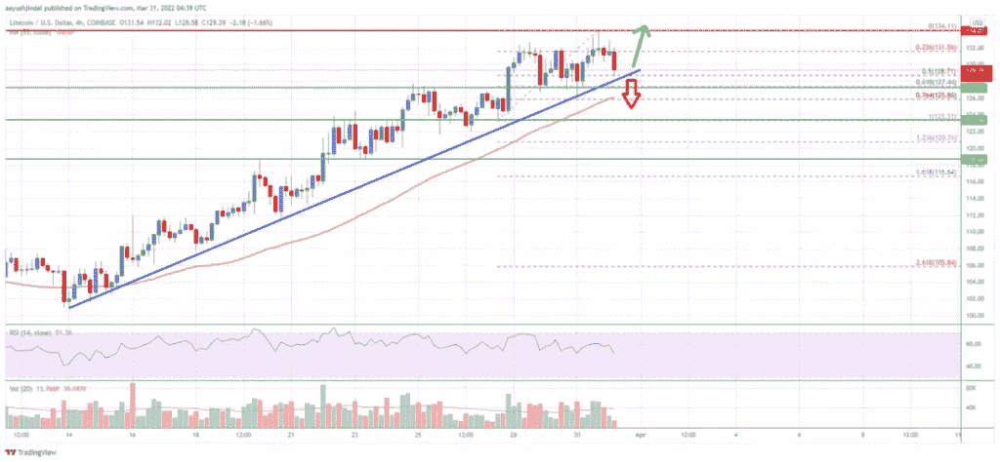

# 在莱特币(LTC)价格分析中，多头的目标是反弹至 135 美元以上

> 原文：<https://medium.com/coinmonks/bulls-aim-to-rally-above-135-in-litecoin-ltc-price-analysis-bbfb0e056576?source=collection_archive---------56----------------------->

**Visit our website:-** [**https://bitcoinsupports.com/**](https://bitcoinsupports.com/)

**莱特币价格分析**

本周比特币、以太坊、ripple、莱特币相对于美元都有所升值。之前，LTC 在 115 美元支撑位上方形成了一个基础。

价格恢复上升趋势前的前一个摆动低点在 123 美元附近。在 125 美元阻力位和 55 简单移动平均线上方出现了明显的突破(4 小时)。价格甚至超过了 130 美元大关。它最近达到了 134 美元的高点，现在正在巩固收益。

下行，支撑位位于 128 美元水平附近。它正在接近从 123 美元的低点到 134 美元高点的 50%斐波纳契回撤线。

在 LTC/USD 对的 4 小时图上，一条显著的看涨趋势线也正在形成，支撑位在 128 美元附近。下一个重要支撑位在 126 美元附近。这也是从 123 美元的低点到 134 美元的高点向上运行的 61%斐波纳契回档位。

如果价格跌破 126 美元支撑，可能会继续向 120 美元水平下跌。上行方面，早期阻力位在 134 美元附近。第一个重要阻力位位于 135 美元附近。价格必须突破 134 美元和 135 美元才能开始新的攀升。在上述场景中，价格可能达到 150 美元。下一个重要关口可能是 162 美元。

**Visit our website:-** [**https://bitcoinsupports.com/**](https://bitcoinsupports.com/)

从图表来看，莱特币的价格明显高于 122 美元和 55 简单移动平均线(4 小时)。一般来说，如果价格突破 135 美元阻力区，可能会开始新的上升趋势。

**技术指标**

— 4 小时 MACD——美元/日元的 MACD 现在正在多头区域失去步伐。

— 4 小时 RSI(相对强弱指数)——LTC/USD 的 RSI 目前位于 50 水平上方。

——关键支撑位——128 美元和 126 美元

——关键阻力位——135 美元和 150 美元。

**访问我们的网站:-**[**https://bitcoinsupports.com/**](https://bitcoinsupports.com/)

**免责声明:以上为作者观点，不应视为投资建议。读者应该自己做研究。**

> 加入 Coinmonks [电报频道](https://t.me/coincodecap)和 [Youtube 频道](https://www.youtube.com/c/coinmonks/videos)了解加密交易和投资

# 另外，阅读

*   [Bitsgap 评审](/coinmonks/bitsgap-review-a-crypto-trading-bot-that-makes-easy-money-a5d88a336df2) | [Quadency 评审](/coinmonks/quadency-review-a-crypto-trading-automation-platform-3068eaa374e1) | [Bitbns 评审](/coinmonks/bitbns-review-38256a07e161)
*   [加密复制交易平台](/coinmonks/top-10-crypto-copy-trading-platforms-for-beginners-d0c37c7d698c) | [Coinmama 审核](/coinmonks/coinmama-review-ace5641bde6e)
*   [印度的加密交易所](/coinmonks/bitcoin-exchange-in-india-7f1fe79715c9) | [比特币储蓄账户](/coinmonks/bitcoin-savings-account-e65b13f92451)
*   [OKEx vs KuCoin](https://coincodecap.com/okex-kucoin) | [摄氏替代品](https://coincodecap.com/celsius-alternatives) | [如何购买 VeChain](https://coincodecap.com/buy-vechain)
*   [币安期货交易](https://coincodecap.com/binance-futures-trading)|[3 comas vs Mudrex vs eToro](https://coincodecap.com/mudrex-3commas-etoro)