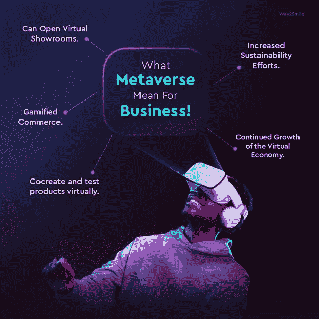

# 元宇宙的商业转型

> 原文：<https://medium.com/coinmonks/business-transformation-in-the-metaverse-dd1f268bb44a?source=collection_archive---------21----------------------->

我们许多人可能会想起 2018 年所谓的“加密冬天”。加密货币总市值从 2018 年 1 月的 6920 亿美元降至 2020 年 4 月的 934 亿美元。这意味着下降了 86.5%。对于数字资产投资者来说，这是一个艰难的时期。我们目前正在目睹类似的动态。

虽然数字资产增长放缓，但推动区块链空间的主要趋势并未放缓。事实上，一种新的趋势即将出现，它有可能改变我们社交、工作、交易等方式。

没有人能就如何准确定义元宇宙达成一致，但毫无疑问，我们已经看到了它的一瞥，以及它可能成为什么。你肯定知道，元宇宙是互联网发展的下一个阶段，是互联网上的社交和互动。

如果我们必须定义它，元宇宙可以被定义为虚拟世界的互联网络，它使用人工智能(AR)、虚拟现实(VR)和其他沉浸式技术为用户提供数字第二人生。许多专家认为，元宇宙将很快成为商业世界的延伸——事实上，比尔·盖茨预测，在未来两三年内，大多数虚拟会议将从 Zoom 转移到元宇宙。

对于一些小企业来说，元宇宙可能是一个新的挑战，但它可以提供竞争优势。受欢迎的元宇宙游戏，如沙盒和分散的土地，在过去的五个月里报告了数百万新用户。事实上，在过去的 13 个月里，超过 200 万人加入了沙盒元宇宙。

## 元宇宙的商业

移动互联网提供了一种个性化体验的新方法，以满足人们对如何与企业互动的日益增长的期望。我们相信元宇宙将加速这一趋势，元技术将在其中发挥重要作用。在这些游戏中，用户可以在类似游戏的虚拟世界中与自己的新兴经济体进行互动。一旦进入元宇宙，我们可以找到一个具有诱人用户激励的整体经济环境。

像分散的元宇宙现在有繁荣的商业和经济。个人拥有并开发购物区、赌场，甚至私人房地产。在这一大趋势下，元宇宙房地产是我一直在追踪的最吸引人的投资机会之一。2021 年，元宇宙房地产销售额将超过 5 亿美元。

许多科技公司已经声称自己是元宇宙公司，一些公司正在开发元宇宙平台，以增强用户的虚拟和物理现实。此外，元宇宙商业机会的可行性在很大程度上依赖于目前在单一共享空间中各自为政的活动的执行。以下是一些值得注意的元宇宙活动，可以支持新的商业机会。

*   虚拟事件
*   沉浸式学习体验
*   虚拟购物体验
*   社会化媒体
*   娱乐和游戏
*   员工敬业度

## 元宇宙的商业转型

企业应该参与元宇宙的原因有很多。所有迹象表明，元宇宙是通信的未来。它也将是我们的数字身份的位置。不管我们喜欢与否，这就是我们正在创造的世界。让我们来看一些例子，看看不同行业的企业如何利用元宇宙创造真正独特的体验。

*   营销:品牌可以在元宇宙做广告，推销自己。他们可以为客户的虚拟形象销售虚拟商品，创建限量版的数字收藏品，并举办虚拟活动。新年前夜在时代广场的落球事件在元宇宙被虚拟再现。
*   **合作和建立关系网的机会增加:**企业现在可以亲自调查与客户互动的机会。他们还能以以前无法想象的方式合作。根据《哈佛商业评论》的一项研究，Facetime 的效率是任何基于文本的对话的 34 倍。鉴于非语言暗示的重要性，这个结论并不令人惊讶。
*   **提高生产力:**元宇宙还可以帮助人力资源、人力资源部门和客户服务机构。远程工作人员现在可以在虚拟世界中面对面地讨论项目、分享想法并提供反馈。
*   **银行和金融:**虚拟经济的出现标志着基于数字资产的全新替代金融系统的形成。银行等传统金融机构将需要适应这些变化。作为第一步，他们必须投资自己的数字化转型，如 VR 培训和客户应用。

通过适当的策略，企业可以利用元宇宙与消费者进行对话，创造真正独特的体验。随着技术的进步，来自其他行业的公司可以相互学习，尝试新的元宇宙应用。

**最终想法**

元宇宙的企业可以发展自己的经济，与其他企业进行贸易，并形成新的和创新的合作。很明显，mataverse 有能力改变商业世界。这项技术可以帮助各种规模的组织提高运营和底线，从改善客户体验到提高销售额和生产力。虽然进入元宇宙可能有一定的风险，但潜在的回报是巨大的，不容忽视。

> 加入 Coinmonks [电报频道](https://t.me/coincodecap)和 [Youtube 频道](https://www.youtube.com/c/coinmonks/videos)了解加密交易和投资

# 另外，阅读

*   [Bookmap 点评](https://coincodecap.com/bookmap-review-2021-best-trading-software) | [美国 5 大最佳加密交易所](https://coincodecap.com/crypto-exchange-usa)
*   最佳加密[硬件钱包](/coinmonks/hardware-wallets-dfa1211730c6) | [Bitbns 评论](/coinmonks/bitbns-review-38256a07e161)
*   [新加坡十大最佳加密交易所](https://coincodecap.com/crypto-exchange-in-singapore) | [购买 AXS](https://coincodecap.com/buy-axs-token)
*   [红狗赌场评论](https://coincodecap.com/red-dog-casino-review) | [Swyftx 评论](https://coincodecap.com/swyftx-review) | [CoinGate 评论](https://coincodecap.com/coingate-review)
*   [投资印度的最佳密码](https://coincodecap.com/best-crypto-to-invest-in-india-in-2021)|[WazirX P2P](https://coincodecap.com/wazirx-p2p)|[Hi Dollar Review](https://coincodecap.com/hi-dollar-review)
*   [加拿大最佳加密交易机器人](https://coincodecap.com/5-best-crypto-trading-bots-in-canada) | [库币评论](https://coincodecap.com/kucoin-review)