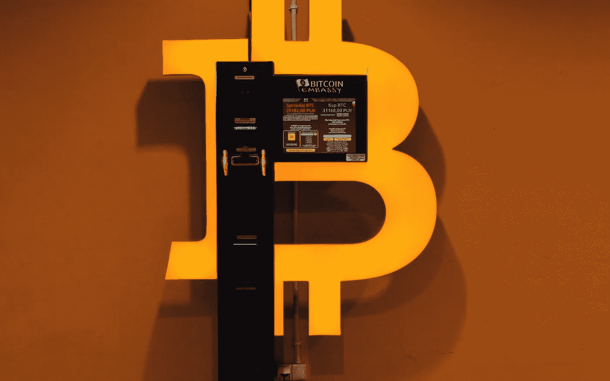

# 因在洗衣店经营非法比特币自动取款机而被捕

> 原文：<https://medium.com/coinmonks/busted-for-running-illegal-bitcoin-atms-in-laundromats-derev-blog-8d0a5dbed4ed?source=collection_archive---------51----------------------->

# 快速拍摄:

*   纽约人罗伯特·泰勒因在自助洗衣店经营 46 个非法比特币亭而被捕。
*   **他的非法网络完成了价值超过 560 万美元的交易。**

罗伯特·泰勒因涉嫌非法运营超过 46 台比特币自动取款机而被起诉。曼哈顿地方检察官阿尔文·L·布拉格…