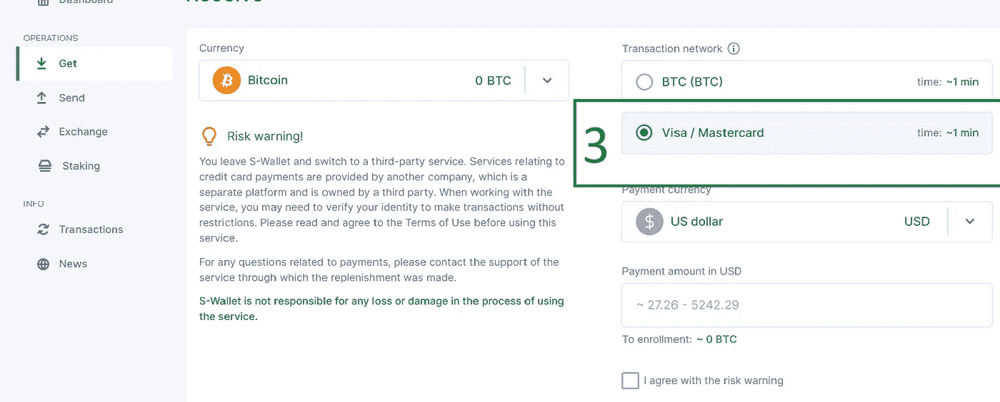

# 现在在 S-Wallet 上用您的银行卡购买密码

> 原文：<https://medium.com/coinmonks/buy-crypto-with-your-bank-card-now-on-s-wallet-75f395d4f736?source=collection_archive---------51----------------------->

> 您现在可以用 S-Wallet 上的银行卡(信用卡/借记卡)来补充您的加密余额
> 
> …使用您的银行卡(信用卡/借记卡)，您现在可以轻松地为您的 S 钱包充值

S-Wallet 仍然是您最好的金融聚合器，让您进入一流数字金融的伟大世界

它为存储、接收、发送和交换数字资产提供了高度安全的创新解决方案。

S-wallet 在超过 115 个国家拥有超过 50，000+的每日用户，如果您正在寻找一个多功能和快速的加密钱包，它是您的必备之选。S-wallet 目前支持 4 个区块链网络和 2 种法定货币(欧元和美元)

S-Wallet 平台每天都在变得越来越好，直到最近，一个新的惊人的功能已经被添加进来，以帮助您使用您的银行卡来补充您的加密钱包。

这意味着，有了我们的银行卡(信用卡/借记卡),您现在可以轻松地从任何地方为您的 S-Wallet 资产充值，不会有任何麻烦或麻烦。你所需要做的就是遵循简单的步骤，你就可以开始了。

# 如何在 S 钱包上用银行卡充值

*   通过[**【https://s-wallet.ai/】**](https://s-wallet.ai/)登录您的 S-Wallet 档案
*   点击获取

Click on Get

*   选择所需的资产

Select Desired Asset from the available options

*   选择 Visa/MasterCard 选项

Choose Visa/Mastercard option

*   选择您的首选存款货币

Choose card debit currency

*   输入您要充值的金额[介于 27.26 美元至 5242.29 美元、25 美元至 5000 美元(欧元)、34835 美元至 6701498 韩元(韩元)以及其他类似货币的等值金额]

Enter amount

*   阅读并同意风险警告

Check on risk warning

*   点击补充

Click Replenish

*   遵循下一个屏幕上的维修说明
*   填写并确认您的详细信息

**交易一经确认，您的资产将会存入您的钱包**

不熟悉 S-Wallet？在[https://s-wallet.ai/](https://s-wallet.ai/)上创建账户

不要忘记使用以下任何/所有链接加入 Medium、Twitter、Instagram、脸书和 TG 上的社区；

[https://medium.com/@S-Wallet.ai](/@S-Wallet.ai)

[https://twitter.com/SWallet_ai](https://twitter.com/SWallet_ai)

[https://www.instagram.com/swallet_ai](https://www.instagram.com/swallet_ai)

[https://www.facebook.com/S-Wallet-111855014417822/](https://www.facebook.com/S-Wallet-111855014417822/)

 [## s 钱包|官方渠道

### 用于管理数字资产的官方渠道分散解决方案。环保且可扩展的平台…

t.me](https://t.me/SWallet_ai) 

> 加入 Coinmonks [电报频道](https://t.me/coincodecap)和 [Youtube 频道](https://www.youtube.com/c/coinmonks/videos)了解加密交易和投资

# 另外，阅读

*   [非洲最佳密码交易所](https://coincodecap.com/crypto-exchange-africa) | [胡交易所评论](https://coincodecap.com/hoo-exchange-review)
*   [eToro vs robin hood](https://coincodecap.com/etoro-robinhood)|[MoonXBT vs Bybit vs Bityard](https://coincodecap.com/bybit-bityard-moonxbt)
*   [有哪些交易信号？](https://coincodecap.com/trading-signal) | [比特斯坦普 vs 比特币基地](https://coincodecap.com/bitstamp-coinbase)
*   [ProfitFarmers 点评](https://coincodecap.com/profitfarmers-review) | [如何使用 Cornix Trading Bot](https://coincodecap.com/cornix-trading-bot)
*   [如何在势不可挡的域名上购买域名？](https://coincodecap.com/buy-domain-on-unstoppable-domains)
*   [印度的秘密税](https://coincodecap.com/crypto-tax-india) | [altFINS 审查](https://coincodecap.com/altfins-review) | [Prokey 审查](/coinmonks/prokey-review-26611173c13c)
*   [赢取注册奖励——10 大最佳加密平台](https://coincodecap.com/earn-sign-up-bonus)