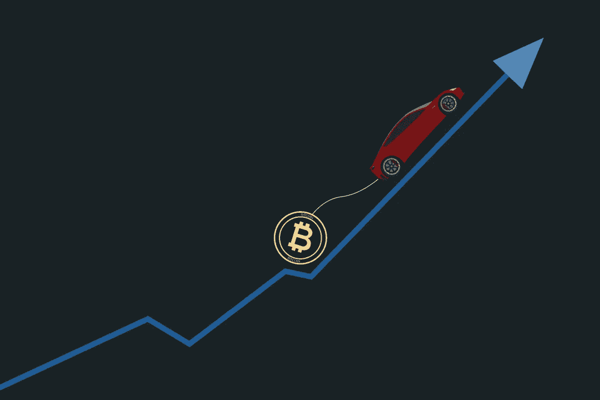

# 用加密货币买车

> 原文：<https://medium.com/coinmonks/buying-a-car-with-cryptocurrency-80ab6cbdd787?source=collection_archive---------69----------------------->

过去 12 年，加密货币越来越受欢迎，也推动了交易量的增长。了解如何使用您的密码来购买汽车。

Buying a Car with Cryptocurrency

自 2009 年公开推出以来，加密货币已经成为越来越受欢迎的货币。它是在 2008 年金融危机期间创建的，作为用户在没有传统金融机构参与的情况下自己控制自己资金的一种方式。

根据 Statista 的数据，2021 年比特币的日交易量达到约 40 万次，以太坊的日处理量将超过 110 万次。如您所见，在过去的 12 年中，购买、销售和使用 crypto 变得如此流行，以至于人们现在使用它来进行大宗购买，如购买汽车

# 可以用加密货币购买汽车吗？

简单的回答是肯定的。当然和现金买车或者融资买车不一样，但是肯定是可以的。使用 crypto 购买汽车时，有几个原因需要考虑，每个选项都有自己的优缺点:

*   **从接受加密货币的经销商处购买。**
*   优点:更少的交易费用，因为你不需要把你的密码转换成现金。
*   缺点:在你所在的地区可能很难找到接受加密付款的经销商。
*   **向接受数字货币的私人卖家购买。**
*   优点:更少的交易费用和潜在的更快的流程，更少的文书工作。
*   缺点:可能很难找到私人卖家，从私人卖家那里买一辆车的成本可能比你在经销商那里支付的要高得多。
*   **将您的加密货币兑换成现金。**
*   优点:你可以以现金的形式使用你的密码，你可以用它来购买其他东西。
*   缺点:将你的密码转换成现金的费用会很高。
*   **为您的汽车融资，并使用加密货币进行支付。**
*   优点:这可能是最快的选择，因为大多数经销商习惯于处理融资。
*   缺点:你将不得不处理交易费用，这取决于你是否需要转换你的密码来进行支付。

# 你应该用加密货币购买汽车吗？

既然你知道可以使用加密来买车，那么是否使用加密来买车就完全取决于你了。有些人可能认为使用密码买车是一个更好的选择。加密更安全、更快速、更方便，因为它是一种数字资产。

## 如何用加密货币购买汽车？

使用 crypto 买车时，有几种不同的选择可供您选择。首先，有一个名为 [BitCars](https://bitcars.eu/) 的网站，你可以使用流行的加密货币购买汽车，他们甚至处理所有必要的文件。虽然他们专营豪华车，但他们也有常规选择。如前所述，你也可以在谷歌上快速搜索，找到你所在地区接受加密货币的经销商。

一旦你选择了你的车，最后一步就是实际购买。你很可能需要下载一个安全的加密传输应用程序。大多数汽车经销商将使用 [BitPay](https://bitpay.com/) ，但有些可能会使用 [BTCPay](https://btcpayserver.org/) 。

## 加密货币合法吗？

法定货币是政府批准的作为交易媒介的货币。因此，虽然加密是合法的，但加密货币没有政府或私人的支持。因此很难向世界各地的金融当局证明其合宪性。

归根结底，加密货币就是钱，可以用来购买许多不同的东西。当进行任何大额购买时，比如买车，权衡你所有的选择，以确保你做出了正确的决定。

> 加入 Coinmonks [电报频道](https://t.me/coincodecap)和 [Youtube 频道](https://www.youtube.com/c/coinmonks/videos)了解加密交易和投资

# 另外，阅读

*   [在美国如何使用 BitMEX？](https://coincodecap.com/use-bitmex-in-usa) | [BitMEX 审查](https://coincodecap.com/bitmex-review)
*   [最佳期货交易信号](https://coincodecap.com/futures-trading-signals) | [流动性交易所评论](https://coincodecap.com/liquid-exchange-review)
*   [南非的加密交易所](https://coincodecap.com/crypto-exchanges-in-south-africa) | [BitMEX 加密信号](https://coincodecap.com/bitmex-crypto-signals)
*   [MoonXBT 副本交易](https://coincodecap.com/moonxbt-copy-trading) | [阿联酋的加密钱包](https://coincodecap.com/crypto-wallets-in-uae)
*   [雷米塔诺评论](https://coincodecap.com/remitano-review)|[1 inch 协议指南](https://coincodecap.com/1inch) | [购买 Floki](https://coincodecap.com/buy-floki-inu-token)