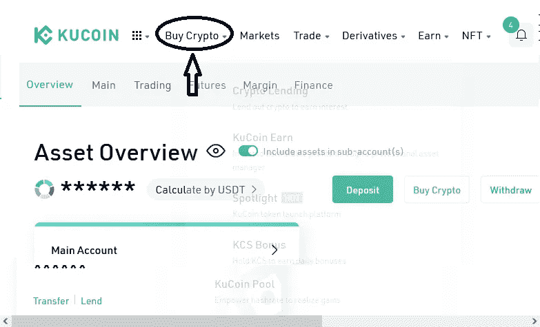
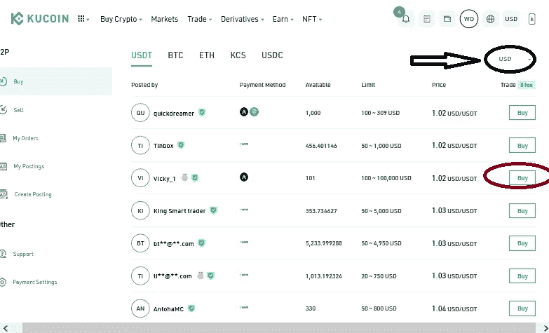
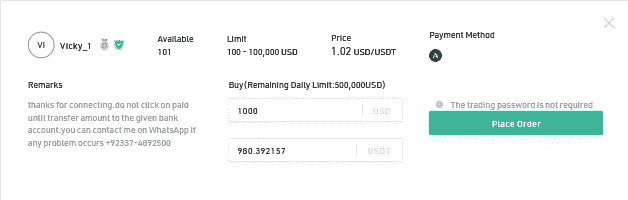

# 用当地货币购买比特币，没有税收或限制。

> 原文：<https://medium.com/coinmonks/buying-bitcoin-with-your-local-currency-without-tax-or-restrictions-2a60e18d988c?source=collection_archive---------31----------------------->

购买比特币相当困难，或者你是这么认为的。

不是的！

这就像在网上购买和支付一件衣服一样简单，至少过去是这样。现在你先买一个稳定的硬币，最有可能是 USDT，因为它的支持范围更广，然后你用它买比特币。这是开始购买加密的许多方式之一，唯一的问题是，它只适用于受支持的卡或加密货币不受限制或制裁的国家。这就产生了用于密码买卖的点对点(p2p)系统。

什么是 p2p？购买密码的效率如何？

点对点系统可以让你用当地货币直接从想卖的人那里买密码，也可以把密码卖给想买的人以获得回报。

大多数情况下，你不需要知道与你交易的人是谁，但是个人所需的交易细节可以用来促进交易。

但是既然你不认识这个人，那你付款后他们拿着你的钱跑了怎么办？。或者你卖了一枚硬币却没有得到报酬？

在 Kucoin 上，这里是 p2p 如何保护参与的双方免受资产或资金损失的。我将用一个简单的例子来说明它是如何工作的。假设我的朋友(用户 A)想用当地法定货币美元购买价值 1000 美元的比特币，他是这样做的；

●登录您的 KuCoin 账户。没有库币账户？报名[这里](https://www.kucoin.com/r/rf/r395ZQJ)

●完成了对 KuCoin 的 KYC 验证

Click “Buy Crypto”

Choose the fiat currency and then choose a merchant

*   当用户 A 找到一个概况和价格符合他们预算的卖家时，他可以通过点击“下订单”开始交易。(在这种情况下，卖方应该是用户 B)。

当用户 A 为价值 1000 美元的比特币创建购买订单时，内置机制会锁定用户 B 账户中价值 1000 美元的比特币。

现在，用户 A 必须通过本地银行转账或任何其他可用的选定方法向用户 B 支付 1000 美元，然后点击“支付”按钮。

当用户 B 收到付款时，他通过点击“释放资产”按钮在交易页面上确认他已经收到付款。这将触发资产被自动发送到用户 A 的账户，并且不收取任何费用。

这通常需要几秒到几分钟的时间来完成，取决于所用支付方式的交易速度。

一旦交易成功完成，资产会立即自动转入买家的主账户。

现在，如果一方未能在规定的时间内履行其职责，另一方可以选择通过单击交易页面中提供的“上诉”按钮提起上诉。

当不满意的一方点击上诉时，KuCoin 的工作人员会立即通过检查双方用户的交易证据并找到正确的解决方案来手动整理双方之间的差异。尽管你很少在 KuCoin 上遇到这种情况，因为这个平台上的所有商家都受到严格的审查规则的约束。但万一你遇到任何麻烦或困难，只需点击一下申诉按钮就可以了。

在 kucoin p2p 上购买 crypto 的众多优势包括

●零费用

●高流动性和最佳价格

●支持多种本地支付方式

●非常方便用户的资金保护政策

●专业可靠的商家

●快速交易

您还可以了解更多关于在 kucoin p2p 上购买比特币和其他加密货币的信息，并在此查看常见问题

[https://m . ku coin . com/blog/everything-you-should-to-know-about-ku coin-P2P-trading](https://m.kucoin.com/blog/everything-you-should-to-know-about-kucoin-p2p-trading)

为什么是 KUCOIN？

KuCoin 是世界上排名第一的 altcoin 交易所，提供各种各样的资产可供选择；600 多项顶级性能资产。Kucoin 通常被称为人民交易所，在全球最佳加密交易所中排名前五，为所有类别的投资者提供服务，Kucoin 目前拥有加密爱好者最佳交易所的称号。如果你是一个爱好者，这是一列你想跳上的火车。通过简单、安全和直接的方式购买密码，包括但不限于:sepa、信用卡/借记卡、paypal、本地银行转账、visa/mastercard 和超过 26 种以上的选项。但这还不是全部，KuCOIN 为用户提供了多种方式，通过赌博和贷款从闲置资产中获得被动收入。

> 加入 Coinmonks [电报频道](https://t.me/coincodecap)和 [Youtube 频道](https://www.youtube.com/c/coinmonks/videos)了解加密交易和投资

# 另外，阅读

*   [CoinDCX 评论](/coinmonks/coindcx-review-8444db3621a2) | [加密保证金交易交易所](https://coincodecap.com/crypto-margin-trading-exchanges)
*   [红狗赌场评论](https://coincodecap.com/red-dog-casino-review) | [Swyftx 评论](https://coincodecap.com/swyftx-review) | [CoinGate 评论](https://coincodecap.com/coingate-review)
*   [Bookmap 点评](https://coincodecap.com/bookmap-review-2021-best-trading-software) | [美国 5 大最佳加密交易所](https://coincodecap.com/crypto-exchange-usa)
*   [如何在 FTX 交易所交易期货](https://coincodecap.com/ftx-futures-trading) | [OKEx vs 币安](https://coincodecap.com/okex-vs-binance)
*   [CoinLoan 评论](https://coincodecap.com/coinloan-review) | [YouHodler 评论](/coinmonks/youhodler-4-easy-ways-to-make-money-98969b9689f2) | [BlockFi 评论](https://coincodecap.com/blockfi-review)
*   [XT.COM 评论](https://coincodecap.com/profittradingapp-for-binance)币安评论 |