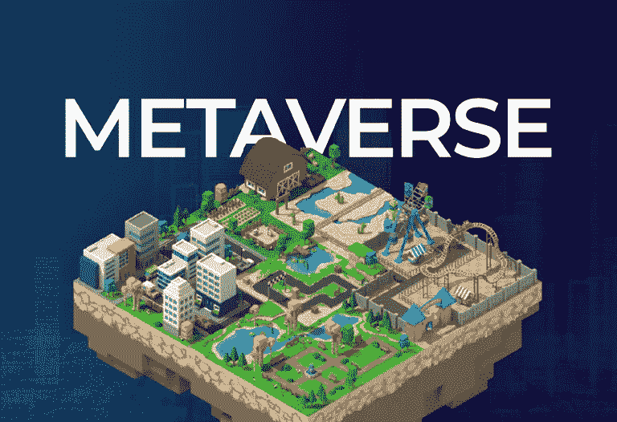

# 在元宇宙购买土地:值得吗？

> 原文：<https://medium.com/coinmonks/buying-land-in-the-metaverse-is-it-worth-it-298e70d27376?source=collection_archive---------33----------------------->

所以，我们现在处于元宇宙时代，这一切都要感谢马克·扎克伯格在 2021 年 10 月宣布脸书转型为 Meta 后，将这个相对不为人知的概念带入生活。时至今日，元宇宙不再是一个模糊的概念；它已经从相对不为人知转变为淘金热。市场分析和预测也相当看好它的增长潜力，正如预期的那样，似乎没有人想错过这个新发掘的金矿。

这里有一些关于元宇宙的统计数据-2021 年市场规模已经达到 638.3 亿美元，预计将在 2022 年达到 1000 亿美元。不仅如此，据分析，该市场的年增长率为 47.6%，到 2029 年将达到 15，275.5 亿美元。这些预测与[《财富》商业洞察报告](https://www.globenewswire.com/news-release/2022/04/11/2419827/0/en/Metaverse-Market-Size-2022-2029-Worth-USD-1527-55-Billion-Exhibiting-a-CAGR-of-47-6.html)一致。

但真正的问题是，从目前的情况来看，大型科技公司似乎对元宇宙概念的接受程度超出了我们的想象。该领域顶级科技公司的名单令人印象深刻，因为名单中包括微软、Meta(原脸书)、腾讯、英伟达、阿里云、Roblox 和许多其他科技巨头。

随着主导元宇宙空间的竞争持续升温，似乎有一个共同点强调了该空间的所有项目。这不是别人，正是元宇宙的土地。这些天来，虚拟土地很快持有价值，有时等同于物理土地，随着这种趋势继续增长，它只需要一个好奇的头脑和一点点努力来达到元宇宙土地的重要性和价值的问题。

在这篇文章中，我向你提供了为什么元宇宙土地是值得的，更重要的是，为什么你应该考虑持有这一蓬勃发展的空间。别再浪费时间了，让我们开始吧。

# 虚拟土地的概念

元宇宙土地是虚拟的土地，在区块链上用不可替代的标记巧妙地表现出来。这些令牌拥有唯一的元数据，用于区分不同的虚拟土地。元宇宙土地是日益增长的虚拟财产趋势的一部分，这可能代表着未来的巨大价值和投资。

虚拟房地产通常是元宇宙趋势的一部分，旨在创造模拟现实生活价值的虚拟经济。这些虚拟经济可以代表人类活动的任何领域，它们通常拥有虚拟货币作为虚拟世界的交易手段。

建立在区块链上的元宇宙土地就像现实世界中的土地一样，应该升值。诸如位置、发展水平和购买目的等因素在资产价值中起着关键作用。像 [VaultHill](https://www.vaulthill.io/) 这样的元宇宙项目有基于不同主题的区域，这些区域的土地价格由下面提到的因素决定。不出所料，商业区的一块虚拟土地与住宅区或工业区的土地会有所不同，完全开发区的一块土地比未开发区的一块土地贵得多是正常的。同样的概念也适用于分散土地或 Roblox 上的一块土地。

本质上，我们可以开始看到虚拟世界的存在，并遵循与现实世界相同的原则。

# 元宇宙的土地是值得的

现在你应该想象一下，你必须决定在一个选择的地点购买土地。这值得吗？肯定，值得买。但是，你购买的理由是什么？这次我会帮你的。你可能会因为对该位置的商业或居住前景的一些战略考虑而决定购买。从商业角度来说，它可以是你个人的生意，或者作为一种投资形式，在适当的时候，你可以从中获得卖出价值。

带回沃尔希尔的区域概念，我们可以看到项目的每个区域都有其规范。这里有商业区、娱乐区等等。现在想象一下，在商业区购买一块有价值的土地，在不久的将来，该地区剩余的土地由古驰、巴黎世家、耐克等品牌开发，作为他们的虚拟商店。这自动增加了你的土地价值。

我想说，是的，元宇宙的土地是值得的，所有有能力的加密投资者都应该努力从一个著名的项目中购买一块。这是值得的，而且随着互联网的不断发展，这种价值只会越来越大。

# 战略重要性…

# 作为投资者

作为投资者，这应该是你购买元宇宙土地的主要动力。有几个元宇宙的项目，这是很重要的，你知道你想购买的土地的战略相关性。

元宇宙旨在通过将常规的身体活动传输到虚拟世界，将生活带入虚拟世界。基于此，不同的项目关注这些相互作用的不同方面。像微软这样的平台更倾向于企业版的元宇宙，而 Vaulthill 专注于基本的人类本能。NVIDIA 和 Roblox 等项目更关注元宇宙游戏体验，而 Meta 则专注于社交和虚拟互动。因此，投资者有必要了解他们希望购买的土地的战略重要性。

让我们进一步分析一下。一个兼任投资者的游戏玩家可能会基于他们预见到的游戏中的重要性而购买 Roblox 上的土地。这片土地可能包含高价值的游戏宝藏，或者对整个游戏有其他特殊的重要性。在 Vaulthill 上，它可以严格地用于以后的出售价值。只要确保你清楚地了解你的虚拟土地的战略价值。

# 作为一个企业

企业大量涌入元宇宙已经不是什么新闻了。从可口可乐到古驰、摩根大通、口袋妖怪、Shopify……元宇宙的顶级品牌不胜枚举。

作为一家企业，在元宇宙拥有一块土地可能对品牌定位具有战略意义。元宇宙已经被认为是继互联网之后人类互动的下一次飞跃，因此，品牌加入这场土地争夺战具有商业意义。

我们还不在未来，但所有的手指都指向一个世界，在这个世界里，互联网变得更加相关和以人为中心，所有形式的人类活动都将发生。游戏、会议、活动和娱乐、放松、旅游、医疗、静修，甚至性。

这标志着元宇宙将会见证一个巨大的进化，它将会成为一个常规的互动。由增强现实、扩展现实和虚拟现实技术驱动。此外，随着这些技术变得更加实惠，更多的人将能够“属于”元宇宙，而整个空间将像今天的智能手机一样激增。

对于企业来说，在元宇宙购买一块土地将是一个精明的举动，因为这样的企业仍然具有现实意义。

那么，你经营哪种生意？我相信有一个完美的虚拟世界可以满足你的商业需求。总会有元宇宙的土地出售，如果你正在寻找购买元宇宙土地的地方，查看分散土地可能是一个好的开始。

# 元宇宙的土地价格是多少？

元宇宙的土地价格没有固定的数额。首先，价格因项目而异，进一步的价格变化可能由位置和稀有程度等因素决定。这就是项目类型如此重要的原因。

你可以看看[分散土地](https://market.decentraland.org/)上的地块价格，你会看到报价的变化。离公路的远近，发展水平，以及其他因素，会对同一地段的土地价格产生影响。有[报道](https://www.ndtv.com/business/decentraland-here-s-all-you-need-to-know-about-the-digital-real-estate-world-2778793#:~:text=In%20November%202021%2C%20a%20report,individual%20plots%20of%20virtual%20land.)称，一块土地曾在 2021 年 11 月以 243 万美元的价格售出。

# 结果

元宇宙的土地是值得购买的，持有一块有许多额外的好处。然而，你应该确保你完全了解元宇宙项目是什么之前，你投资于它的土地。几乎可以肯定的是，你的投资会有回报，但了解项目的全部内容可以进一步帮助你从投资中获得最大收益。

> 加入 Coinmonks [电报频道](https://t.me/coincodecap)和 [Youtube 频道](https://www.youtube.com/c/coinmonks/videos)了解加密交易和投资

# 另外，阅读

*   [Bookmap 评论](https://coincodecap.com/bookmap-review-2021-best-trading-software) | [美国 5 大最佳加密交易所](https://coincodecap.com/crypto-exchange-usa)
*   [如何在 FTX 交易所交易期货](https://coincodecap.com/ftx-futures-trading) | [OKEx vs 币安](https://coincodecap.com/okex-vs-binance)
*   [CoinLoan 评论](https://coincodecap.com/coinloan-review) | [YouHodler 评论](/coinmonks/youhodler-4-easy-ways-to-make-money-98969b9689f2) | [BlockFi 评论](https://coincodecap.com/blockfi-review)
*   《XT.COM 评论》的[《币安评论》的](https://coincodecap.com/profittradingapp-for-binance)|
*   [SmithBot 评论](https://coincodecap.com/smithbot-review) | [4 款最佳免费开源交易机器人](https://coincodecap.com/free-open-source-trading-bots)