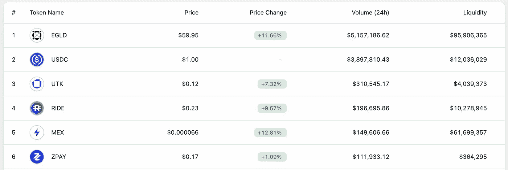

# 2023 年买这个会赚几百万

> 原文：<https://medium.com/coinmonks/buying-this-will-make-millions-in-2023-5754ed324260?source=collection_archive---------0----------------------->

秘密星期天第 28 集。

目前的市场形势带来了我也没有预料到的机会。今天，就在我写这篇文章的时候，比特币还不到 1.9 万美元的门槛。

Maiar Exchange Tokens

几乎所有在马亚尔交易所发行的 ESDT 代币今天都能以低于挂牌价格买到，尽管在 ATH 它们达到了挂牌价格的 10 倍。

如果你问我，哪些 ESDT 代币最有可能在这次熊市中幸存下来，我可以肯定地告诉你，它们将是你可以在 Metastaking 中找到的，是接受埃尔隆德审计的项目，有坚实的团队努力开发项目。

这些项目的基本面没有改变，只是价格暴跌，这意味着什么？赚大钱的机会。

这些项目分别是 Ride、Zpay、Itheum 和 BlackHat。UTK 当然不会被允许崩溃，因为它现在是埃尔隆德的财产。Egold 和 Mex 现在的价格非常有优势，在下一个市场周期肯定会保持这种优势。

上面提到的所有项目都可以入股，并能在整个熊市中为你创造额外的收入。在这些时候，一旦你买了它们，你就必须脱离它们在菲亚特的价格。

这些项目的价格，虽然现在极低，但不代表不能再跌了。这就是为什么你不必认为你投资了 1000 美元，你仍然有 700 美元，但你必须认为你买了 100 个代币，在这个赌注下，每个月产生一个或两个新代币。当你对代币的价格满意时，你会卖掉代币，而不是现在。这就是为什么一旦你买了一枚硬币，它的价格就无关紧要了，只要你相信这个项目，在你选择的项目中没有什么基本的东西会改变。

如果价格急剧下降，你想降低你的平均代币购买量，那么你仍然可以购买，否则，你必须完全脱离这个价值。

我注意到在网络环境中，人们对某些项目感到恐慌，尤其是埃尔隆德。当一些人看到一个 EGDL 值 40 美元时，他们会感到害怕，如果这些人在 12 月发现这个项目并以 540 美元一个的价格购买它，这是可以理解的。

如果这些人投资了 1000 美元，他们还有 70 美元，我理解他们的痛苦和沮丧，但你必须明白这是市场周期。如果你相信这个项目，并认为它值得以 540 美元的价格投资，为什么不采取明智的行动，现在以 40 美元的价格投资呢？

项目是一样的，团队也是一样的，他们上周在两大交易所有两个非常重要的上市，一个是北海巨妖，另一个是 Okcoin。一个新项目的启动很快就要抽签了，所以事情仍然进展得很快，团队的工作节奏和牛市时一样。

他们的 Maiar 钱包目前有 170 万人使用，而且这个数字还在急剧增长。

如果你还没有一个 Maiar 钱包，我建议你现在[观看我们关于这个主题的视频](https://www.youtube.com/watch?v=MO_10Myp8LM)，在那里你将获得视频支持和一步一步的指导，来创建你自己的非保管钱包，你可以开始在里面存放 EGLD 和许多其他代币。，而且还以此为赌注。

Egold 股份总数已经上升到 1270 万，并且还在增长。

每天的交易数量在不断增长，到这段视频发布时，该网络可能已经处理了超过 50，000，000 笔交易。

这些东西是项目基本分析的一部分，这些东西定义了项目和令牌的价值。另一方面，价格是由供给和需求决定的，并根据具体情况通过制造恐惧或贪婪来操纵。

代币的价格和价值永远不会相等，所以你必须在价格低于价值的时候买入代币，在价格高于其内在价值的时候卖出。

如果在购买和出售之间，你设法用赌注或其他方法增加这些代币，你就设法使你的利润最大化。

比特币也有非常好的价格，而且还有以太坊、Bnb、Solana 或其他非常好的项目。埃尔隆德不是唯一的好项目，我也不认为它是最好的。

这是一个我密切研究的项目，我知道他们的生态系统中正在发生什么。有超过 19，000 个加密项目，不可能全部跟踪，所以我选择了几个我可以永久分析的项目，并从中积累每一滴。

对于几乎所有的货币，你都可以在币安找到非常好的报价，如果你需要这方面的教程，请在评论中告诉我。我在币安赌了几十个硬币，我建议你去那里看看，也许你的投资组合里有硬币，你可以把它们放在那里。可以找 Stake，包括比特币或者以太坊。

请记住，这是一个集中的平台，存放在那里的资金不属于你，不像在一个非托管钱包或甚至在一个硬街。然而，币安拥有多年的功能，从未让客户失望，是迄今为止最大的加密货币交易平台。

我不建议你把所有的钱都花在币安，就像我不会把所有的东西都放在那里一样，但归根结底，如果你把钱放在币安，这在法律上相当于把钱存在银行账户，但与币安的银行不同，你还可以获得重要的被动收入。

请记住，您在这个频道上看到的任何内容都不是授权的金融建议，而是我们的团队根据我们拥有和可以获得的信息进行的分析，这些是我们得出的结论，而不是有执照的金融分析师。

有句老话说，金融分析师和上帝的区别在于，连上帝都不认为自己是金融分析师。

所以我们不敢相信自己是金融分析师。

不情愿地接受这个频道或任何其他频道提供的任何信息。在做任何重要的决定之前，质疑所有的信息，仔细考虑你的想法。

记住信息或多或少都是被发送者操纵的，这样才能达到预期的目的。这就是为什么重要的是，你不要通过单一来源通知自己，即使这个来源是我们的 youtube 频道。

但一定要获得重要信息，如 1750 EGLD - CPA 彩票，或我们在迪拜的朋友平台，用它们你可以投资迪拜房地产，在自己家里舒适地获得被动收入。

如果你还没有看过这些视频，你可以在[这里](https://www.youtube.com/watch?v=XllIZLJZ29Y&t=268s)和[这里](https://www.youtube.com/watch?v=7jnBlzZpVzA&t=1s)找到这些视频的链接，我在评论里等着告诉我们你是否想展示几个项目的基本分析，以及你是否想让它们更详细。

显然每个人都擅长图形分析。我认为我们没有必要再给出我们的观点，说如果不增加，它就减少，如果不减少，它可能会保持不变。我在 youtube 上看到每个人都在这么做。

我很高兴你继续关注我们，不要忘记你可以在 Twitter、抖音、Instagram、Medium 或 telegram 上找到我们，在那里你将总能收到原创和干净的内容。

谢谢你陪我到最后，直到下一次，保管好你的钱！

**|** [**网站**](https://www.b-successful.com/)**|**[**YouTube**](https://www.youtube.com/channel/UCWrfC_w5wVnrOr8jy0ICoDw)**|**[**推特**](https://twitter.com/BSuccessful_)**|**[**insta gram**](https://www.instagram.com/bsuccessful.crypto/)**|**[**电报**](https://t.me/+NQbP3V_iaKQwMDYy) **|** [**脸书**](https://www.facebook.com/Bsuccesful/?_rdc=2&_rdr)

> 加入 Coinmonks [电报频道](https://t.me/coincodecap)和 [Youtube 频道](https://www.youtube.com/c/coinmonks/videos)了解加密交易和投资

# 另外，阅读

*   [Bookmap 点评](https://coincodecap.com/bookmap-review-2021-best-trading-software) | [美国 5 大最佳加密交易所](https://coincodecap.com/crypto-exchange-usa)
*   最佳加密[硬件钱包](/coinmonks/hardware-wallets-dfa1211730c6) | [Bitbns 评论](/coinmonks/bitbns-review-38256a07e161)
*   [新加坡十大最佳加密交易所](https://coincodecap.com/crypto-exchange-in-singapore) | [购买 AXS](https://coincodecap.com/buy-axs-token)
*   [红狗赌场评论](https://coincodecap.com/red-dog-casino-review) | [Swyftx 评论](https://coincodecap.com/swyftx-review) | [CoinGate 评论](https://coincodecap.com/coingate-review)
*   [投资印度的最佳密码](https://coincodecap.com/best-crypto-to-invest-in-india-in-2021)|[WazirX P2P](https://coincodecap.com/wazirx-p2p)|[Hi Dollar Review](https://coincodecap.com/hi-dollar-review)