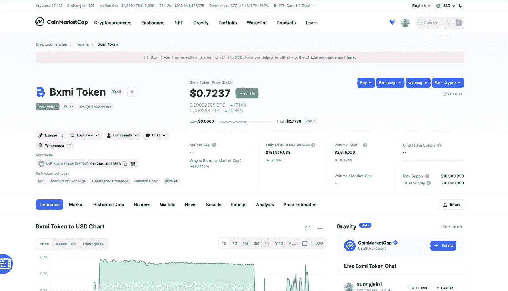
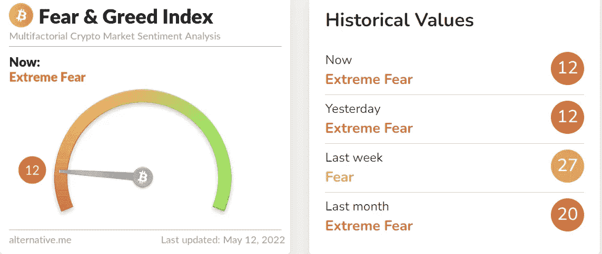
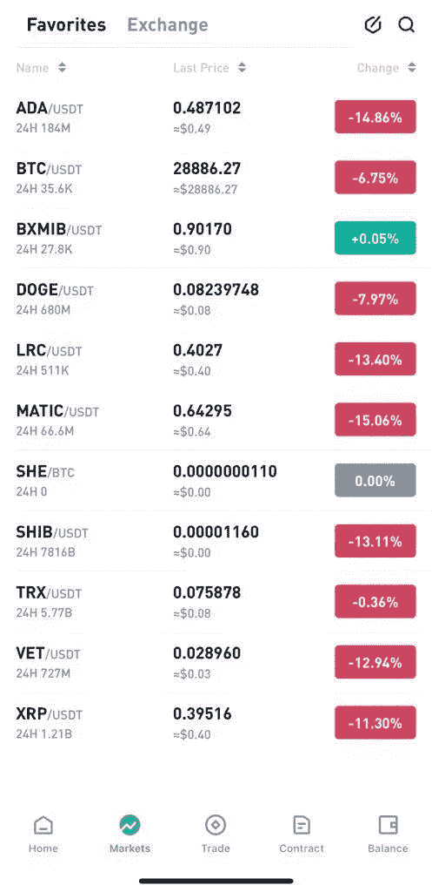
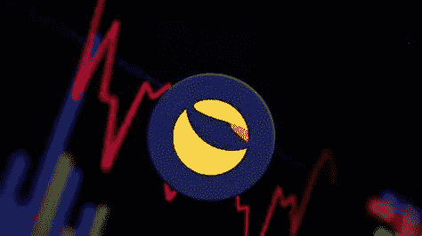
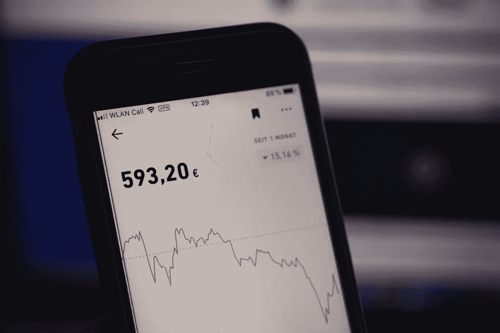

# BXMI 固若金汤在加密市场崩溃。

> 原文：<https://medium.com/coinmonks/bxmi-solid-as-gold-amidst-crypto-market-crash-14df474fa0c8?source=collection_archive---------64----------------------->

Source: Coinmarketcap.com

尽管最近的加密市场危机，Bitxmi 的本地加密货币 BXMI 保持了其价值。在撰写本文时，BXMI 的价格为 0.75 美元，随着加密货币市场最近的崩溃，现在已经上涨到 0.77 美元。

在过去的几天里，整个加密市场已经陷入下滑，比特币(BTC)从历史最高价格下跌了 50%以上，跌至 2022 年的最低水平。CoinMarketCap 的价格指数显示，周一上午加密货币自 2021 年 7 月以来首次跌破 33，000 美元。这是自去年 11 月达到历史高点以来的最新一次大幅下滑。

> **另见:** [**在加密熊市中要做的 4 件事**](/coinmonks/4-things-to-do-in-a-crypto-bear-market-c4b5bda76ba4) **。**

**最近的密码市场崩溃**

Source: Alternative.me

在过去的一周里，加密货币市场已经损失了大约 3000 亿美元的价值，导致了今天的价格暴跌。如果抛售继续，BTC 将处于未知领域，因为自 2021 年以来，它从未跌破这一价格。

尽管比特币的价格最近有所下跌，但几位加密货币行业专业人士仍对该货币的长期前景保持乐观。

比特币的长期持有者似乎没有出售他们的加密储备，这鼓励了投资者。根据一些投资者的说法，比特币的链上指标研究显示，比特币反弹至约 3 万美元的关键支撑位。

根据最新的加密恐惧与贪婪指数，比特币市场目前仅处于 12 点——深入“严重恐惧”区。鉴于比特币目前的低位，分析师指出这是比特币目前可能超卖的证据。

> **另见:** [**BITXMI Token 推出金银支持令牌。**](/@bitxmiblog/bxmi-token-introduces-gold-and-silver-backed-tokens-3ea279ab240b)

**BXMI 令牌**

Source: Cointiger.com

在 Cointiger 等主要交易平台和 pancakeswap 等分散交易平台上，BXMI 自 0.1 美元推出以来一直保持着一定程度的价格稳定性和流动性。在撰写本文时，BXMI 加密货币的交易价格为每令牌 0.77 美元。

BXMI 令牌价格预计将在未来一年攀升至 5 美元。到 2023 年底，分析师预计 BXMI 股票价格约为 5.5037 美元。根据分析师和典型的加密货币爱好者的说法，BXMI 正在走向 1 美元或更高的价值。BXMI 的投资者对该项目及其预期投资回报充满信心。

此外，Bitxmi 团队一直在努力改进这个项目。该交易所最近将其业务扩展到新西兰，并预计不久将开设萨尔瓦多和澳大利亚办事处。几个月前，Bitxmi NFT 市场启动了。仅这一举措就导致 BXMI 令牌的价格大幅上涨。

> **另见:** [**需要用 Bitxmi 交易所交易的 8 个理由。**](/coinmonks/8-reasons-you-need-to-trade-with-bitxmi-exchange-c4bff2ab3096)

BXMI 的总供应量为 210，000，000 枚硬币，流通供应量为 98，000，000 枚。BXMI 可以在 Cointiger、Pancakeswap 和 Coinmarketcap 上交易。它也是 Dex tools 的特色。

自去年 Bitxmi 上市以来，它已经取得了令人难以置信的里程碑式的成就，例如以 1 美元的价格完成了预售，然后在第二个交易所上市，并在短短一周内实现了 700%的增值！

Luna 导致了加密市场的崩溃吗？

Source: Google.com

对于 Terra 生态系统的 UST (LUNA)来说，事情在几天内变得越来越糟。由于稳定币与美元报价脱钩，随后跌至 0.22 美元的低点，整个加密货币市场陷入自由落体式下跌。

在崩盘之前，UST 是市场上第三大资本雄厚的稳定货币，这一壮举是在短短几个月内实现的

随着比特币的没落，所有的 altcoins 都纷纷效仿，Luna 也不例外。通过抛售 UST，UST 持有者利用了套利机制，这种机制允许他们提取等量的 LUNA，然后卖出进行对冲。在一次据称针对 Curve Finance 的攻击中，UST 中的 3.5 亿美元被用于消耗流动性，导致 UST 最初暴跌至每股 0.97 美元。

> **另见:** [**比特币是通胀的避风港吗？**](/coinmonks/is-bitcoin-a-haven-from-inflation-7a05e709aaf3)

结果，套利系统停止并未能有效恢复 UST 价格指数化。露娜基金会的守卫(LFG 饰)前来救援。该基金会的任务是维持稳定的比特币，它清算了自己的比特币储备，以回购 UST，并试图提高其价格。

Source: Unsplash.com

在此之前，自 2022 年初以来，LFG 一直在建立 20 亿美元的比特币安全储备。在投资基金的帮助下，它已经安排了比特币场外购买的折扣。可悲的是，LFG 的计划很难恢复 UST 的价值。

稳定的货币资本为 200 亿美元，20 亿美元的储备是不够的。此外，这些以平均 42，000 美元购买的比特币在被迫出售时已经损失了超过 15%的价值。

尽管与最大的加密货币 6000 亿美元的市值相比，售出的 20 亿 BTC 可能显得微不足道，但其影响足以引发恐惧。

如何交换露娜和 UST？

Source: Google.com

卢娜和 UST 的交换方法相当简单。用户可以用 1 美元兑换 1 美元的 Luna，反之亦然。当 1 UST 兑换 1 卢娜时，必须铸造新的卢娜，并且摧毁 UST。同样，如果把 1 美元的露娜换成美元，露娜被消灭，美元被创造。

这似乎是一个完美的计划，但是，这种机制存在一些问题。假设对 UST 的需求减少，导致更多用户将他们的 UST 换成 Luna，从而增加其供应量。这将对 Luna 的价格产生不利影响。这发生在过去的几天里。

**套利机会吸引了投资者。**

Source: Unsplash.com

如果 1 UST 仍与美元挂钩，而兑换成 1 卢纳，那就没什么可担心的了。然而，现在人民币已经与美元脱钩，这给投资者带来了巨大的套利机会。人们可以用 1 美元购买许多 UST，用它们交换露娜，然后在公开市场上出售。这将给 Luna 带来额外的抛售压力，并继续对 UST 联系汇率施加压力。他们可能会维持这种循环，无限地创造货币。

因此，一旦 depeg 发生，对于 Terra 基金会来说，让 UST 回到 1 美元将是极其困难的。它也被称为死亡螺旋，因为这是一个循环周期，在这个周期中，UST 的低价导致更多的交换给卢娜，这进一步压低了卢娜的价格，导致铸造更多的 UST 和更多的交换。

**恐慌如何摧毁市场？Luna 是一个非常受欢迎的项目，它在市场低迷时期保持了它的价值。因此，价格在几天内下跌 99%是出乎意料的。**

面对攻击 UST、美元贬值和稳定货币安全系统崩溃的指控，大范围的恐慌随之而来。因此，UST 的价格继续下降。LFG 安全储备是空的，Terra 基金会的多个比特币钱包也是空的。不再有任何安全程序来保护稳定的硬币，所有的信任都消失了，生态系统继续衰退。

**1)1.93 亿美元的现金抛售及其对 Luna 的影响**

前一段时间，大约有 2 亿美元的美国国债被抛售。这一下跌使 UST 与 0.985 美元脱钩，但第二天又恢复了挂钩。然而，这个 depeg 引起了广泛的市场恐慌和 FUD。上周末，人们开始从锚协议中撤回他们的 UST，以换取卢娜，这增加了 UST 的压力。上周末，大约 30 亿美元从 Anchor 协议中撤出，该协议为 UST 提供了 20%的 APY。

也有说法称，Terra 的创始人 Do Kwon 协调了这次倾倒。随着 UST 的价值暴跌，客户开始用它来交换卢娜，并在公开市场上出售。它产生了如此巨大的抛售压力，以至于 Luna 在两三天内暴跌至 1 美元以下。目前，它的售价接近 30 美分。

**2。缺乏用例；投资者全押在钱上**
UST 稳定币使用案例不多。其市值的大约 75%，即 140 亿美元，被锁定在 Anchor Protocol，其年收益率接近 20%。这表明大多数投资者只对获得高利率感兴趣。

然而，许多观察家断言，这是不可持续的，因为该项目的资金最终将耗尽。此外，投资者主要对回报感兴趣。因此，价格一下跌，他们就开始抛售。如果 UST 有更多的使用案例和更大的容量，这可能是可以避免的。我希望这三个原因能解释为什么卢娜和 UST 都崩溃了。

**如果 UST 恢复了呢？**

Source: Unsplash.com

即使 Terra 基金会能够让 UST 回归 1 美元，前景也不完全乐观。许多投资者可能一直持有代币，认为价格会回归；一旦价格回升，他们就会卖掉代币，不再回头。

因此，当 UST 达到 1 美元时，它可能会产生另一波抛售，导致另一个 depeg。无论如何，如果露娜基金会计划在这种情况下做什么，结果可能会不同。目前，对 Terra 来说事情看起来很复杂。

由于卢娜和 UST 的破产，美国政客们再次呼吁稳定的货币监管。美国财政部长珍妮特·耶伦(Janet Yellen)也提出了 UST 问题，并强调了稳定货币监管的必要性。他们甚至声称稳定的货币会威胁到美国的经济稳定。Janet 要求两党小组建立一个稳固的结构，她也表达了与他们合作的渴望。

在这一点上，几乎很难说 Terra 及其 UST 稳定币的问题是加密货币市场衰落的结果还是原因。

> 加入 Coinmonks [电报频道](https://t.me/coincodecap)和 [Youtube 频道](https://www.youtube.com/c/coinmonks/videos)了解加密交易和投资

# 另外，阅读

*   [无聊猿游艇俱乐部(BAYC)回顾](https://coincodecap.com/bored-ape-yacht-club-bayc-review) | [拜比特 vs 比特币基地](https://coincodecap.com/bybit-vs-coinbase)
*   [5 款最佳加密交易终端](https://coincodecap.com/crypto-trading-terminals) | [最佳 DeFi 应用](https://coincodecap.com/best-defi-apps)
*   [比特币基地 vs 瓦济克斯](https://coincodecap.com/coinbase-vs-wazirx) | [比特鲁点评](https://coincodecap.com/bitrue-review) | [波洛涅克斯 vs 比特鲁](https://coincodecap.com/poloniex-vs-bittrex)
*   [德国最佳加密交易所](https://coincodecap.com/crypto-exchanges-in-germany) | [Arbitrum:第二层解决方案](https://coincodecap.com/arbitrum)
*   [币安交易机器人](/coinmonks/binance-trading-bots-d0d57bb62c4c) | [OKEx 评论](/coinmonks/okex-review-6b369304110f) | [阿塔尼评论](https://coincodecap.com/atani-review)